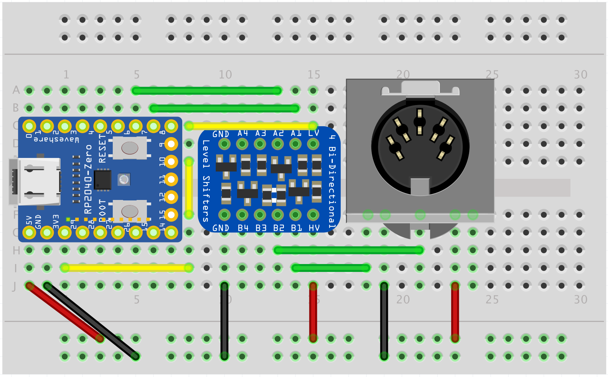

# RP2040 Multi-Protocol Keyboard & Mouse Converter
[](https://github.com/PaulW/rp2040-keyboard-converter/actions/workflows/docker-image.yml)

A USB HID converter for vintage keyboards and mice, using the RP2040's PIO (Programmable I/O) hardware to support multiple protocols including AT/PS2, XT, and Apple M0110.

## Overview

This project started as a way to use an IBM Model F PC/AT keyboard on modern hardware, and has grown to support keyboards and mice from various manufacturers and eras. The goal is to provide a non-invasive interface solution that preserves original hardware.

**Features:**
- Multi-protocol support: AT/PS2, XT, and Apple M0110 via PIO state machines
- Simultaneous keyboard and mouse conversion
- USB HID Boot Protocol for BIOS/UEFI compatibility
- Per-keyboard configuration with layer support and macros

**Why RP2040?**

Most existing converters use Atmel AVR or ARM Cortex-M microcontrollers (TMK/QMK/VIAL, Soarer's Converter). The RP2040 offers some interesting advantages:
- PIO state machines for hardware-accelerated protocol handling
- Dual-core architecture for parallel processing (although we don't use that currently)
- Low cost and wide availability
- Active SDK support

This project is also a learning exercise in RP2040 hardware, pico-sdk, and TinyUSB implementation.

## Hardware Setup

### Quick Start - Breadboard Prototype

For testing and development, connect your RP2040 board to the keyboard using a simple level shifter circuit:

**Required Components:**
- RP2040 board ([Raspberry Pi Pico](https://www.raspberrypi.com/products/raspberry-pi-pico/), [WaveShare RP2040-Zero](https://www.waveshare.com/rp2040-zero.htm), or similar)
- Bi-directional logic level converter (e.g., [BSS138-based 4-channel converter](https://www.adafruit.com/product/757))
- Appropriate connector for your keyboard protocol

**Connection Overview:**
```
Keyboard (5V) <---> Level Shifter <---> RP2040 (3.3V)
    CLK/DAT             HV/LV            GPIO Pins
```



**Pin Configuration:**
Protocol-specific GPIO assignments are defined in each keyboard's configuration file. Refer to the [Keyboards README](src/keyboards/README.md) for details.

### Hardware

**Custom PCB for IBM Model F PC/AT Keyboard:**
This is where the project started! An early experimental custom PCB was designed specifically to fit inside the IBM Model F PC/AT keyboard (model 6450225), providing:
- Integrated level shifting circuitry
- Compact form factor designed to fit inside the keyboard case
- Direct connector interface to keyboard controller

See the [Custom PCB Design](doc/custom_pcb.md) for schematics, PCB renders, fabrication files, and photos of the installed converter.

**Universal Inline Connector (In Development):**
I'm currently working on a universal inline adaptor which will allow various different connectors and devices to be used.

## Supported Hardware

### Protocols

The converter supports multiple vintage keyboard and mouse protocols through PIO state machines:

| Protocol | Type | Description | Status |
|----------|------|-------------|--------|
| **AT/PS2** | Keyboard & Mouse | IBM PC/AT and PS/2 protocol (bidirectional synchronous) | ✅ Full Support |
| **XT** | Keyboard | IBM PC/XT protocol (unidirectional synchronous) | ✅ Full Support |
| **Apple M0110** | Keyboard | Apple M0110/M0110A protocol (unique to these models) | ⚠️ Partial Support |

See [Protocols Documentation](src/protocols/) for technical details and PIO implementation.

### Keyboards

Supported keyboards with per-device configuration:

| Manufacturer | Models | Protocol | Scancode Set |
|--------------|--------|----------|--------------|
| **IBM** | Model F (PC/AT) | AT/PS2 | Set 2 |
| **IBM** | Model M (Enhanced) | AT/PS2 | Set 2 |
| **IBM** | Model M (122-key) | AT/PS2 | Set 3 |
| **Cherry** | G80-0614H, G80-1104H | XT | Set 1 |
| **Microswitch** | 122ST13 | AT/PS2 | Set 3 |

See [Keyboards Documentation](src/keyboards/) for configuration details and adding new keyboards.

### Mice

Mouse support is protocol-based. Specify the protocol when building:

| Protocol | Features |
|----------|----------|
| **AT/PS2** | 3-button, scroll wheel, extended buttons |

### Scancode Sets

The converter translates between different scancode sets:

| Scancode Set | Used By | Description |
|--------------|---------|-------------|
| **Set 1** | XT, AT/PS2 | Original IBM PC/XT codes (make code + 0x80 for break) |
| **Set 2** | AT/PS2 (default) | Most common, uses F0 prefix for break codes |
| **Set 3** | AT/PS2 (rare) | Uniform make/break structure |

**Implementation:** Sets 1, 2, and 3 are handled by a unified, configuration-driven processor (`src/scancodes/set123/scancode.{h,c}`) that consolidates common XT/AT protocol logic while maintaining per-set behavior. See [Scancodes Documentation](src/scancodes/) for complete tables.

## Building Firmware

The project uses Docker to provide a consistent build environment across platforms.

### Initial Setup

Build the Docker container with all required tools and libraries:

```bash
docker compose build builder
```

### Compile Firmware

Build firmware for your specific keyboard and (optionally) mouse:

```bash
# Keyboard only
docker compose run -e KEYBOARD="modelf/pcat" builder

# Keyboard + Mouse
docker compose run -e KEYBOARD="modelm/enhanced" -e MOUSE="at-ps2" builder
```

**Build Options:**
- `KEYBOARD`: Required. Path to keyboard configuration (relative to `src/keyboards/`)
- `MOUSE`: Optional. Protocol for mouse support (currently only `at-ps2` supported)

**Output:**
The compiled firmware is placed in `./build/rp2040-converter.uf2` and ready to flash to your RP2040.

### Available Keyboards

| Path | Description |
|------|-------------|
| `modelf/pcat` | IBM Model F PC/AT (6450225) |
| `modelm/enhanced` | IBM Model M Enhanced (101-key) |
| `modelm/m122` | IBM Model M 122-key |
| `cherry/G80-0614H` | Cherry G80-0614H |
| `cherry/G80-1104H` | Cherry G80-1104H |
| `microswitch/122st13` | Microswitch 122ST13 |

See [Keyboards README](src/keyboards/README.md) for adding new keyboard configurations.

## Flashing & Updating

### Initial Flash

1. **Enter Bootloader Mode**: 
   - Hold the **BOOT** button on your RP2040 board
   - Press and release the **RESET** button
   - Release the **BOOT** button
   - The RP2040 will mount as a USB drive named `RPI-RP2`

2. **Flash Firmware**:
   - Copy `build/rp2040-converter.uf2` to the `RPI-RP2` drive
   - The drive will automatically unmount and the RP2040 will reboot with new firmware

### Firmware Updates (Keyboard Build Only)

Once flashed, the converter provides a macro to enter bootloader mode without physical access:

**Press and hold in sequence**: **Fn** + **Left Shift** + **Right Shift** + **B**

**Note**: This macro is only available when the firmware includes keyboard support. Mouse-only builds require manual bootloader entry (hold BOOT during power-on or reset).

## Important Usage Notes

### ⚠️ Hot-Swapping Keyboards Not Really Supported

**Do NOT connect or disconnect keyboards while the converter is powered on.**

While AT/PS2 and XT keyboards may be electrically compatible with hot-plugging, the protocol's state machine is not designed for mid-operation keyboard changes. Hot-swapping can cause:

- Key misinterpretation for several keypresses after swap
- State machine stuck in incomplete multi-byte sequences (E0, E1, F0 prefixes)
- Debug messages like `[DBG] !INIT!` appearing in console output, and the converter then getting into a hung state
- Incorrect keyboard identification if swap occurs during initialization

**Why This Matters:**
- The protocol layer handles keyboard initialization (self-test, ID detection)
- The scancode processor maintains persistent state across multi-byte sequences
- Configuration is determined once during initialization based on keyboard ID
- No automatic state cleanup occurs when a keyboard is disconnected
- Any layout changes (switching from 101-key to 122-key for example) would cause keymapping assignment issues when built against the wrong layout

## Architecture & Data Flow

Understanding how the converter processes keyboard input:

### Signal Flow

```
┌─────────────┐     ┌──────────────┐     ┌──────────────┐     ┌──────────┐
│  Keyboard   │────▶│ PIO State    │────▶│  Ring Buffer │────▶│ Protocol │
│  Hardware   │     │  Machine     │     │  (32 bytes)  │     │  Handler │
└─────────────┘     └──────────────┘     └──────────────┘     └──────────┘
     5V Logic        Hardware Decode      IRQ→Main Queue        Validation
                     Timing Control       Thread-Safe FIFO      Error Check
                                                                     │
                                                                     ▼
┌─────────────┐     ┌──────────────┐     ┌──────────────┐     ┌──────────┐
│  USB Host   │◀────│  USB HID     │◀────│   Keymap     │◀────│ Scancode │
│  Computer   │     │  Interface   │     │  Translation │     │  Decoder │
└─────────────┘     └──────────────┘     └──────────────┘     └──────────┘
   6-Key Report     Boot Protocol        Layout Layers        Set 1/2/3
   Consumer/System  BIOS Compatible      Macro Support        Make/Break
```

### Processing Stages

1. **PIO State Machine** (Hardware): Captures keyboard CLK/DATA signals, validates bits, interrupts CPU with scancodes
2. **Ring Buffer** (IRQ Context): 32-byte lock-free FIFO queue for burst typing
3. **Protocol Handler** (Main Loop): Processes multi-byte sequences, manages keyboard state
4. **Scancode Decoder** (Main Loop): Translates protocol-specific scancodes to key positions
5. **Keymap Translation** (Main Loop): Maps positions to HID keycodes, handles layers and macros
6. **USB HID Interface** (USB Context): Generates USB reports, handles host LED state

### Thread Safety

The converter operates across multiple execution contexts (IRQ, main loop, USB callbacks). Thread safety is maintained through volatile qualifiers, lock-free ring buffer design, and non-blocking operations.

## Debugging & Development

### Serial UART Output

Connect a USB-UART adapter to the RP2040's UART pins for runtime diagnostics:

```
--------------------------------
[INFO] RP2040 Keyboard Converter
[INFO] RP2040 Serial ID: E66160F423782037
[INFO] Build Time: 2024-03-02 13:40
--------------------------------
[INFO] Keyboard Make: IBM
[INFO] Keyboard Model: 1390131
[INFO] Keyboard Description: Model M (101-key)
[INFO] Keyboard Protocol: at
[INFO] Keyboard Scancode Set: set2
--------------------------------
[INFO] RP2040 Clock Speed: 125000KHz
[INFO] Interface Polling Interval: 50us
[INFO] PIO SM Interface program loaded at 7
--------------------------------
[DBG] Keyboard Self Test OK!
[DBG] Keyboard ID: 0xAB83
[DBG] Keyboard Initialised!
```

**Runtime diagnostics can include:**
- Scancode sequences (make/break codes)
- Ring buffer overflow warnings
- Protocol errors
- Layer switching events

### USB Device Enumeration
Here we see the output from `lsusb -v` for when the converter is configured for both Keyboard and Mouse support. The converter only exposes interfaces for features included at build time:
```
Bus 002 Device 001: ID 5515:400c
Device Descriptor:
  bLength                18
  bDescriptorType         1
  bcdUSB               1.10
  bDeviceClass            0 (Defined at Interface level)
  bDeviceSubClass         0
  bDeviceProtocol         0
  bMaxPacketSize0        64
  idVendor           0x5515
  idProduct          0x400c
  bcdDevice            1.00
  iManufacturer           1 paulbramhall.uk
  iProduct                2 RP2040 Device Converter
  iSerial                 3 E66160F423782037
  bNumConfigurations      1
  Configuration Descriptor:
    bLength                 9
    bDescriptorType         2
    wTotalLength           84
    bNumInterfaces          3
    bConfigurationValue     1
    iConfiguration          0
    bmAttributes         0x80
      (Bus Powered)
    MaxPower              250mA
    Interface Descriptor:
      bLength                 9
      bDescriptorType         4
      bInterfaceNumber        0
      bAlternateSetting       0
      bNumEndpoints           1
      bInterfaceClass         3 Human Interface Device
      bInterfaceSubClass      1 Boot Interface Subclass
      bInterfaceProtocol      1 Keyboard
      iInterface              0
        HID Device Descriptor:
          bLength                 9
          bDescriptorType        33
          bcdHID               1.11
          bCountryCode            0 Not supported
          bNumDescriptors         1
          bDescriptorType        34 Report
          wDescriptorLength      67
         Report Descriptors:
           ** UNAVAILABLE **
      Endpoint Descriptor:
        bLength                 7
        bDescriptorType         5
        bEndpointAddress     0x81  EP 1 IN
        bmAttributes            3
          Transfer Type            Interrupt
          Synch Type               None
          Usage Type               Data
        wMaxPacketSize     0x0008  1x 8 bytes
        bInterval               8
    Interface Descriptor:
      bLength                 9
      bDescriptorType         4
      bInterfaceNumber        1
      bAlternateSetting       0
      bNumEndpoints           1
      bInterfaceClass         3 Human Interface Device
      bInterfaceSubClass      0 No Subclass
      bInterfaceProtocol      0 None
      iInterface              0
        HID Device Descriptor:
          bLength                 9
          bDescriptorType        33
          bcdHID               1.11
          bCountryCode            0 Not supported
          bNumDescriptors         1
          bDescriptorType        34 Report
          wDescriptorLength      25
         Report Descriptors:
           ** UNAVAILABLE **
      Endpoint Descriptor:
        bLength                 7
        bDescriptorType         5
        bEndpointAddress     0x82  EP 2 IN
        bmAttributes            3
          Transfer Type            Interrupt
          Synch Type               None
          Usage Type               Data
        wMaxPacketSize     0x0010  1x 16 bytes
        bInterval               8
    Interface Descriptor:
      bLength                 9
      bDescriptorType         4
      bInterfaceNumber        2
      bAlternateSetting       0
      bNumEndpoints           1
      bInterfaceClass         3 Human Interface Device
      bInterfaceSubClass      1 Boot Interface Subclass
      bInterfaceProtocol      2 Mouse
      iInterface              0
        HID Device Descriptor:
          bLength                 9
          bDescriptorType        33
          bcdHID               1.11
          bCountryCode            0 Not supported
          bNumDescriptors         1
          bDescriptorType        34 Report
          wDescriptorLength      79
         Report Descriptors:
           ** UNAVAILABLE **
      Endpoint Descriptor:
        bLength                 7
        bDescriptorType         5
        bEndpointAddress     0x83  EP 3 IN
        bmAttributes            3
          Transfer Type            Interrupt
          Synch Type               None
          Usage Type               Data
        wMaxPacketSize     0x0040  1x 64 bytes
        bInterval               8
Device Status:     0x0000
  (Bus Powered)
```

**Interface Breakdown:**
- **Interface 0**: HID Keyboard (Boot Protocol, 6-key rollover)
- **Interface 1**: HID Consumer/System Control (media keys, power control)
- **Interface 2**: HID Mouse (Boot Protocol, 5-button + scroll)

Boot Protocol is used for BIOS/UEFI compatibility (6-key rollover, NKRO not supported).

## Contributing

Contributions welcome! Areas for expansion:

- New keyboard configurations
- New Protocol implementations
- Feature development (NKRO, dynamic keymaps)
- Hardware designs (PCBs, inline adapters, cases)
- Documentation improvements

## Future Development

Planned improvements:

- [ ] NumLock emulation for Mac keyboards
- [ ] Dynamic keymap switching
- [ ] Additional protocols
- [ ] Universal inline adapter hardware
- [ ] Configuration interface via USB

## License

The project is licensed under **GPLv3** or later. Third-party libraries and code used in this project have their own licenses as follows:

* **Pico-SDK (https://github.com/raspberrypi/pico-sdk)**: License information can be found in the Pico-SDK repository.

* **TinyUSB (https://github.com/hathach/tinyusb)**: License information can be found in the TinyUSB repository. These licenses remain intact in any included portions of code from those shared resources.

* **Pico-Simon (https://github.com/Zheoni/pico-simon)**: Portions of code from the Pico-Simon project are used under the MIT License. A copy of the MIT License can be found in the Pico-Simon repository.

* **Ringbuffer implementation (source files: ringbuf.c, etc.)**:
  * Based on code originally created by Hasu@tmk for the TMK Keyboard Firmware project.
  * Potential source references:
    * https://github.com/tmk/tinyusb_ps2/blob/main/ringbuf.h
    * https://github.com/tmk/tmk_keyboard/blob/master/tmk_core/ring_buffer.h
  * License: Likely GPLv2 or later (same as TMK) due to its inclusion in the TMK repository, but the exact origin is unclear.
