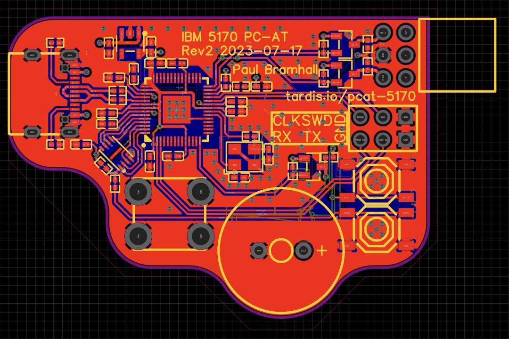
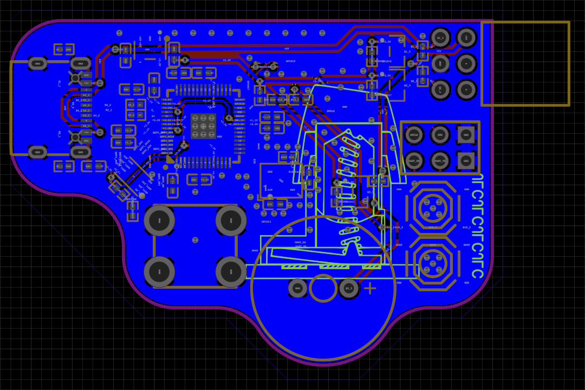
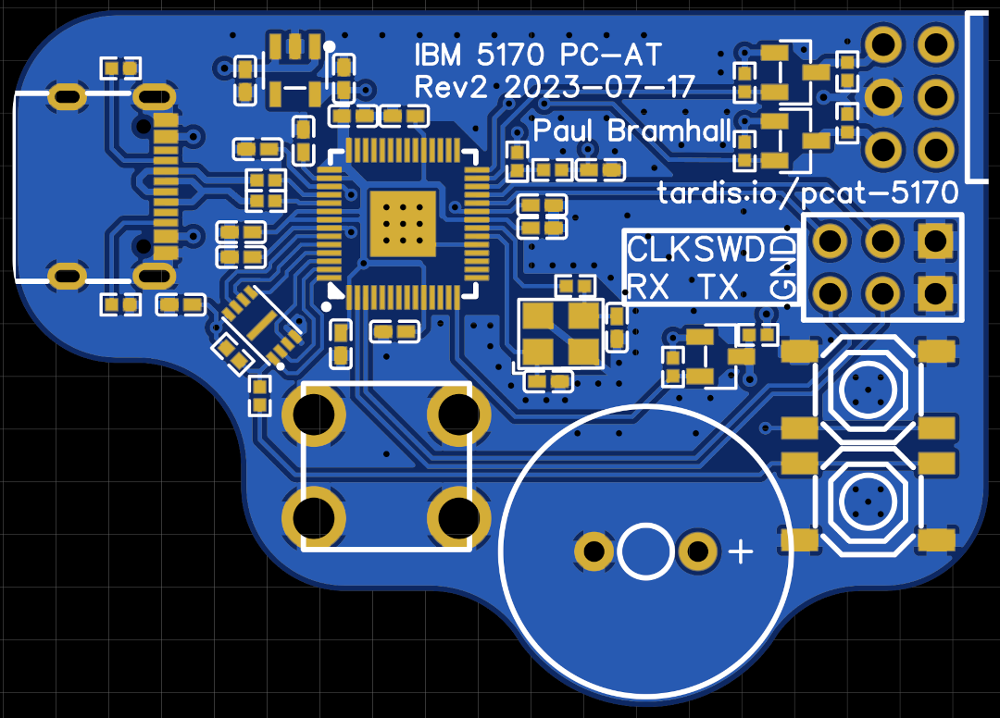
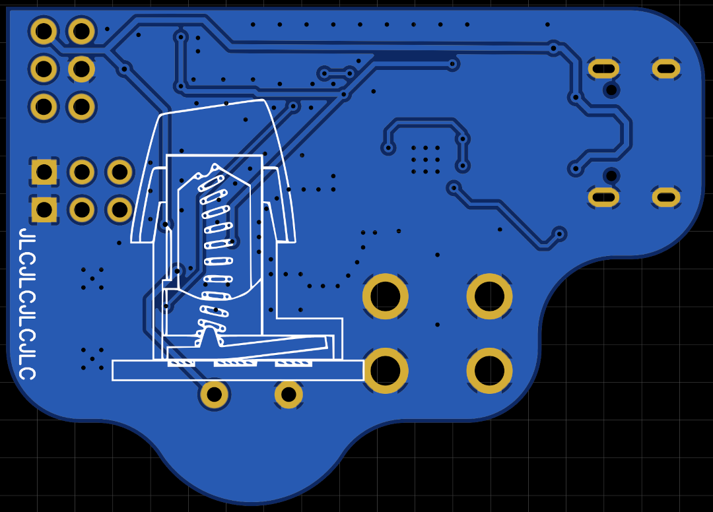
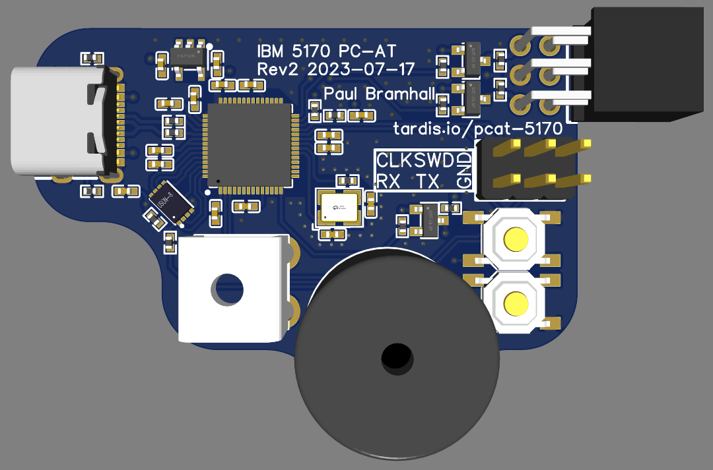
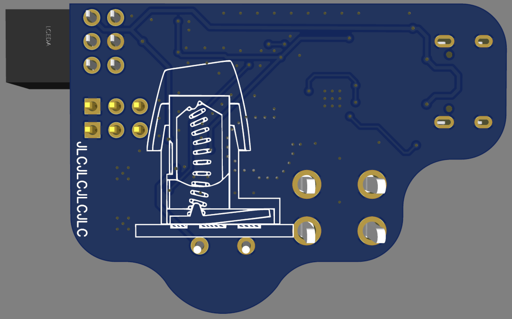
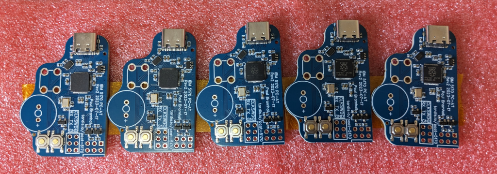
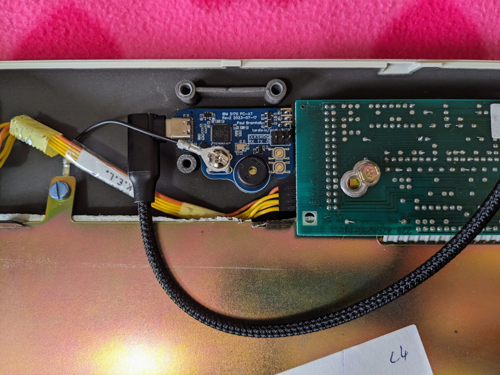
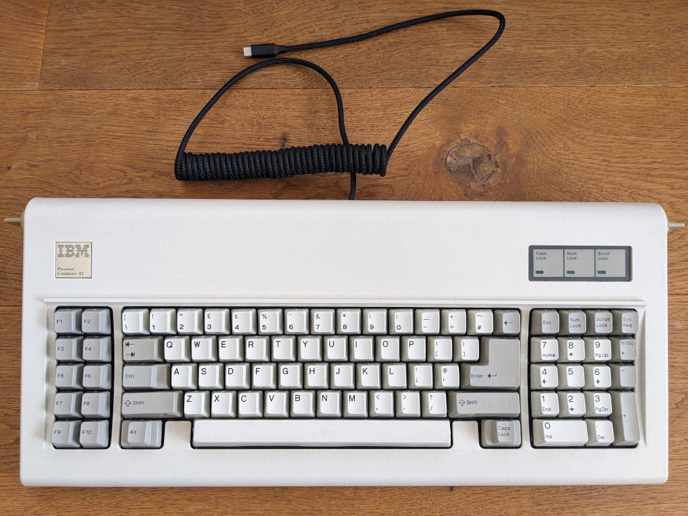

# Model-F 5170 Converter for Raspberry Pi PICO RP2040

## Custom Hardware Design

As this project progressed, one key aspect which I wanted to achieve was my own custom interface converter which would fit inside the Model F PC/AT Keyboard, allowing me to keep to the original aesthetic of the keyboard, but not require a bulky external converter, or an excess amount of cable on the desk.

There have so far been 2 revisions of the design, Rev 1 was more of a test-fit PCB to ensure measurements were correct, and parts were poorly placed.  Rev 2 (current) is more of a final design, and is what I'm currently running in my PC/AT Keyboard.

This was designed entirely in EasyEDA (Standard Edition) and manufacturerd by JLCPCB using their SMT Assembly support.

Here you can find the [PCB Schematic](Schematic.pdf) for which the PCB Design is based off.

#### PCB Trace Design (Top)

#### PCB Trace Design (Bottom)

#### 2D PCB Render (Top)

#### 2D PCB Render (Bottom)

#### 3D PCB Render (Top)

#### 3D PCB Render (Bottom)

#### Manufacturerd PCBs

#### Installed Converter

#### Fully Assembled
