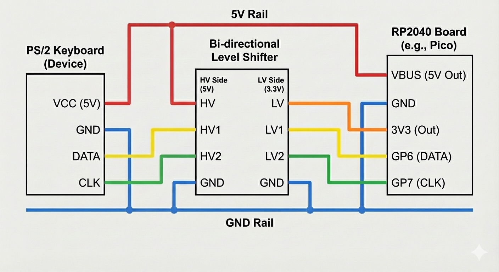

# Hardware Setup

By the end of this guide, you should have a working converter ready to connect whichever device you're using (keyboard, mouse, or both) and get it working on your computer.

I'm not going to dive into the deep technical details of how everything works here (that's what the [Hardware Documentation](../hardware/README.md) is for), but rather give you a simple, step-by-step guide to get you up and running as quickly as possible.

---

## What We're Building

To keep things simple, we'll be setting everything up on a breadboard that you can connect your device to. It'll handle the necessary voltage level shifting between the keyboard and the Raspberry Pi Pico, then connect to your computer via USB. This is actually the exact setup I used when I originally started development—it's simple to build, easy to modify and test different configurations.

**When you're done, you'll have:**
- No messy wiring or splicing cables to connect things up
- A level shifter handling the different voltage levels between 5V and 3.3V
- The Raspberry Pi Pico connected and ready to go

---

## What You'll Need

**The essentials:**
- A PS/2 keyboard (or whichever supported device you're working with)
- An RP2040 board. I've used a WaveShare RP2040-Zero for mine, but a Raspberry Pi Pico or any similar board should work just fine—the only real difference between them is the pinout and physical size
- A breadboard and jumper wires (a 400-point half-size breadboard should do nicely)
- A bi-directional level shifter module (I'd really recommend one using BSS138 level shifters—I use the Adafruit one listed below and find it much easier and more compact than mucking about with a bunch of resistors)
- Whichever breakout or connector you need to connect your device (a PS/2 Mini-DIN-6 socket for PS/2 keyboards, a 5-pin DIN-5 socket for older AT/XT keyboards, that sort of thing)

**Quick shopping list:**

| Component | Quantity | Approx Cost |
|-----------|----------|-------------|
| [Waveshare RP2040-Zero](https://amzn.eu/d/bZ0RDjV) | 1 | £8-12 |
| [Level shifter module](https://thepihut.com/products/adafruit-4-channel-i2c-safe-bi-directional-logic-level-converter) | 1 | £2-5 |
| PS/2 connector/adapter (Mini-DIN-6) | 1 | £2-10 |
| USB cable (Micro USB or USB-C depending on your RP2040 board) | 1 | £1-5 |
| [Breadboard](https://thepihut.com/products/raspberry-pi-breadboard-half-size) | 1 | £3-5 |
| [Jumper wires](https://thepihut.com/products/premium-male-male-jumper-wires-20-x-6-150mm) | 1 set | £2-5 |

**Total**: Around £15-40 depending on what you choose and what you might already have lying about. I know it might seem like a bit of an expense just to try this out, but these components are all fairly reusable for other projects too, so they won't go to waste.

**Where to buy**: Adafruit, SparkFun, Pimoroni, Amazon, eBay—all the usual suspects.

---

## What Do We Need the Level Shifter For?

⚠️ **This is important**: Don't connect your device directly to the RP2040!

Older keyboards and mice operate at 5V, which is far too high for the RP2040 to handle directly. If you connect them straight in without a level shifter (or some other way to step down the voltages, like resistors), you'll damage the RP2040.

The level shifter sits between them, translating voltages automatically in both directions:
- Device → RP2040: Converts 5V HIGH down to a safe 3.3V HIGH
- RP2040 → Device: Converts 3.3V HIGH up to 5V HIGH

This isn't optional—it's essential for protecting your hardware! Now, there are other ways to handle this (like using step-down resistors), but for simplicity I decided to use a dedicated level shifter module.

Another reason I use the BSS138-based level shifter modules is that they're bi-directional. Some keyboard and mouse protocols send data in both directions (from device to RP2040, and from RP2040 back to device), so having a bi-directional level shifter makes the wiring much simpler.

---

## Step 1: Identify Your Device's Connector

Now, I know we're focusing on PS/2 keyboards for this guide, but it's worth knowing how to identify your device's connector type and pinout if you want to use something different. I've added a quick overview of some of the different connector types and pinouts below, but just be aware your mileage may vary—even though different keyboards or mice might use the same connector, the pinouts can differ slightly between manufacturers. AT/PS2 keyboards and mice will all use the same standard pinout. It's just when you start looking at other devices, like Amiga or Apple M0110 keyboards, where things can differ a bit more.

**Working out the pinout:**

You'll need to know which wires carry the power and signal lines. Have a look at the **[Protocol Documentation](../protocols/README.md)** for whichever type of device you're wanting to use, as they contain specific information about wiring layouts and pinouts for each protocol.

**Tip**: It's always handy to have a multimeter to hand—it'll help you verify which wire corresponds to each pin before connecting things up.

---

## Step 2: Set Up the Breadboard

### Component Placement


*The breadboard schematic above shows a WaveShare RP2040-Zero, a BSS138 level shifter, and a 5-pin 180° DIN socket for the keyboard connection (you can use whatever connector you need though—it just depends on your specific keyboard or mouse). This particular example is keyboard-only (no mouse), but the principle's the same if you're adding mouse support too.*

**How to lay things out:**
1. Place the RP2040 board on the left side, spanning the centre gap (so the pins are accessible on both sides)
2. Place the level shifter module on the right side, leaving a few rows between it and the RP2040
3. Keep the top and bottom power rails accessible for connections
4. Orient the modules so the pin labels are visible

**Tip**: Take a photo of your layout for reference when troubleshooting. That way, if you do move anything around, you have a visual record to compare against.

---

## Step 3: Connect the Power Lines

First, connect the power and ground connections to all the components.

| From | To | Wire Colour | Purpose |
|------|-----|------------|---------|
| RP2040 **VSYS** pin | Power Rail **Upper** | Red | 5V for level shifter HV side and device |
| RP2040 **GND** pin | Power Rail **Lower** | Black | Common ground |
| RP2040 **3V3** pin | BSS138 **LV** | Yellow | 3.3V for level shifter LV side |
| Power Rail **Upper** | BSS138 **HV** | Red | Connect HV Power to level shifter |
| Power Rail **Lower** | BSS138 **GND** | Black | Common Ground to level shifter |
| Power Rail **Upper** | Device **VCC** pin* | Red | Power for device (5V) |
| Power Rail **Lower** | Device **GND** pin* | Black | Common ground |

**Important**: Different breadboards might have slightly different layouts—I'm basing this on the one I've got, so make sure to verify the power rails on your own breadboard. Also, with the WaveShare RP2040-Zero, pins 9 to 15 shouldn't be used or connected to anything. Because they're all positioned horizontally, they'll end up on the same row on the breadboard and might cause shorts if you connect them.

***Device VCC/GND pins**: These will depend on the connector you're using for your device. Check the pinout for your specific connector to work out which pins are VCC and GND.

**Don't power anything on yet** - we've still got the signal lines to connect, so hold off on plugging in the USB for now.

---

## Step 4: Connect the Signal Lines

With the power lines connected, we can now wire up the signal lines. These carry the data and clock signals between the RP2040 ↔ Level Shifter ↔ Device.

### Level Shifter

As we're using the Adafruit Level Shifter, the pinout is as follows:

```
   [Level Shifter Module]
   
                    LV ──┐────┌── HV
 Low Voltage Side   A1 ──┤    |── B1   High Voltage Side
 (3.3V - RP2040)    A2 ──┤    |── B2   (5V - Device side)
                    A3 ──┤    |── B3
                    A4 ──┤    |── B4
                   GND ──┘────└── GND
```

We should've already connected the LV, HV and GND pins in the previous step, so now we just need to connect the signal lines. It's important we make sure the LV side connects to the RP2040, and the HV side connects to the device. For the PS/2 keyboard example, we'll only be connecting the data and clock lines.

### Signal Line Connections

| From | To | Wire Colour | Purpose |
|------|----|------------|---------|
| RP2040 **DATA** pin | Level Shifter **A1** | Green | DATA signal (3.3V side) |
| RP2040 **CLOCK** pin | Level Shifter **A2** | Green | CLOCK signal (3.3V side) |
| Level Shifter **B1** | Device **DATA** pin | Green | DATA signal (5V side) |
| Level Shifter **B2** | Device **CLOCK** pin | Green | CLOCK signal (5V side) |

**Note**: The Adafruit level shifter has 4 channels (A1/B1 to A4/B4)—A1-A4 are the 3.3V low voltage side, and B1-B4 are the 5V high voltage side.

**One hardware constraint to be aware of**: The firmware expects the clock pin to be data pin + 1. So if data is on `GPIO 2`, then clock needs to be on `GPIO 3`. This means you can use pairs like `2`/`3`, `6`/`7`, `10`/`11`, etc. If you follow the breadboard schematic with `GPIO 6`/`7`, you'd update `KEYBOARD_DATA_PIN` to `6` in the [`src/config.h`](../../src/config.h) file before building.

```c
#define KEYBOARD_DATA_PIN 6  // Change this to match your DATA pin
#define MOUSE_DATA_PIN 10    // Change this if you're using a mouse too
#define LED_PIN 29           // Change this if you're adding LEDs
```

### Example: Wiring a PS/2 Keyboard

PS/2 pinout (this is the female connector on the cable, looking at the pins):


---

## Step 5: Adding a Status LED (Optional but Recommended)

This might go a bit beyond the basic setup we're working towards (and it's completely optional), but I wanted to mention it here because it's a really useful addition to have.

The converter can use an addressable WS2812B RGB LED to show you what's going on, providing useful visual feedback about what the converter's doing.

**What the LED shows:**
- **🟢 Green**: Converter's ready and working
- **🟠 Orange**: Waiting for device initialisation
- **🟣 Magenta**: Bootloader mode (ready for firmware flashing)
- **💚💙 Flashing Green/Blue**: Command mode active
- **💚💖 Flashing Green/Pink**: Log level selection mode
- **🌈 Rainbow**: Brightness adjustment mode

You can also use 4 LEDs if you want to show the lock key states (Num Lock, Caps Lock, Scroll Lock).

### What You Need

Just a WS2812B LED (or 'NeoPixel') and 3 jumper wires. Cost is around £2-8 depending on whether you get individual LEDs, a strip, or a breakout board. The **[Hardware Guide](../hardware/README.md#status-leds)** has detailed info on where to buy them and the different options available.

### Wiring It Up

The WS2812B is 3.3V tolerant, so you can wire it straight to the RP2040.

**LED Pinout** (typical WS2812B):
```
     ┌───────────┐
     │  WS2812B  │
     │    LED    │
     │           │
VCC ─┤   ●   ●   ├─ GND
     │    ╲ ╱    │
DIN ─┤     X     ├─ DOUT
     │    ╱ ╲    │
     └───────────┘
```

**Connections:**

| WS2812B Pin | Connect To | Wire Colour | Notes |
|-------------|------------|------------|-------|
| **VCC** | RP2040 **3V3** pin | Red | Use 3.3V, not 5V |
| **GND** | Power Rail **Lower** | Black | Common ground |
| **DIN** (Data In) | RP2040 **`GPIO 29`** | Any colour | Default data pin |

**A couple of things to note**: 
- Use the **DIN** (Data In) pin, not DOUT (Data Out). You'd only use DOUT if you're chaining multiple LEDs together.
- The default GPIO is pin 29 (defined in [`src/config.h`](../../src/config.h))
- If you're using an LED strip, connect to the first LED's DIN pin

**For multiple LEDs or changing the GPIO pin**, have a look at the **[Hardware Guide - Status LEDs section](../hardware/README.md#status-leds)** for detailed instructions on chaining LEDs and customising pin assignments.

---

## Step 6: Verify Connections

Before we power things up, let's just check everything we've connected.

### Things to Check

- [ ] **Power connections are solid**: 3.3V and 5V rails properly connected to the RP2040
- [ ] **All grounds tied together**: RP2040, level shifter, and device all sharing common ground
- [ ] **No voltage shorts**: 3.3V and 5V rails are separate and not touching each other
- [ ] **Level shifter powered correctly**: LV connected to 3.3V, HV connected to 5V
- [ ] **Signal paths look right**: GPIO → LV pins → HV pins → Device
- [ ] **GPIO pins match config.h**: Check your wiring matches the pin definitions in [`src/config.h`](../../src/config.h) (or update config.h to match your wiring)
- [ ] **Device connector is correct**: Clock and data wires match your connector's pinout
- [ ] **Nothing's loose**: All connections are firmly seated in the breadboard
- [ ] **LED connected properly (if using one)**: WS2812B VCC to 3.3V, GND to ground, DIN to the right GPIO (check LED_PIN in [`src/config.h`](../../src/config.h))

### Visual Verification

Compare your breadboard to the wiring diagram earlier in this guide. Take a photo and trace each connection with different coloured markers if it helps.

**Common mistakes to watch out for:**
- ❌ Connecting the device clock/data straight to the RP2040 (bypassing the level shifter)
- ❌ Swapping clock and data lines around
- ❌ Forgetting to connect the level shifter power references (those LV and HV pins)
- ❌ Using separate grounds (remember, all grounds need to be common)
- ❌ Dodgy breadboard connections (give the wires a little wiggle to make sure they're properly seated)

---

## Step 7: Test the Hardware

Now power everything up to verify it's working before we flash the firmware.

### Powering Up for the First Time

1. **Connect the USB cable** from the RP2040 to your computer
2. **The RP2040 LED (if there is one) should light up** - shows the board's getting power
3. **Your device should power on** - keyboards might flash their LEDs briefly during self-test
4. **No smoke, no burning smell** - Unless you have something seriously wrong, or something's damaged, you shouldn't see or smell anything bad

### What to Expect (Before Firmware is Loaded)

Without the firmware, the RP2040 won't respond to your device yet. This is completely normal. Here's what you should see:

✅ **RP2040 board LED is lit** (the power indicator)  
✅ **Device has power** (LEDs might light up if your keyboard has always-on indicators)  
✅ **RP2040 shows up as a USB device** (if it's not already flashed with firmware, it might show up as a mass storage device)  

❌ **Keyboard does nothing when you type** (no firmware loaded yet)  
❌ **No WS2812B LED activity** (if you're using one, firmware's needed to control it, otherwise it won't light)  
❌ **Computer doesn't see it as a keyboard** (normal—you haven't flashed the firmware yet)

### If Something's Not Working

**RP2040 LED not lighting up?**
- Does it even have one? (Some boards don't)
- Check the USB cable (try a different one that you know works for data)
- Make sure the RP2040 board isn't damaged
- Try a different USB port on your computer
- If all else fails, try removing the RP2040 from the breadboard and just powering it on its own to see if the issue is with the board or the wiring

**Device not powering on?**
- Check the 5V connection from VSYS to the device VCC
- Double-check the device connector pinout (make sure VCC and GND are correct)
- If you have a multimeter, test for continuity
- Your computer might not be supplying enough power (try a powered USB hub or a different computer)

**Device LEDs flickering or acting strange?**
- Some keyboards do this during self-test, so it might be perfectly normal
- If it's constantly flickering, check for a power issue (verify that 5V connection is solid)
- It might indicate that the device itself is faulty or has an issue (try a different keyboard if you have one)

---

## Step 8: Next Steps

Your hardware's ready! Now you need to build and flash the firmware to get everything working.

### Where to Go From Here

With the hardware sorted:

1. **[Build the Firmware](building-firmware.md)** - Compile the firmware for your specific device
2. **[Flash the Firmware](flashing-firmware.md)** - Get the firmware installed on the RP2040
3. **Test it all out** - Make sure everything works together

### If Things Still Aren't Right

Hardware issues can be caused by wiring mistakes or component failures. Things to check:

- **Go through the verification checklist again** - Did you miss a connection somewhere?
- **Check the pinout diagrams** - Are clock and data swapped?
- **Double-check the level shifter orientation** - Are the HV and LV sides the right way round?
- **Test continuity** - If you have a multimeter, check the connections
- **Look for shorts** - Make sure no adjacent breadboard holes are accidentally bridged
- **WS2812B not lighting up?** - Check it's getting 3.3V power, and that DIN's connected to the right GPIO pin

**Need more help?**
- 📖 **[Hardware Deep Dive](../hardware/README.md)** - More detailed component information
- 📖 **[Advanced Topics](../advanced/README.md)** - System architecture and implementation details
- 💬 **[Ask on GitHub Discussions](https://github.com/PaulW/rp2040-keyboard-converter/discussions)** - Community support
- 🐛 **[Report Issues](https://github.com/PaulW/rp2040-keyboard-converter/issues)** - Found a bug? Let me know!

---

## Complete Wiring Diagram

Here's everything in one place as a reference:


**Connection Summary:**
- Device VCC → 5V Rail → RP2040 VSYS
- Device GND → GND Rail (common to all)
- Device DATA → Level Shifter HV1 → Level Shifter LV1 → RP2040 GPIO (your DATA pin)*
- Device CLOCK → Level Shifter HV2 → Level Shifter LV2 → RP2040 GPIO (your CLOCK pin)*
- Level Shifter HV → 5V Rail
- Level Shifter LV → RP2040 3V3
- Level Shifter GND → GND Rail

**\* A note on GPIO pins**: The diagram shows example GPIO connections. Your actual pin numbers will match whatever you've defined in [`src/config.h`](../../src/config.h) (KEYBOARD_DATA_PIN). The hardware requires the clock pin to be data pin + 1.

---

**[← Previous: Getting Started](README.md)** | **[Next: Building Firmware →](building-firmware.md)**
