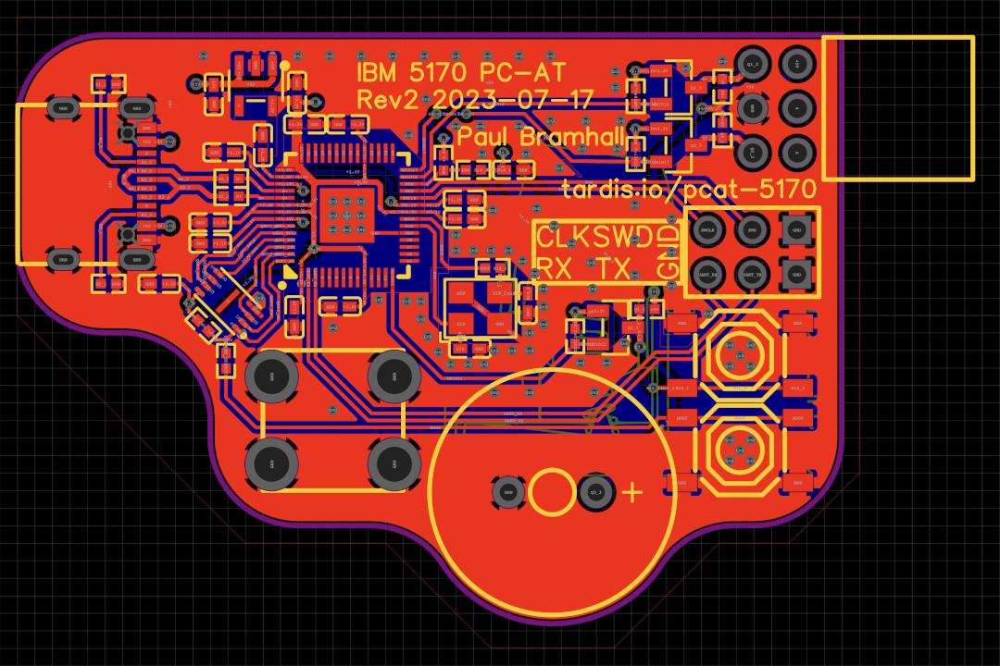
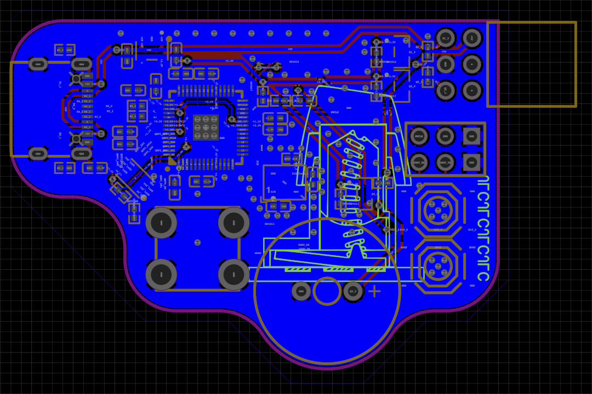
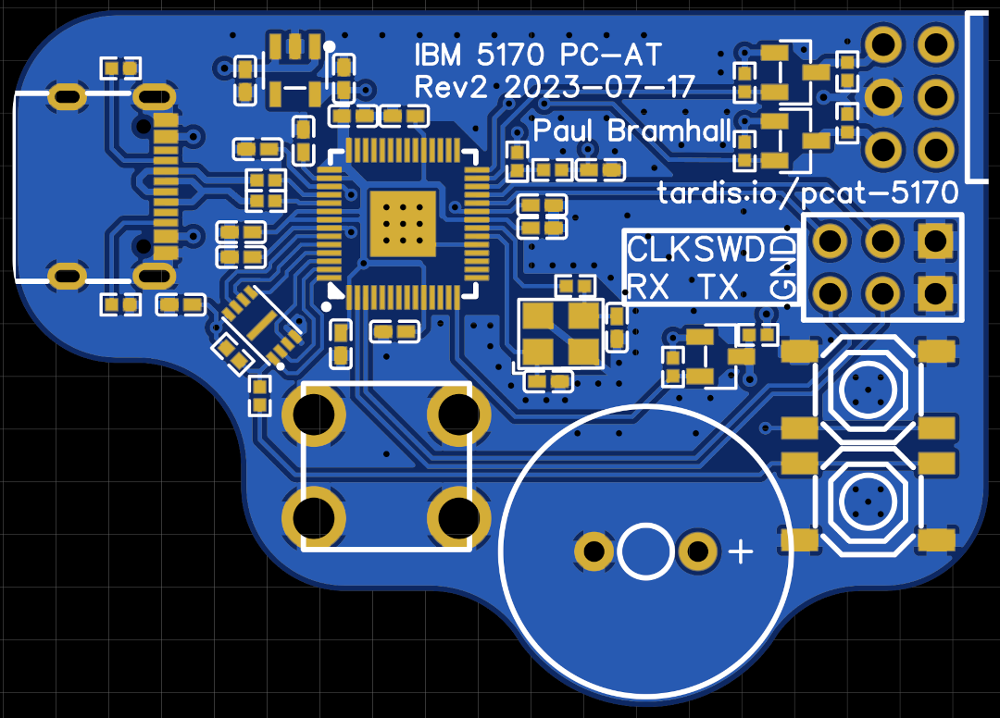
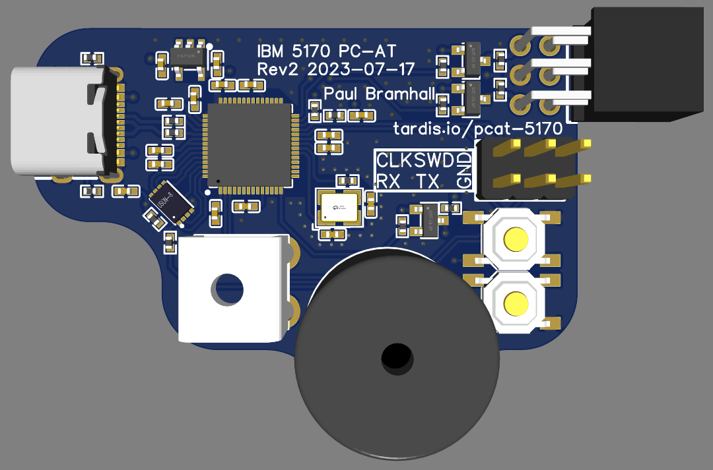
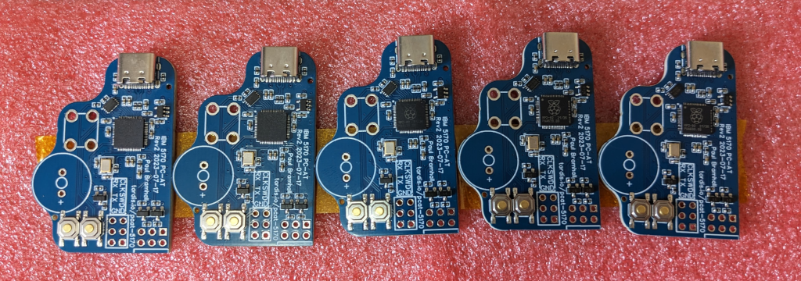
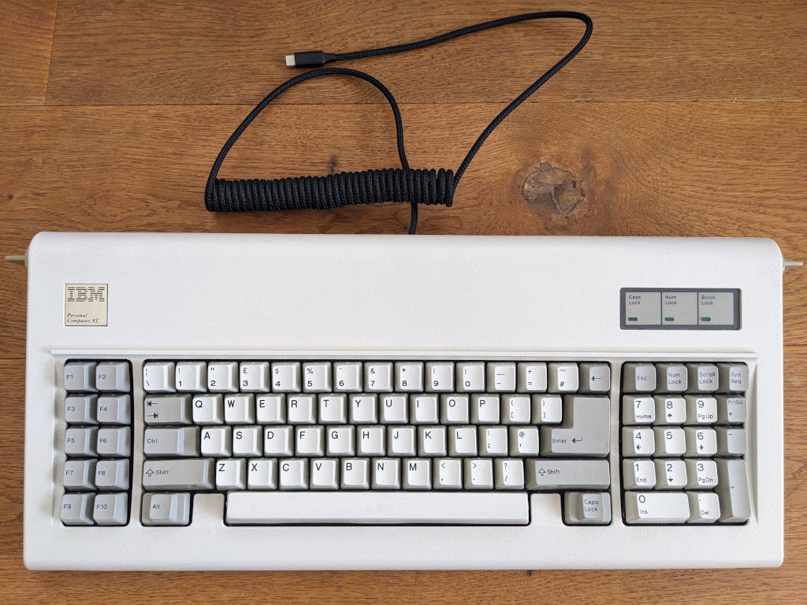

# Custom PCB Design

**Status**: ✅ Current | **Last Updated**: 27 October 2025

A custom PCB design specifically for the IBM Model F PC/AT keyboard (model 6450225), allowing the converter to be installed internally while maintaining the original aesthetic.

## Table of Contents

- [Overview](#overview)
- [Design Goals](#design-goals)
- [Specifications](#specifications)
- [PCB Designs](#pcb-designs)
- [Manufacturing](#manufacturing)
- [Installation](#installation)
- [Fabrication Files](#fabrication-files)
- [Related Documentation](#related-documentation)

---

## Overview

This custom PCB was designed to fit inside the IBM Model F PC/AT keyboard, providing a clean, internal conversion solution without requiring an external adapter or excessive cabling.

**Key Features:**
- Compact form factor designed for internal keyboard installation
- Integrated level shifting circuitry (5V ↔ 3.3V)
- Direct connection to keyboard controller
- USB Type-C connector
- RP2040 microcontroller with all necessary support circuitry

---

## Design Goals

The custom PCB design addresses several key requirements:

1. **Internal Installation** - Fits inside the keyboard case without modifications
2. **Clean Aesthetic** - Preserves the original keyboard appearance
3. **Minimal Cabling** - Only a single USB cable exits the keyboard
4. **Reliable Operation** - Proper level shifting and signal conditioning
5. **Easy Assembly** - SMT assembly service compatible

---

## Specifications

**Board Dimensions:**
- Custom-sized to fit IBM Model F PC/AT internal space
- Compact layout optimises available room

**Components:**
- **Microcontroller**: RP2040 (Raspberry Pi Pico-compatible)
- **Level Shifters**: Integrated 5V ↔ 3.3V bi-directional level shifters
- **Power**: USB bus-powered (5V)
- **Connector**: USB Type-C
- **Assembly**: SMT components for JLCPCB assembly service

**Connections:**
- Keyboard CLK: GPIO 17
- Keyboard DATA: GPIO 16
- USB: Native RP2040 USB
- LED: Status indicator (optional)

---

## PCB Designs

### PCB Trace Design (Top)

### PCB Trace Design (Bottom)

### 2D PCB Render (Top)

### 2D PCB Render (Bottom)

### 3D PCB Render (Top)

### 3D PCB Render (Bottom)

---

## Manufacturing

The PCB was designed using **EasyEDA (Standard Edition)** and manufactured by **JLCPCB** with their SMT Assembly service.

### Manufactured PCBs

**Manufacturing Notes:**
- PCB thickness: Standard (1.6mm)
- Copper weight: 1 oz
- Surface finish: HASL (lead-free)
- Solder mask: Green
- Silkscreen: White

**Assembly Service:**
- SMT assembly for top-side components
- Basic components from JLCPCB catalogue
- No hand-soldering required (except optional through-hole components)

---

## Installation

### Installed Converter Board

The converter installs directly inside the IBM Model F PC/AT keyboard:

1. **Preparation**:
   - Disconnect keyboard from computer
   - Open keyboard case (remove screws)
   - Identify controller board location

2. **Installation**:
   - Connect converter to keyboard controller connector
   - Secure converter board (double-sided tape or mounting)
   - Route USB cable through existing cable opening

3. **Testing**:
   - Connect USB cable to computer
   - Verify keyboard functionality
   - Check LED indicators

### Fully Assembled Board

---

## Fabrication Files

Complete fabrication files are available for manufacturing:

**Files Included:**
- **[Schematic (PDF)](../images/hardware/Schematic.pdf)** - Complete electrical schematic
- **BOM (Bill of Materials)** - Component list with part numbers
- **Pick-and-Place** - Component placement coordinates for SMT assembly
- **Gerber Files** - PCB manufacturing files

**Location:** [`doc/fabrication/`](../../doc/fabrication/)

**Using These Files:**
1. Upload Gerber files to PCB manufacturer (e.g., JLCPCB, PCBWay)
2. Upload BOM and Pick-and-Place files for SMT assembly
3. Review and confirm component availability
4. Order PCBs with assembly service

**Cost Estimate (as of 2025):**
- PCB + SMT Assembly (5 units): ~£50-80
- Shipping: Varies by location
- Lead time: ~2-3 weeks

---

## Pin Configuration

For this custom PCB design, the following GPIO pins are used:

| Function | GPIO Pin | Notes |
|----------|----------|-------|
| Keyboard CLK | GP17 | 5V tolerant with level shifter |
| Keyboard DATA | GP16 | 5V tolerant with level shifter |
| Status LED | GP25 | Built-in RP2040 LED |
| USB D+ | GP20 | Native RP2040 USB |
| USB D- | GP21 | Native RP2040 USB |

---

## Revisions

### Revision 2 (Current)
- ✅ Improved component placement
- ✅ Optimised trace routing
- ✅ Better fit for keyboard case
- ✅ Added level shifter circuit
- **Status**: Production (current version)

### Revision 1 (Obsolete)
- Test-fit PCB for measurements
- Poor component placement
- **Status**: Superseded by Rev 2

---

## Related Documentation

**In This Documentation:**
- [Hardware Overview](README.md) - All hardware options
- [Breadboard Prototype](breadboard-prototype.md) - Simple alternative
- [Pin Configurations](pin-configurations.md) - GPIO assignments
- [Level Shifters](level-shifters.md) - Level shifting explained

**Source Code:**
- Configuration is keyboard-specific (see [`src/keyboards/ibm/modelf-pcat/`](../../src/keyboards/ibm/modelf-pcat/))

**External Resources:**
- [EasyEDA](https://easyeda.com/) - PCB design tool
- [JLCPCB](https://jlcpcb.com/) - PCB manufacturer
- [RP2040 Datasheet](https://datasheets.raspberrypi.com/rp2040/rp2040-datasheet.pdf)

---

## Future Improvements

Potential enhancements for future revisions:

- [ ] USB-C on both ends (keyboard and host)
- [ ] Onboard USB hub for additional devices
- [ ] RGB LED for status indication
- [ ] Smaller form factor
- [ ] Universal mounting for other keyboards

---

**Questions or Suggestions?**  
Please [open an issue](https://github.com/PaulW/rp2040-keyboard-converter/issues) or join the [discussion](https://github.com/PaulW/rp2040-keyboard-converter/discussions).
