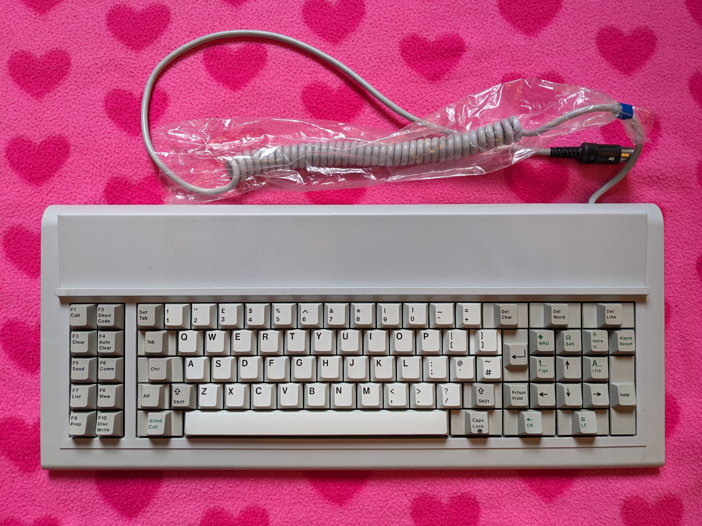

# Cherry G80-0614H Terminal Keyboard

**Configuration**: `cherry/G80-0614H`



---

## Overview

The Cherry G80-0614H is a terminal keyboard with Cherry MX switches in an XT-variant layout. Designed for the BT Merlin Cheetah Terminal (STC TX3000S Telex Terminal).

---

## Features

The G80-0614H uses Cherry MX switches in an 84-key XT-variant layout. The key legends are custom-labelled for BT Cheetah Terminal functions, so the key labels don't match standard PC layouts — the converter keymap translates them to the expected USB HID codes.

The keyboard supports full NKRO at the hardware level, meaning all key presses are reported independently regardless of how many keys are held. In practice the converter outputs USB HID Boot Protocol, which caps simultaneous reporting at 6 regular keys plus 8 modifiers — see the note in the Specifications section.

The layout has two layers. The physical F9 key on the keyboard acts as a momentary layer key (MO_1): hold it to access Layer 1, which provides F9–F12, media controls (volume, brightness), arrow key navigation, and the application key. Release it to return to Layer 0.

The XT protocol has no mechanism for the host to send LED control commands, so the keyboard has no LED indicators. The connector is the standard XT 5-pin DIN in 180° arrangement.

---

## Specifications

| Specification    | Details                                   |
| ---------------- | ----------------------------------------- |
| **Make**         | Cherry                                    |
| **Model**        | G80-0614H BT Cheetah Terminal Keyboard    |
| **Keys**         | 84 keys (XT-variant layout)               |
| **Protocol**     | XT                                        |
| **Codeset**      | Scancode Set 1 (XT standard)              |
| **Connector**    | 5-pin DIN (180° arrangement, XT standard) |
| **Voltage**      | 5V                                        |
| **Switch Type**  | Cherry MX                                 |
| **Key Rollover** | Full NKRO                                 |
| **Layout**       | XT-variant layout (BT Cheetah Terminal)   |

> **Note:** The keyboard hardware supports full NKRO, but the converter outputs USB HID Boot Protocol, which limits simultaneous key reporting to 6 regular keys plus 8 modifiers (6KRO). In practice this means up to 6 non-modifier keys can be pressed simultaneously over USB.

---

## Building Firmware

Build firmware specifically for this keyboard:

```bash
# Cherry G80-0614H only
docker compose run --rm -e KEYBOARD="cherry/G80-0614H" builder

# Cherry G80-0614H + AT/PS2 Mouse
docker compose run --rm -e KEYBOARD="cherry/G80-0614H" -e MOUSE="at-ps2" builder
```

**Output**: `build/rp2040-converter.uf2`

---

## Key Mapping

The default keymap preserves the XT keyboard layout with a second layer (activated by holding the physical F9 key) providing additional functions.

### Layout Overview

**Base Layer - Physical Layout** (from [`keyboard.c`](../../../src/keyboards/cherry/G80-0614H/keyboard.c)):

```text
Cherry G80-0614H:
This Keyboard was used on the BT Cheetah Plus.
Key legends are unique, however the keycodes match the IBM 101 Key keyboard.
,-------.  ,--------------------------------------------------------------------------.
| F1| F2|  |Esc|  1|  2|  3|  4|  5|  6|  7|  8|  9|  0|  -|  =|  BS  |NumLck |ScrLck |
|-------|  |--------------------------------------------------------------------------|
| F3| F4|  | Tab |  Q|  W|  E|  R|  T|  Y|  U|  I|  O|  P|  [|  ] |   |  7|  8|  9|  -|
|-------|  |------------------------------------------------------|Ent|---------------|
| F5| F6|  | Ctrl |  A|  S|  D|  F|  G|  H|  J|  K|  L|  ;|  '|  `|   |  4|  5|  6|   |
|-------|  |----------------------------------------------------------------------|   |
| F7| F8|  |Shif|  \|  Z|  X|  C|  V|  B|  N|  M|  ,|  .|  /|Shift|  *|  1|  2|  3|  +|
|-------|  |----------------------------------------------------------------------|   |
| F9|F10|  |  Alt  |               Space                  |CapsLck|   0   |   .   |   |
`-------'  `--------------------------------------------------------------------------'
```

### Raw Scancode Map

(from [`keyboard.h`](../../../src/keyboards/cherry/G80-0614H/keyboard.h)):

```text
Cherry G80-0614H
Keyboard uses a Scancode Set 1
,-------.  ,--------------------------------------------------------------------------.
| 3B| 3C|  | 01| 02| 03| 04| 05| 06| 07| 08| 09| 0A| 0B| 0C| 0D|  0E  |  45   |  46   |
|-------|  |--------------------------------------------------------------------------|
| 3D| 3E|  | 0F  | 10| 11| 12| 13| 14| 15| 16| 17| 18| 19| 1A| 1B |   | 47| 48| 49| 4A|
|-------|  |------------------------------------------------------| 1C|---------------|
| 3F| 40|  | 1D   | 1E| 1F| 20| 21| 22| 23| 24| 25| 26| 27| 28| 29|   | 4B| 4C| 4D|   |
|-------|  |----------------------------------------------------------------------|   |
| 41| 42|  | 2A | 2B| 2C| 2D| 2E| 2F| 30| 31| 32| 33| 34| 35|  36 | 37| 4F| 50| 51| 4E|
|-------|  |----------------------------------------------------------------------|   |
| 43| 44|  |  38   |                  39                  |  3A   |  52   |  53   |   |
`-------'  `--------------------------------------------------------------------------'
```

### Special Key Mappings

| Physical Key  | Layer 0 (Base) | Layer 1 (F9 held) | Notes                          |
| ------------- | -------------- | ----------------- | ------------------------------ |
| **Caps Lock** | Caps Lock      | App/Menu          | Layer 1 remaps to App/Menu key |
| **F9**        | Layer 1 (MO_1) | —                 | Hold to activate Layer 1       |
| **F10**       | LGUI           | —                 | Windows Key / Command Key      |
| **F1**        | F1             | F9                | —                              |
| **F2**        | F2             | F10               | —                              |
| **F3**        | F3             | F11               | —                              |
| **F4**        | F4             | F12               | —                              |
| **F5**        | F5             | Volume Down       | —                              |
| **F6**        | F6             | Volume Up         | —                              |
| **F7**        | F7             | Brightness Down   | —                              |
| **F8**        | F8             | Brightness Up     | —                              |

---

## Customisation

### Modifying Key Layout

To customise the key layout, edit the keymap in [`keyboard.c`](../../../src/keyboards/cherry/G80-0614H/keyboard.c):

```c
// Edit the layer definitions in keyboard.c to customise key behaviour
```

Available keycodes are defined in [`hid_keycodes.h`](../../../src/common/lib/hid_keycodes.h).

### Command Mode Keys

This keyboard uses the default command mode keys: **Left Shift + Right Shift**. Hold for 3 seconds to enter Command Mode.

---

## Hardware Connection

### Connector and Pinout

Cherry G80-0614H uses a **5-pin DIN connector** with **180° arrangement** (XT standard):

**Pinout details and diagram**: See [XT Protocol - Physical Interface](../../protocols/xt.md#physical-interface) for complete DIN-5 connector pinout diagrams and specifications.

**Note**: Pin 3 may be used for reset on some XT keyboards, but is not used by this converter.

### Wiring to RP2040

Connect the keyboard to your Raspberry Pi Pico:

| DIN Pin | Function | RP2040 GPIO      | Notes                                               |
| ------- | -------- | ---------------- | --------------------------------------------------- |
| 1       | CLOCK    | GPIO 3 (DATA+1)  | Must be DATA pin + 1                                |
| 2       | DATA     | GPIO 2 (default) | Configurable in [`config.h`](../../../src/config.h) |
| 4       | GND      | GND              | Any ground pin                                      |
| 5       | VCC      | VBUS (5V)        | External 5V recommended for reliability             |

**⚠️ Important**: CLOCK pin must be DATA pin + 1 (hardware constraint). If you change DATA to GPIO 10, CLOCK becomes GPIO 11.

See: [Hardware Setup Guide](../../getting-started/hardware-setup.md)

---

## Protocol Details

The Cherry G80-0614H uses the XT protocol with unidirectional communication:

- **Device to Host**: Keyboard sends scancodes only (unidirectional)
- **Host to Device**: No LED support (XT limitation)
- **Scancode Set**: Scancode Set 1 (XT standard)
- **Clock Frequency**: ~15 kHz (generated by keyboard)

See: [XT Protocol Documentation](../../protocols/xt.md)

---

## History & Variants

### BT Merlin Cheetah Terminal System

The BT Merlin Cheetah was British Telecom's rebrand of the STC TX3000S Telex Terminal, used in the late 1980s and early 1990s for telecommunications. The G80-0614H was designed specifically for this system, with custom key legends for terminal functions and Cherry MX switches. It uses the XT protocol with Scancode Set 1 for communication.

### Terminal Keyboard Era

This keyboard's from an era when Cherry's G80 family included models produced for specific commercial terminal systems. Layouts were tailored to particular applications, with XT and AT protocols used for communication.

### Cherry G80 Family

The G80-0614H is part of Cherry's extensive G80 family of keyboards:

| Model         | System     | Protocol | Notes                  |
| ------------- | ---------- | -------- | ---------------------- |
| **G80-0614H** | BT Cheetah | XT       | Featured configuration |
| **G80-1xxx**  | Various    | XT/AT    | Terminal keyboards     |
| **G80-3xxx**  | PC         | AT/PS2   | Standard PC keyboards  |

---

## Troubleshooting

### Keyboard Not Detected

Check your wiring first—DATA should be GPIO2 and CLOCK should be GPIO3 by default (check [`config.h`](../../../src/config.h) to confirm). Make sure you have stable 5V power—external power's better than relying on the Pico's VBUS directly. 5-pin DIN connectors can have dodgy contacts, so clean them with contact cleaner if you're having issues. Worth remembering that the XT protocol's unidirectional, so the converter can't query the keyboard.

### Keys Not Registering

Cherry MX switches can fail—test individual switches if you're having problems. Debris can prevent switch actuation too, so give them a clean. Also check for cold solder joints or cracked traces on the PCB. Matrix diodes can pack in as well, which prevents key registration.

### Layer 1 Not Activating

Verify the physical F9 key is mapped to `MO_1` in Layer 0 of [`keyboard.c`](../../../src/keyboards/cherry/G80-0614H/keyboard.c), and that Layer 1 is defined in the keymap.

### No LED Support

This is expected. The XT protocol's unidirectional (keyboard to host only), so there's no LED control—no Caps Lock, Num Lock, or Scroll Lock indicators. It's a protocol limitation, not a firmware issue.

### Some Keys Produce Wrong Characters

Verify your OS keyboard layout settings match what you're expecting. You can customise [`keyboard.c`](../../../src/keyboards/cherry/G80-0614H/keyboard.c) to match your preferred layout if needed. The XT layout might differ from modern keyboards, too.

---

## Source Files

- **Configuration**: [`src/keyboards/cherry/G80-0614H/keyboard.config`](../../../src/keyboards/cherry/G80-0614H/keyboard.config)
- **Keymap**: [`src/keyboards/cherry/G80-0614H/keyboard.c`](../../../src/keyboards/cherry/G80-0614H/keyboard.c)
- **Header**: [`src/keyboards/cherry/G80-0614H/keyboard.h`](../../../src/keyboards/cherry/G80-0614H/keyboard.h)

---

## Related Documentation

- [Supported Keyboards](../README.md) - All supported keyboards
- [XT Protocol](../../protocols/xt.md) - Protocol details
- [Hardware Setup](../../getting-started/hardware-setup.md) - Wiring guide
- [Building Firmware](../../getting-started/building-firmware.md) - Build instructions
- [Command Mode](../../features/README.md) - Command mode features

---

## External Resources

- [Deskthority Wiki: Cherry G80 Series](https://deskthority.net/wiki/Cherry_G80_series)
- [Cherry MX Switch Documentation](https://deskthority.net/wiki/Cherry_MX)
