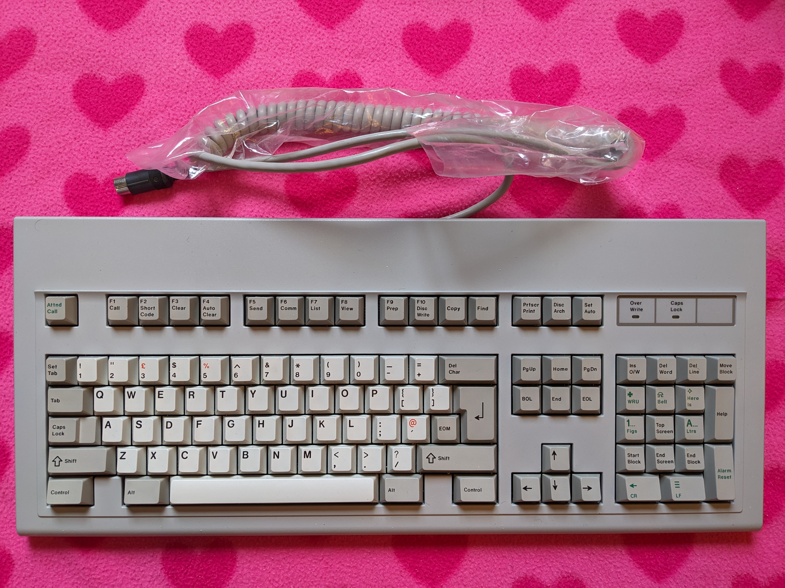

# Cherry G80-1104H Terminal Keyboard

**Configuration**: `cherry/G80-1104H`



---

## Overview

The Cherry G80-1104H is a UK ISO layout terminal keyboard with Cherry MX switches. Uses XT protocol with Scancode Set 1. Designed for the BT Merlin Cheetah Terminal (STC TX3000S Telex Terminal).

**Layout**: UK ISO-variant (missing extra key between Left Shift and Z)

---

## Specifications

| Specification | Details |
|---------------|---------|
| **Make** | Cherry |
| **Model** | G80-1104H BT Cheetah Terminal Keyboard (UK ISO) |
| **Keys** | 104 keys (UK ISO-variant, missing extra key between Left Shift and Z) |
| **Protocol** | XT |
| **Codeset** | Scancode Set 1 (XT standard) |
| **Connector** | 5-pin DIN (180° arrangement, XT standard) |
| **Voltage** | 5V |
| **Switch Type** | Cherry MX |
| **Key Rollover** | Full NKRO |
| **Layout** | UK ISO-variant (similar to UK ISO but missing 1 key) |

---

## Building Firmware

Build firmware specifically for this keyboard:

```bash
# Cherry G80-1104H only
docker compose run --rm -e KEYBOARD="cherry/G80-1104H" builder

# Cherry G80-1104H + AT/PS2 Mouse
docker compose run --rm -e KEYBOARD="cherry/G80-1104H" -e MOUSE="at-ps2" builder
```

**Output**: `build/rp2040-converter.uf2`

---

## Key Mapping

The default keymap preserves the UK ISO layout whilst adding modern functionality through the Fn modifier.

### Layout Overview

**Base Layer - Physical Layout** (from [`keyboard.c`](../../../src/keyboards/cherry/G80-1104H/keyboard.c)):

```
Cherry G80 (ISO Layout - 1104H):
This Keyboard was used on the BT Cheetah Plus.
Key legends are unique, however the keycodes match the IBM 101 Key keyboard.
Keyboard is also similar to UK ISO spec, but missing the extra key between left shift and Z.
,---.   ,---------------. ,---------------. ,---------------. ,-----------.
|Esc|   |F1 |F2 |F3 |F4 | |F5 |F6 |F7 |F8 | |F9 |F10|F11|F12| |PrS|ScL|Pau|
`---'   `---------------' `---------------' `---------------' `-----------'
,-----------------------------------------------------------. ,-----------. ,---------------.
|  `|  1|  2|  3|  4|  5|  6|  7|  8|  9|  0|  -|  =|     BS| |Ins|Hom|PgU| |NmL|  /|  *|  -|
|-----------------------------------------------------------| |-----------| |---------------|
|Tab  |  Q|  W|  E|  R|  T|  Y|  U|  I|  O|  P|  [|  ]|     | |Del|End|PgD| |  7|  8|  9|   |
|------------------------------------------------------.    | `-----------' |-----------|  +|
|CapsL |  A|  S|  D|  F|  G|  H|  J|  K|  L|  ;|  '|  \| Ret|               |  4|  5|  6|   |
|-----------------------------------------------------------|     ,---.     |---------------|
|Shift   |  Z|  X|  C|  V|  B|  N|  M|  ,|  ,|  /|     Shift|     |Up |     |  1|  2|  3|   |
|-----------------------------------------------------------| ,-----------. |-----------|Ent|
|Ctrl|    |Alt |          Space              |Alt |    |Ctrl| |Lef|Dow|Rig| |    0|    .|   |
`----'    `---------------------------------------'    `----' `-----------' `---------------'
```

### Raw Scancode Map

(from [`keyboard.h`](../../../src/keyboards/cherry/G80-1104H/keyboard.h)):

```
Cherry G80 (ISO Layout - 1104H):
Keyboard uses a Scancode Set 1
,---.   ,---------------. ,---------------. ,---------------. ,-----------.
| 01|   | 3B| 3C| 3D| 3E| | 3F| 40| 41| 42| | 43| 44| 57| 58| |*37| 46|*46|
`---'   `---------------' `---------------' `---------------' `-----------'
,-----------------------------------------------------------. ,-----------. ,---------------.
| 29| 02| 03| 04| 05| 06| 07| 08| 09| 0A| 0B| 0C| 0D|     0E| |e52|e47|e49| | 45|e35| 37| 4A|
|-----------------------------------------------------------| |-----------| |---------------|
| 0F  | 10| 11| 12| 13| 14| 15| 16| 17| 18| 19| 1A| 1B|     | |e53|e4F|e51| | 47| 48| 49| 4E|
|------------------------------------------------------.    | `-----------' |-----------|   |
| 3A   | 1E| 1F| 20| 21| 22| 23| 24| 25| 26| 27| 28| 2B| 1C |               | 4B| 4C| 4D|   |
|-----------------------------------------------------------|     ,---.     |---------------|
| 2A     | 2C| 2D| 2E| 2F| 30| 31| 32| 33| 34| 35|      36  |     |e48|     | 4F| 50| 51|e1C|
|-----------------------------------------------------------| ,-----------. |-----------|   |
| 1D |    | 7B |              39             | e38|    | e1D| |e4B|e50|e4D| |   52|   53|   |
`----'    `---------------------------------------`    '----' `-----------' `---------------'

e: E0-prefixed codes.
*: special handling codes
```

### Special Key Mappings

| Physical Key | Default Function | With Fn Modifier | Notes |
|--------------|------------------|------------------|-------|
| **Caps Lock** | Menu | — | Remapped to Menu key |
| **Right Alt** | Fn Modifier | — | Primary Fn key for this layout |
| **Right Ctrl** | GUI (Right) | — | Right GUI modifier |
| **F1** | F1 | F9 | Fn + F1 = F9 |
| **F2** | F2 | F10 | Fn + F2 = F10 |
| **F3** | F3 | F11 | Fn + F3 = F11 * |
| **F4** | F4 | F12 | Fn + F4 = F12 |
| **F5** | F5 | Volume Down | Fn + F5 = Vol Down |
| **F6** | F6 | Volume Up | Fn + F6 = Vol Up |
| **F7** | F7 | Brightness Down | Fn + F7 = Brightness Down |
| **F8** | F8 | Brightness Up | Fn + F8 = Brightness Up |

_* F11 works correctly, but may not display in Chrome on QMK Configurator test page_

### Fn Modifier Default

**Fn Modifier Key**: Right Alt (default, can be customised)

---

## Customisation

### Modifying Key Layout

To customise the key layout, edit the keymap in [`keyboard.c`](../../../src/keyboards/cherry/G80-1104H/keyboard.c):

```c
// Example: Change Fn modifier key from Right Alt to another key
// Edit the Fn layer definitions in the keymap
```

Available keycodes are defined in [`hid_keycodes.h`](../../../src/common/lib/hid_keycodes.h).

### Command Mode Keys

This keyboard uses the default command mode keys: **Left Shift + Right Shift**. Hold for 3 seconds to enter Command Mode.

---

## Hardware Connection

### Connector and Pinout

Cherry G80-1104H uses a **5-pin DIN connector** with **180° arrangement** (XT standard):

**Pinout details and diagram**: See [XT Protocol - Physical Interface](../../protocols/xt.md#physical-interface) for complete DIN-5 connector pinout diagrams and specifications.

**Note**: Pin 3 may be used for reset on some XT keyboards, but is not used by this converter.

### Wiring to RP2040

Connect the keyboard to your Raspberry Pi Pico:

| DIN Pin | Function | RP2040 GPIO | Notes |
|---------|----------|-------------|-------|
| 1 | CLOCK | GPIO 3 (DATA+1) | Must be DATA pin + 1 |
| 2 | DATA | GPIO 2 (default) | Configurable in [`config.h`](../../../src/config.h) |
| 4 | GND | GND | Any ground pin |
| 5 | VCC | VBUS (5V) | External 5V recommended for reliability |

**⚠️ Important**: CLOCK pin must be DATA pin + 1 (hardware constraint). If you change DATA to GPIO 10, CLOCK becomes GPIO 11.

See: [Hardware Setup Guide](../../getting-started/hardware-setup.md)

---

## Protocol Details

The Cherry G80-1104H uses the XT protocol with unidirectional communication:

- **Device to Host**: Keyboard sends scancodes only (unidirectional)
- **Host to Device**: No LED support (XT limitation)
- **Scancode Set**: Scancode Set 1 (XT standard)
- **Clock Frequency**: ~15 kHz (generated by keyboard)
- **Key Rollover**: Full N-key rollover (NKRO)

See: [XT Protocol Documentation](../../protocols/xt.md)

---

## History & Variants

### BT Merlin Cheetah Terminal System

The BT Merlin Cheetah was British Telecom's rebrand of the STC TX3000S Telex Terminal, used in the late 1980s and early 1990s for telecommunications. The G80-1104H was the UK ISO-variant designed for this system—a 104-key layout that's similar to UK ISO but missing the extra key between Left Shift and Z. It uses the XT protocol with Scancode Set 1, has custom key legends for terminal functions, and was built with Cherry MX switches for heavy commercial use.

### Cherry G80-1xxx Series

The G80-1xxx series represents Cherry's terminal keyboard offerings for BT Merlin Cheetah / STC TX3000S systems:

| Model | Layout | Protocol | Notes |
|-------|--------|----------|-------|
| **G80-0614H** | XT-variant | XT (Set 1) | US layout for BT Cheetah |
| **G80-1104H** | UK ISO | XT (Set 1) | UK layout for BT Cheetah (featured) |
| **G80-11xx** | Various | XT (Set 1) | Multiple regional variants for Cheetah system |

All models feature:
- XT protocol with Scancode Set 1
- Full NKRO hardware capability
- Cherry MX switches
- Designed for BT Merlin Cheetah (STC TX3000S) terminal system

### Terminal Keyboard Era

This keyboard's from when Cherry competed with IBM and other manufacturers in the commercial terminal keyboard market during the 1980s-1990s. Cherry MX switches were seeing growing adoption in commercial systems, and multiple regional variants were produced for heavy use in office environments.

### Collectibility

The G80-1104H was used with British Telecom's telex terminal system. UK ISO-variant layout with 104 keys. Full NKRO capability with Cherry MX switches. Uses XT protocol with Scancode Set 1. Built for telecommunications use.

---

## Troubleshooting

### Keyboard Not Detected

Check your wiring first—DATA should be GPIO2 and CLOCK should be GPIO3 by default (check [`config.h`](../../../src/config.h) to confirm). Make sure you have stable 5V power—external power's better than relying on the Pico's VBUS directly. 5-pin DIN connectors can have dodgy contacts, so clean them with contact cleaner if you're having issues. Worth remembering that the XT protocol's unidirectional, so the converter can't query the keyboard.

### Keys Not Registering

Cherry MX switches can fail—test individual switches if you're having problems. Debris can prevent switch actuation too, so give them a clean. Also check for cold solder joints or cracked traces on the PCB. Matrix diodes can pack in as well, which prevents key registration.

### Fn Modifier Not Working

Verify the Fn modifier's mapped to Right Alt in [`keyboard.c`](../../../src/keyboards/cherry/G80-1104H/keyboard.c), and make sure the Fn layer's properly defined in the keymap. Use an online key tester to verify Fn combinations are working.

### Status LEDs

The G80-1104H has status LEDs, but they're controlled internally by the keyboard itself. The XT protocol's unidirectional (keyboard to host only), so the host can't send commands back to control them. This means the LEDs can become out-of-sync with the host state—the keyboard tracks its own state, which might not match what the host thinks is happening.

### UK ISO Layout Issues

Make sure your OS is set to "British PC" or "UK" keyboard layout for proper character mapping. Some keys will produce different characters than US layouts (£, @, ", etc.). You can customise [`keyboard.c`](../../../src/keyboards/cherry/G80-1104H/keyboard.c) if you need different character mappings.

---

## Source Files

- **Configuration**: [`src/keyboards/cherry/G80-1104H/keyboard.config`](../../../src/keyboards/cherry/G80-1104H/keyboard.config)
- **Keymap**: [`src/keyboards/cherry/G80-1104H/keyboard.c`](../../../src/keyboards/cherry/G80-1104H/keyboard.c)
- **Header**: [`src/keyboards/cherry/G80-1104H/keyboard.h`](../../../src/keyboards/cherry/G80-1104H/keyboard.h)

---

## Related Documentation

- [Supported Keyboards](../README.md) - All supported keyboards
- [XT Protocol](../../protocols/xt.md) - Protocol details
- [Hardware Setup](../../getting-started/hardware-setup.md) - Wiring guide
- [Building Firmware](../../getting-started/building-firmware.md) - Build instructions
- [Command Mode](../../features/README.md) - Command mode features

---

## External Resources

- [Deskthority Wiki: Cherry G80 Series](https://deskthority.net/wiki/Cherry_G80_series)
- [Cherry MX Switch Documentation](https://deskthority.net/wiki/Cherry_MX)
- [UK ISO Layout Specification](https://en.wikipedia.org/wiki/British_and_American_keyboards)

