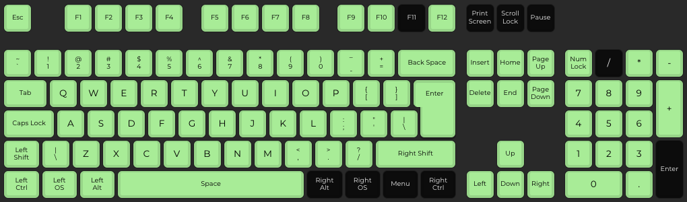

# IBM Model F PC/AT Keyboard

**Configuration**: `modelf/pcat`


---

## Overview

The IBM Model F PC/AT keyboard uses buckling spring over capacitive switch technology. This keyboard was designed for the IBM PC/AT (model 5170), before ISO and ANSI layouts were standardized. This configuration is based on the UK layout variant.

**Part Number**: 6450225 (UK Layout)

---

## Specifications

| Specification | Details |
|---------------|---------|
| **Make** | IBM |
| **Model** | Model F PC/AT Keyboard |
| **Keys** | 84 (compact layout) |
| **Protocol** | AT/PS2 |
| **Codeset** | Set 2 |
| **Connector** | 5-pin DIN (180° arrangement) |
| **Voltage** | 5V |
| **Switch Type** | Buckling spring over capacitive |
| **Key Rollover** | Full NKRO |
| **Layout** | UK layout (pre-ISO/ANSI standardization) |

---

## Building Firmware

Build firmware specifically for this keyboard:

```bash
# Model F PC/AT only
docker compose run --rm -e KEYBOARD="modelf/pcat" builder

# Model F PC/AT + AT/PS2 Mouse
docker compose run --rm -e KEYBOARD="modelf/pcat" -e MOUSE="at-ps2" builder
```

**Output**: `build/rp2040-converter.uf2`

See: [Building Firmware Guide](../../getting-started/building-firmware.md)

---

## Key Mapping

The default keymap preserves the original IBM 5170 keyboard layout while adding modern functionality through the Fn modifier.

### Base Layer Mapping (from keyboard.h)

From [`keyboard.c`](../../../src/keyboards/modelf/pcat/keyboard.c):

```
IBM Model F AT UK 84-key (UK Standard Layout - 6450225)
,-------. ,-----------------------------------------------------------. ,---------------.
| F1| F2| |  \|  1|  2|  3|  4|  5|  6|  7|  8|  9|  0|  -|  =|  #| BS| |Esc|NmL|ScL|SyR|
|-------| |-----------------------------------------------------------| |---------------|
| F3| F4| |Tab  |  Q|  W|  E|  R|  T|  Y|  U|  I|  O|  P|  [|  ]|     | |  7|  8|  9|  *|
|-------| |-----------------------------------------------------|     | |-----------|---|
| F5| F6| |Ctrl  |  A|  S|  D|  F|  G|  H|  J|  K|  L|  ;|  '|     Ret| |  4|  5|  6|  -|
|-------| |-----------------------------------------------------------| |---------------|
| F7| F8| |Shift   |  Z|  X|  C|  V|  B|  N|  M|  ,|  ,|  /|     Shift| |  1|  2|  3|   |
|-------| |-----------------------------------------------------------| |-----------|  +|
| F9|F10| |Alt |    |                  Space                |    |CapL| |      0|  .|   |
`-------' `----'    `---------------------------------------'    `----' `---------------'
```



*(Key test performed using [QMK Configurator](https://config.qmk.fm/#/test))*

### Raw Scancode Map

From [`keyboard.h`](../../../src/keyboards/modelf/pcat/keyboard.h):

```
IBM 5170 (Model F-AT) - Scancode Set 2 Subset of Set 3
,-------. ,-----------------------------------------------------------. ,---------------.
| 05| 06| | 0E| 16| 1E| 26| 25| 2E| 36| 3D| 3E| 46| 45| 4E| 55| 5D| 66| | 76| 77| 7E|~84|
|-------| |-----------------------------------------------------------| |---------------|
| 04| 0C| | 0D  | 15| 1D| 24| 2D| 2C| 35| 3C| 43| 44| 4D| 54| 5B| -5C | | 6C| 75| 7D| 7C|
|-------| |-----------------------------------------------------------| |---------------|
| 03| 0B| | 14   | 1C| 1B| 23| 2B| 34| 33| 3B| 42| 4B| 4C| 52|-53| 5A | | 6B| 73| 74| 7B|
|-------| |-----------------------------------------------------------| |---------------|
|~83| 0A| | 12 |-13| 1A| 22| 21| 2A| 32| 31| 3A| 41| 49| 4A|-51|   59 | | 69| 72| 7A| 79|
|-------| |-----------------------------------------------------------| |-----------|---|
| 01| 09| | 11  |   | -19 |             29            | -39 |   |  58 | |-68| 70| 71|-78|
`-------' `-----'   `---------------------------------------'   `-----' `---------------'

 -: Hidden Keys (not used in standard Layout)
 ~: Remaps to alternate code (83-02, 84-7F)
```

**Note**: Raw scancodes are a subset of Set 3 (from 122-key keyboards). By keycap labels they correspond to Set 2 values, but by key position they're Set 3. The converter maps these directly to the keymap array.

**Hidden Keys**: Keys marked with `-` are unused PCB pads that return scancodes but have no physical key switches installed.

### Key Assignments

| Physical Key | Default Function | With Fn Modifier | Notes |
|--------------|------------------|------------------|-------|
| **Pipe / Back Slash** | Pipe / Back Slash | Grave / Negation | Mac layout specific * |
| **Caps Lock** | Menu | — | Remapped to Menu key |
| **F10** | LGUI (GUI modifier) | — | Windows Key / Command Key |
| **F1** | F1 | F9 | Fn + F1 = F9 |
| **F2** | F2 | F10 | Fn + F2 = F10 |
| **F3** | F3 | F11 | Fn + F3 = F11 ** |
| **F4** | F4 | F12 | Fn + F4 = F12 |
| **F5** | F5 | Volume Down | Fn + F5 = Vol Down |
| **F6** | F6 | Volume Up | Fn + F6 = Vol Up |
| **F7** | F7 | Brightness Down | Fn + F7 = Brightness Down |
| **F8** | F8 | Brightness Up | Fn + F8 = Brightness Up |

_* Mapping may differ on Windows PC (not tested)_  
_** F11 works correctly, but may not display in Chrome on QMK Configurator test page_

### Numpad Navigation Layer

The numpad doubles as a navigation cluster when using the Fn modifier:

| Numpad Key | With Fn Modifier |
|------------|------------------|
| **Numpad 0** | Insert |
| **Numpad .** | Delete |
| **Numpad 1** | End |
| **Numpad 2** | Down Arrow |
| **Numpad 3** | Page Down |
| **Numpad 4** | Left Arrow |
| **Numpad 6** | Right Arrow |
| **Numpad 7** | Home |
| **Numpad 8** | Up Arrow |
| **Numpad 9** | Page Up |

### Fn Modifier Key

**Default Fn Key**: F9 (can be customised in [`keyboard.c`](../../../src/keyboards/modelf/pcat/keyboard.c))

---

## Customization

### Modifying Key Layout

To customise the key layout, edit the keymap in [`keyboard.c`](../../../src/keyboards/modelf/pcat/keyboard.c). Available keycodes are defined in [`hid_keycodes.h`](../../../src/common/lib/hid_keycodes.h).

### Command Mode Keys

This keyboard uses the default command mode keys: **Left Shift + Right Shift**

Hold for 3 seconds to enter command mode (bootloader entry).

---

## Hardware Connection

### Connector and Pinout

Model F PC/AT uses a **5-pin DIN connector** with **180° arrangement** (standard AT keyboard connector):

**Pinout details and diagram**: See [AT/PS2 Protocol - Physical Interface](../../protocols/at-ps2.md#physical-interface) for complete DIN-5 connector pinout diagrams and specifications.

### Wiring to RP2040

Connect the keyboard to your Raspberry Pi Pico:

| DIN Pin | Function | RP2040 GPIO | Notes |
|---------|----------|-------------|-------|
| 1 | CLOCK | GPIO 3 (DATA+1) | Must be DATA pin + 1 |
| 2 | DATA | GPIO 2 (default) | Configurable in [`config.h`](../../../src/config.h) |
| 4 | GND | GND | Any ground pin |
| 5 | VCC | VBUS (5V) | External 5V recommended for reliability |

**⚠️ Important**: CLOCK pin must be DATA pin + 1 (hardware constraint). If you change DATA to GPIO 10, CLOCK becomes GPIO 11.

See: [Hardware Setup Guide](../../getting-started/hardware-setup.md)

---

## Protocol Details

The Model F PC/AT uses the AT/PS2 protocol with bidirectional communication. The keyboard sends scancodes to the host, and the converter can send LED commands back. It responds to the identify command (0xF2) with just an acknowledge (0xFA).

The scancode set's a bit unusual—it uses Set 2 codes (by keycap labels), but they're actually a subset borrowed from the 122-key keyboard's Set 3 layout. The scancodes aren't contiguous because this 84-key layout's missing the 24 function keys that fill in the gaps on the full 122-key boards. You can't switch to a different scancode set either—it's fixed.

The keyboard supports full N-key rollover (NKRO).

See: [AT/PS2 Protocol Documentation](../../protocols/at-ps2.md) for complete technical details.

---

## History & Variants

The Model F PC/AT was designed for the IBM Personal Computer AT (model 5170). This 84-key layout was a transitional design that came before the standardized layouts we got with the Model M keyboards, and it turned out to be one of the last new Model F variants IBM would introduce.

The keyboard uses thick steel construction with dye-sublimated PBT keycaps. The buckling spring switches provide tactile and audible feedback. Unlike the later Model M which uses membrane assembly-based buckling springs, the Model F uses capacitive sensing where a change in capacitance is measured to register key presses.

The F/AT introduced a few significant changes to IBM's keyboard lineup. It was the first to use the AT protocol with bidirectional communication, which enabled LED control (the earlier XT keyboards couldn't manage that). It also introduced the ANSI-style large left shift key and separated numeric keypad that would become standard on later keyboards.

Example part numbers:

| Part Number | Region | Notes |
|-------------|--------|-------|
| **6450225** | UK | Featured configuration, pre-ISO layout |
| **6450200** | US | ANSI-predecessor layout |

**Note**: Many regional variants exist. See [Admiral Shark's Keyboards](https://sharktastica.co.uk/keyboard-directory/Ink3GUEA) for comprehensive part number directory.

---

## Troubleshooting

### Keyboard Not Detected

Check your wiring first—DATA should be GPIO2 and CLOCK should be GPIO3 by default (check [`config.h`](../../../src/config.h) to confirm). Make sure you have stable 5V power—external power's better than relying on the Pico's VBUS directly. 5-pin DIN connectors can have dodgy contacts, so clean them with contact cleaner if you're having issues. Model F keyboards need a power cycle to initialize properly.

### Keys Not Registering

Foam deterioration is a frequent issue—there's a foam layer sandwiched between the PCB and barrel plate, and it degrades over time. Age can also bring corrosion on the steel backing plate, PCB traces, or the springs themselves. Individual buckling springs may be deformed or missing, and the small plastic flippers can break which affects the capacitive sensing. Dirt on the capacitive sensing pads can also cause issues.

### Fn Modifier Not Working

Verify the Fn modifier's mapped to F9 in [`keyboard.c`](../../../src/keyboards/modelf/pcat/keyboard.c), and make sure the Fn layer's properly defined in the keymap. Use an online key tester to verify Fn combinations are working.

### LEDs Not Working

The LEDs should respond to Caps Lock and Num Lock. If they're not working, individual LEDs can fail over time. LED control comes from the keyboard controller, not the converter.

### Some Keys Produce Wrong Characters

Verify your OS keyboard layout settings match what you're expecting. You can customise [`keyboard.c`](../../../src/keyboards/modelf/pcat/keyboard.c) to match your preferred layout if needed.

---

## Source Files

- **Configuration**: [`src/keyboards/modelf/pcat/keyboard.config`](../../../src/keyboards/modelf/pcat/keyboard.config)
- **Keymap**: [`src/keyboards/modelf/pcat/keyboard.c`](../../../src/keyboards/modelf/pcat/keyboard.c)
- **Header**: [`src/keyboards/modelf/pcat/keyboard.h`](../../../src/keyboards/modelf/pcat/keyboard.h)

---

## Related Documentation

- [Supported Keyboards](../README.md) - All supported keyboards
- [AT/PS2 Protocol](../../protocols/at-ps2.md) - Protocol details
- [Hardware Setup](../../getting-started/hardware-setup.md) - Wiring guide
- [Building Firmware](../../getting-started/building-firmware.md) - Build instructions
- [Command Mode](../../features/README.md) - Command mode features

---

## External Resources

### Technical References

- **[Admiral Shark's Keyboards - IBM Personal Computer AT Keyboard](https://sharktastica.co.uk/keyboard-directory/Ink3GUEA)** - Comprehensive directory entry with part numbers, production dates, and specifications
- **[Admiral Shark's Keyboards - IBM Model F Wiki](https://sharktastica.co.uk/wiki/ibm-model-f)** - Authoritative Model F family history, design details, and technical documentation
- [Deskthority Wiki: IBM Model F](https://deskthority.net/wiki/IBM_Model_F) - Community-maintained technical information
- [Capacitive Buckling Spring Technology](https://deskthority.net/wiki/Buckling_spring#Capacitive) - Switch technology details

### Scancode Behavior

- **[VintagePC - IBM 6450225](https://www.seasip.info/VintagePC/ibm_6450225.html)** - Detailed scancode behavior documentation
- [AEB Linux Keyboard Scancodes](https://www.aeb.win.tue.nl/linux/kbd/scancodes-10.html) - Scancode Set translation tables

### Historical Context

- [IBM PC/AT Documentation](https://en.wikipedia.org/wiki/IBM_Personal_Computer/AT) - Wikipedia article on the IBM 5170 PC/AT

