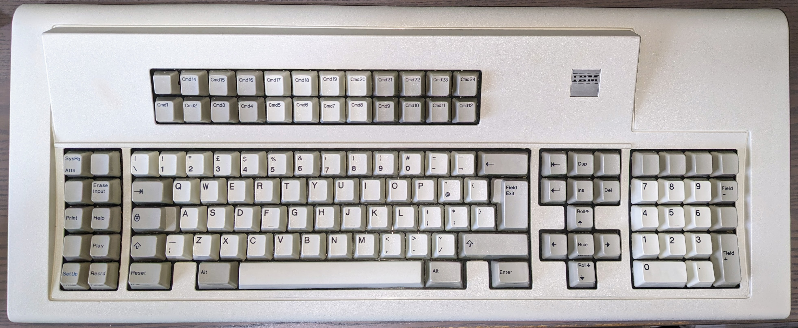

# IBM Model M M122 Terminal Keyboard

**Configuration**: `modelm/m122`



---

## Overview

The IBM Model M M122 is a 122-key terminal keyboard with membrane-based buckling spring switches. Made for various IBM terminal systems including the 3270 and 5250 families. This specific keyboard (part number 1390886) was made for the IBM 3197 Display Station.

**Part Numbers**: 1390876, 1390881, 1390886, 1390888 (Type 2)

---

## Specifications

| Specification | Details |
|---------------|---------|
| **Make** | IBM |
| **Model** | Model M M122 Terminal Keyboard |
| **Keys** | 122 |
| **Protocol** | AT/PS2 |
| **Codeset** | Scancode Set 3 |
| **Connector** | 5-pin DIN (240° arrangement) |
| **Voltage** | 5V |
| **Switch Type** | Buckling spring (membrane-based) |
| **Key Rollover** | 2-key rollover (2KRO) |


---

## Features

The buckling spring switches give tactile click and audible feedback—membrane-based like the regular Model M. The keyboard has a steel backplate with thick ABS plastic case and dye-sublimated PBT keycaps (or pad-printed on later models). The layout's 122 keys with 24 function keys (F1-F24) in two rows, full numeric keypad, and various terminal control keys.

The keyboard's limited to 2-key rollover (2KRO)—only two non-modifier keys can be reliably detected at the same time. This comes from the membrane-based matrix design, same as the standard Model M keyboards. In normal typing you won't notice, but if you're pressing multiple keys simultaneously the keyboard may miss anything beyond the second key. There's a quirk though—depending on which row and column the keys are on, you can sometimes get more than two keys detected. That's just how the membrane matrix is wired, not a design feature.

The connector's a 5-pin DIN with 240° pin arrangement (not the standard 180°), and the cable's hardwired—no removable SDL connector like some Model M Enhanced keyboards.

---

## Building Firmware

Build firmware specifically for this keyboard:

```bash
# Model M M122 only
docker compose run --rm -e KEYBOARD="modelm/m122" builder

# Model M M122 + AT/PS2 Mouse
docker compose run --rm -e KEYBOARD="modelm/m122" -e MOUSE="at-ps2" builder
```

**Output**: `build/rp2040-converter.uf2`

See: [Building Firmware Guide](../../getting-started/building-firmware.md)

---

## Key Mapping

The default keymap preserves the terminal keyboard layout whilst adapting it for modern use.

### Base Layer Mapping (Layer 0 - NumLock On)

From [`keyboard.c`](../../../src/keyboards/modelm/m122/keyboard.c):

```
IBM Model M M122 Terminal Keyboard:
              ,-----------------------------------------------.
              |F13|F14|F15|F16|F17|F18|F19|F20|F21|F22|F23|F24|
              |-----------------------------------------------|
              |F1 |F2 |F3 |F4 |F5 |F6 |F7 |F8 |F9 |F10|F11|F12|
              `-----------------------------------------------'
,-------. ,-----------------------------------------------------------. ,-----------. ,---------------.
|VDn|VUp| |  `|  1|  2|  3|  4|  5|  6|  7|  8|  9|  0|  -|  =|     BS| |  /|PgU|PgD| |Esc|NmL|ScL|  *|
|-------| |-----------------------------------------------------------| |-----------| |---------------|
|BDn|BUp| |Tab  |  Q|  W|  E|  R|  T|  Y|  U|  I|  O|  P|  [|  ]|     | |End|Ins|Del| |  7|  8|  9|  +|
|-------| |------------------------------------------------------.    | `-----------' |-----------|---|
|   |   | |CapsL |  A|  S|  D|  F|  G|  H|  J|  K|  L|  ;|  '|  #| Ret|     |Up |     |  4|  5|  6|  -|
|-------| |-----------------------------------------------------------| ,-----------. |---------------|
|   |   | |Shft|  \|  Z|  X|  C|  V|  B|  N|  M|  ,|  ,|  /|     Shift| |Lef|Hom|Rig| |  1|  2|  3|   |
|-------| |-----------------------------------------------------------| `-----------' |-----------|Ent|
|App|Gui| |Ctrl|    | Alt |           Space           | Alt |    |Ctrl|     |Dow|     |      0|  .|   |
`-------' `----'    `---------------------------------------'    `----'     `---'     `---------------'
```

**Notes**:
- **VDn/VUp**: Volume Down/Up (mapped to left side keys)
- **BDn/BUp**: Brightness Down/Up (mapped to left side keys)
- **App/Gui**: Application and GUI keys (mapped to left side keys)
- **Extra keys**: Various keys on left side provide modern functionality

### Raw Scancode Map

From [`keyboard.h`](../../../src/keyboards/modelm/m122/keyboard.h):

```
IBM Model M M122 Terminal Keyboard (Scancode Set 3):
              ,-----------------------------------------------.
              | 08| 10| 18| 20| 28| 30| 38| 40| 48| 50| 57| 5F|
              |-----------------------------------------------|
              | 07| 0F| 17| 1F| 27| 2F| 37| 3F| 47| 4F| 56| 5E|
              `-----------------------------------------------'
,-------. ,-----------------------------------------------------------. ,-----------. ,---------------.
| 05| 06| | 0E| 16| 1E| 26| 25| 2E| 36| 3D| 3E| 46| 45| 4E| 55|     66| | 67| 6E| 6F| | 76| 77| 7E|~84|
|-------| |-----------------------------------------------------------| |-----------| |---------------|
| 04| 0C| | 0D  | 15| 1D| 24| 2D| 2C| 35| 3C| 43| 44| 4D| 54| 5B|     | | 64| 65| 6D| | 6C| 75| 7D| 7C|
|-------| |------------------------------------------------------.    | `-----------' |---------------|
| 03| 0B| | 14   | 1C| 1B| 23| 2B| 34| 33| 3B| 42| 4B| 4C| 52| 53| 5A |     | 63|   | | 6B| 73| 74| 7B|
|-------| |-----------------------------------------------------------| ,-----------. |---------------|
|~83| 0A| | 12 | 13| 1A| 22| 21| 2A| 32| 31| 3A| 41| 49| 4A|      59  | | 61| 62| 6A| | 69| 72| 7A| 79|
|-------| |-----------------------------------------------------------| `-----------' |-----------|   |
| 01| 09| | 11  |   | 19 |               29            | 39 |   | 58  |     | 60|     |     70| 71|   |
`-------' `-----'   `---------------------------------------'   `-----'     `---'     `---------------'

~: Remaps to alternate code (83→02, 84→7F)
```

**Notes**:
- Scancode Set 3 values transmitted by the keyboard
- Scancodes 0x83 and 0x84 are remapped to 0x02 and 0x7F in the KEYMAP_PC122 macro
- These scancodes serve as indices into the keymap array for direct mapping

### Key Assignments

| Physical Key | Function | Notes |
|--------------|----------|-------|
| **F1-F12** | Standard function keys | Top row function keys |
| **F13-F24** | Extended function keys | Row above standard F-keys, fully mapped and functional |
| **Left Side Keys** | Various modern functions | Volume, brightness, App, GUI keys |

### Layer System

The keyboard defines a single layer (Layer 0) as the base layer. The numpad keys (P7, P8, P9, etc.) are sent directly to the host—Windows and Linux handle NumLock state natively, toggling between numeric and navigation functions.

For macOS, which lacks NumLock support, users could add a function layer to provide navigation key access. This would require editing [`keyboard.c`](../../../src/keyboards/modelm/m122/keyboard.c) to define additional layers and assign layer switching keys.

---

## Customisation

### Modifying Key Layout

To customise the key layout, edit the keymap in [`keyboard.c`](../../../src/keyboards/modelm/m122/keyboard.c). You can remap F13-F24 to media keys or macros, or adjust any of the function key assignments.

Keycode definitions are in [`hid_keycodes.h`](../../../src/common/lib/hid_keycodes.h).

### Command Mode Keys

This keyboard uses the default command mode keys: **Left Shift + Right Shift**

---

## Hardware Connection

### Connector and Pinout

Model M M122 uses a **5-pin DIN connector** with **240° arrangement** (non-standard orientation):

**Pinout details**: See [AT/PS2 Protocol - Physical Interface](../../protocols/at-ps2.md#physical-interface) for DIN-5 connector diagrams. Note the M122 uses the **240° pin arrangement**, not the standard 180° arrangement.

**Important differences**:
- **240° orientation**: Unique to terminal keyboards (pin 2 at bottom, not at side)
- **Fixed cable**: Non-removable, hardwired cable (unlike SDL models)
- **Terminal variants**: Some later variants used RJ45 connectors (not PS/2)

### Wiring to RP2040

Connect the keyboard to your Raspberry Pi Pico:

| DIN Pin | Function | RP2040 GPIO | Notes |
|---------|----------|-------------|-------|
| 1 | CLOCK | GPIO 3 (DATA+1) | Must be DATA pin + 1 |
| 2 | DATA | GPIO 2 (default) | Configurable in [`config.h`](../../../src/config.h) |
| 3 | NC | - | Not connected |
| 4 | GND | GND | Any ground pin |
| 5 | VCC | VBUS (5V) | External 5V recommended for reliability |

**⚠️ Important**: CLOCK pin must be DATA pin + 1 (hardware constraint). If you change DATA to GPIO 10, CLOCK becomes GPIO 11.

See: [Hardware Setup Guide](../../getting-started/hardware-setup.md)

---

## Protocol Details

The Model M M122 uses the AT/PS2 protocol with bidirectional communication. The keyboard sends scancodes to the host, and the converter can send configuration commands back. The keyboard uses Scancode Set 3.

### Initialisation Configuration

Terminal keyboards using Set 3 aren't in make/break mode by default. During initialisation, the converter sends command **0xF8** (Set All Keys to Make/Break) to configure the keyboard to send both key press (make) and key release (break) events for all keys. This is essential for proper operation with modern USB HID.

**Initialisation sequence** (from [`keyboard_interface.c`](../../../src/protocols/at-ps2/keyboard_interface.c)):
1. Keyboard reset (0xFF) and self-test (waits for 0xAA response)
2. Read keyboard ID (0xF2) - detects Set 3 terminal keyboard
3. Set all keys to make/break mode (0xF8) - enables key release events
4. Normal operation begins

### Status LEDs

**Type 1, Type 2, and Type 3 M122 keyboards don't have status LEDs**. They won't respond to any commands to set lock-light states (NumLock, CapsLock, ScrollLock). Only Type 4 (Host Connected Keyboard) has status LEDs in the top-right corner.

See [AT/PS2 Protocol Documentation](../../protocols/at-ps2.md) for complete technical details.

---

## History & Variants

### Terminal Keyboards

The M122 keyboards were made for various IBM terminal systems—different variants for different terminal models in the 3270 and 5250 families, including the 3191, 3196, and 3197 Display Stations. This specific keyboard (part number 1390886) was made for the IBM 3197 Display Station.

### Type Variants

IBM made the M122 in three main types:

- **Type 1**: Original terminal keyboard design
- **Type 2**: Modified with flip-out feet instead of two-setting risers
- **Type 3**: Redesigned with compact "battlecruiser" profile and wedge shape

This specific keyboard is Type 2. Type 4 was the Host Connected Keyboard for PC terminal emulation—different from the terminal variants.

### Type 2 Part Numbers

Example Type 2 part numbers:

| Part Number | Description |
|-------------|-------------|
| **1390876** | Type 2 variant |
| **1390881** | Type 2 variant |
| **1390886** | Type 2 variant (featured) |
| **1390888** | Type 2 variant |

**Note**: This is not a comprehensive list. See [Admiral Shark's Keyboards](https://sharktastica.co.uk/keyboard-directory/iSNpxnhm) for complete Model M M122 directory.

---

## Troubleshooting

### Keyboard Not Detected

**Check the basics first:**
- Verify DATA/CLOCK pins match [`config.h`](../../../src/config.h)
- Check 5V is stable—use external power rather than Pico VBUS if possible
- DIN connector can oxidise over time—clean the pins with contact cleaner
- Test cable continuity—old cables may have broken wires inside

### Keys Not Registering

**Possible causes:**
- Buckling springs accumulate dirt—disassemble and clean the keyboard
- Keyboard membrane may be torn or deteriorated
- Individual buckling springs might be deformed or missing
- Broken rivets can cause registration problems—may need screw or bolt modding
- Barrel plates can split over time, especially in older keyboards

### Function Keys F13-F24 Not Working

**Check these:**
- Verify F13-F24 are properly mapped in [`keyboard.c`](../../../src/keyboards/modelm/m122/keyboard.c)
- Some applications don't support F13-F24—test with a key tester first
- All function keys should work in standard HID mode

---

## Source Files

- **Configuration**: [`src/keyboards/modelm/m122/keyboard.config`](../../../src/keyboards/modelm/m122/keyboard.config)
- **Keymap**: [`src/keyboards/modelm/m122/keyboard.c`](../../../src/keyboards/modelm/m122/keyboard.c)
- **Header**: [`src/keyboards/modelm/m122/keyboard.h`](../../../src/keyboards/modelm/m122/keyboard.h)

---

## Related Documentation

- [Supported Keyboards](../README.md) - All supported keyboards
- [AT/PS2 Protocol](../../protocols/at-ps2.md) - Protocol details
- [Hardware Setup](../../getting-started/hardware-setup.md) - Wiring guide
- [Building Firmware](../../getting-started/building-firmware.md) - Build instructions
- [Command Mode](../../features/README.md) - Command mode features

---

## External Resources

### Technical Documentation
- [sharktastica - IBM 3197 Display Station (1390886)](https://sharktastica.co.uk/keyboard-directory/iSNpxnhm)
- [Scancode Set 3 Documentation](../../scancodes/set3.md)
- [AT/PS2 Protocol Documentation](../../protocols/at-ps2.md)

### Community Resources
- [Deskthority Wiki - IBM Model M](https://deskthority.net/wiki/IBM_Model_M)
- [sharktastica Keyboard Directory](https://sharktastica.co.uk/keyboard-directory)

