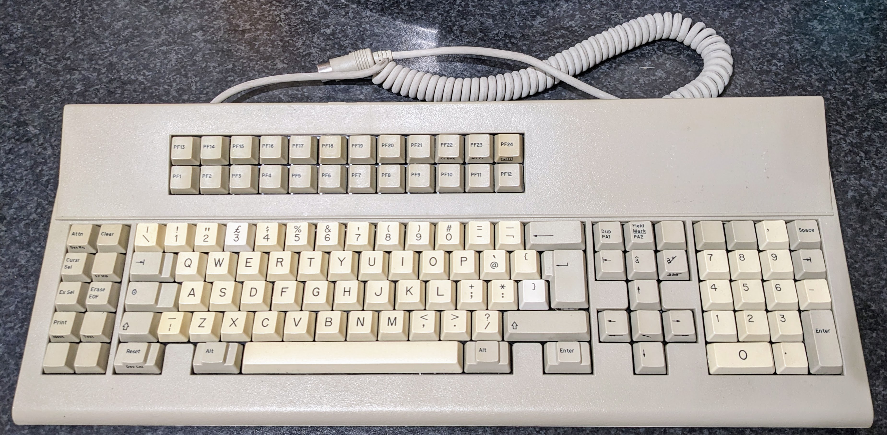

# Micro Switch 122ST13 Terminal Keyboard

**Configuration**: `microswitch/122st13`



---

## Overview

The Micro Switch 122ST13 is a 122-key terminal keyboard using Micro Switch ST membrane switches. The layout's similar to IBM 3270 terminal keyboards, but uses a standard 180° 5-pin DIN (AT) connector instead of the 240° arrangement found on IBM terminal keyboards.

Micro Switch marketed these as having "solid state capacitance switching" despite being membrane-based—odd marketing language for what's just a membrane keyboard. The hardware does support N-key rollover though, which is unusual for membrane keyboards of this era.

**Production Period**: 1984-1991 (documented range)  
**Variant**: 122ST13S-25E (blue plungers, blade mount keycaps)

---

## Specifications

| Specification | Details |
|---------------|---------|
| **Make** | Micro Switch (Honeywell) |
| **Model** | 122ST13 Terminal Keyboard |
| **Keys** | 122 |
| **Protocol** | AT/PS2 |
| **Codeset** | Scancode Set 3 |
| **Connector** | 5-pin DIN (180° arrangement) |
| **Voltage** | 5V |
| **Switch Type** | Micro Switch ST (membrane-based) |
| **Key Rollover** | N-key rollover (NKRO) |
| **Layout** | Terminal layout (24 function keys) |

---

## Features

The Micro Switch ST switches are membrane-based with rubber domes and membrane contact layers. The keyboard has 122 keys with 24 function keys (F1-F24) arranged in two rows above the standard function row, full numeric keypad, and various terminal control keys—same layout pattern as IBM 3270 terminal keyboards.

The hardware supports N-key rollover (NKRO), which is unusual for membrane-based keyboards. The 122ST13 achieves full NKRO despite the membrane design. The keyboard was built for commercial and industrial environments with heavy-duty construction.

The connector's a standard 5-pin DIN with 180° pin arrangement (same as IBM Model M Enhanced), and the cable's hardwired—no removable SDL connector.

---

## Building Firmware

Build firmware specifically for this keyboard:

```bash
# MicroSwitch 122ST13 only
docker compose run --rm -e KEYBOARD="microswitch/122st13" builder

# MicroSwitch 122ST13 + AT/PS2 Mouse
docker compose run --rm -e KEYBOARD="microswitch/122st13" -e MOUSE="at-ps2" builder
```

**Output**: `build/rp2040-converter.uf2`

See: [Building Firmware Guide](../../getting-started/building-firmware.md)

---

## Key Mapping

The default keymap preserves the terminal keyboard layout while adapting it for modern use.

### Base Layer Mapping (Layer 0 - NumLock On)

From [`keyboard.c`](../../../src/keyboards/microswitch/122st13/keyboard.c):

```
Micro Switch 122ST13 Terminal Keyboard:
              ,-----------------------------------------------.
              |F13|F14|F15|F16|F17|F18|F19|F20|F21|F22|F23|F24|
              |-----------------------------------------------|
              |F1 |F2 |F3 |F4 |F5 |F6 |F7 |F8 |F9 |F10|F11|F12|
              `-----------------------------------------------'
,-------. ,-----------------------------------------------------------. ,-----------. ,---------------.
|VDn|VUp| |  `|  1|  2|  3|  4|  5|  6|  7|  8|  9|  0|  -|  =|     BS| |  /|PgU|PgD| |Esc|NmL|ScL|  *|
|-------| |-----------------------------------------------------------| |-----------| |---------------|
|BDn|BUp| |Tab  |  Q|  W|  E|  R|  T|  Y|  U|  I|  O|  P|  [|  ]|     | |End|Ins|Del| |  7|  8|  9|  +|
|-------| |------------------------------------------------------.    | `-----------' |-----------|---|
|   |   | |CapsL |  A|  S|  D|  F|  G|  H|  J|  K|  L|  ;|  '|  #| Ret|     |Up |     |  4|  5|  6|  -|
|-------| |-----------------------------------------------------------| ,-----------. |---------------|
|   |   | |Shft|  \|  Z|  X|  C|  V|  B|  N|  M|  ,|  ,|  /|     Shift| |Lef|Hom|Rig| |  1|  2|  3|   |
|-------| |-----------------------------------------------------------| `-----------' |-----------|Ent|
|App|Gui| |Ctrl|    | Alt |           Space           | Alt |    |Ctrl|     |Dow|     |      0|  .|   |
`-------' `----'    `---------------------------------------'    `----'     `---'     `---------------'
```

**Notes**:
- **VDn/VUp**: Volume Down/Up (mapped to left side keys)
- **BDn/BUp**: Brightness Down/Up (mapped to left side keys)
- **App/Gui**: Application and GUI keys (mapped to left side keys)
- **Extra keys**: Various keys on left side provide modern functionality

### Raw Scancode Map

From [`keyboard.h`](../../../src/keyboards/microswitch/122st13/keyboard.h):

```
Micro Switch 122ST13 Terminal Keyboard (Scancode Set 3):
              ,-----------------------------------------------.
              | 08| 10| 18| 20| 28| 30| 38| 40| 48| 50| 57| 5F|
              |-----------------------------------------------|
              | 07| 0F| 17| 1F| 27| 2F| 37| 3F| 47| 4F| 56| 5E|
              `-----------------------------------------------'
,-------. ,-----------------------------------------------------------. ,-----------. ,---------------.
| 05| 06| | 0E| 16| 1E| 26| 25| 2E| 36| 3D| 3E| 46| 45| 4E| 55|     66| | 67| 6E| 6F| | 76| 77| 7E|~84|
|-------| |-----------------------------------------------------------| |-----------| |---------------|
| 04| 0C| | 0D  | 15| 1D| 24| 2D| 2C| 35| 3C| 43| 44| 4D| 54| 5B|     | | 64| 65| 6D| | 6C| 75| 7D| 7C|
|-------| |------------------------------------------------------.    | `-----------' |---------------|
| 03| 0B| | 14   | 1C| 1B| 23| 2B| 34| 33| 3B| 42| 4B| 4C| 52| 53| 5A |     | 63|   | | 6B| 73| 74| 7B|
|-------| |-----------------------------------------------------------| ,-----------. |---------------|
|~83| 0A| | 12 | 13| 1A| 22| 21| 2A| 32| 31| 3A| 41| 49| 4A|      59  | | 61| 62| 6A| | 69| 72| 7A| 79|
|-------| |-----------------------------------------------------------| `-----------' |-----------|   |
| 01| 09| | 11  |   | 19 |               29            | 39 |   | 58  |     | 60|     |     70| 71|   |
`-------' `-----'   `---------------------------------------'   `-----'     `---'     `---------------'

~: Remaps to alternate code (83→02, 84→7F)
```

**Notes**:
- Scancode Set 3 values transmitted by the keyboard
- Scancodes 0x83 and 0x84 are remapped to 0x02 and 0x7F in the KEYMAP_PC122 macro
- These scancodes serve as indices into the keymap array for direct mapping

### Key Assignments

| Physical Key | Function | Notes |
|--------------|----------|-------|
| **F1-F12** | Standard function keys | Top row function keys |
| **F13-F24** | Extended function keys | Row above standard F-keys, fully mapped and functional |
| **Left Side Keys** | Various modern functions | Volume, brightness, App, GUI keys |

### Function Layer

The Fn modifier key provides access to bootloader entry functionality:

| Fn + Key | Function | Notes |
|----------|----------|-------|
| **Fn (assigned)** | Function layer access | Enables bootloader entry via Left Shift + Right Shift |

### Fn Modifier Key

The Fn modifier is assigned for bootloader entry even though it may not be physically present on the keyboard. This preserves command mode functionality.

**Note**: Keyboard layout may vary by specific 122ST13 variant—different models had custom legends for their intended terminal systems.

---

## Customization

### Modifying Key Layout

To customize the key layout, edit the keymap in [`keyboard.c`](../../../src/keyboards/microswitch/122st13/keyboard.c). You can remap F13-F24 to media keys or macros, or adjust any of the function key assignments.

Keycode definitions are in [`hid_keycodes.h`](../../../src/common/lib/hid_keycodes.h).

### Command Mode Keys

This keyboard uses the default command mode keys: **Left Shift + Right Shift**

---

## Hardware Connection

### Connector and Pinout

Micro Switch 122ST13 uses a **5-pin DIN connector** with **180° arrangement** (standard AT interface, fixed non-removable cable):

**Pinout details and diagram**: See [AT/PS2 Protocol - Physical Interface](../../protocols/at-ps2.md#physical-interface) for complete DIN-5 connector pinout diagrams and specifications.

**Note**: Fixed, non-removable cable (not interchangeable like SDL models).

### Wiring to RP2040

Connect the keyboard to your Raspberry Pi Pico:

| DIN Pin | Function | RP2040 GPIO | Notes |
|---------|----------|-------------|-------|
| 1 | CLOCK | `GPIO 3` (DATA+1) | Must be DATA pin + 1 |
| 2 | DATA | `GPIO 2` (default) | Configurable in [`config.h`](../../../src/config.h) |
| 3 | NC | - | Not connected |
| 4 | GND | GND | Any ground pin |
| 5 | VCC | VBUS (5V) | External 5V recommended for reliability |

**⚠️ Important**: CLOCK pin must be DATA pin + 1 (hardware constraint). If you change DATA to `GPIO 10`, CLOCK becomes `GPIO 11`.

See: [Hardware Setup Guide](../../getting-started/hardware-setup.md)

---

## Protocol Details

The MicroSwitch 122ST13 uses the AT/PS2 protocol with bidirectional communication:

- **Device to Host**: Keyboard sends scancodes
- **Host to Device**: Converter sends configuration commands during initialization
- **Scancode Set**: Set 3
- **Clock Frequency**: 10-16.7 kHz
- **Key Rollover**: N-key rollover (NKRO) - hardware capability

### Initialization Configuration

Terminal keyboards using Set 3 are **not** in make/break mode by default. During initialization, the converter sends command **0xF8** (Set All Keys to Make/Break) to configure the keyboard to send both key press (make) and key release (break) events for all keys. This is essential for proper operation with modern USB HID.

**Initialization sequence** (from [`keyboard_interface.c`](../../../src/protocols/at-ps2/keyboard_interface.c)):
1. Keyboard reset (0xFF) and self-test (waits for 0xAA response)
2. Read keyboard ID (0xF2) - detects Set 3 terminal keyboard
3. Set all keys to make/break mode (0xF8) - enables key release events
4. Normal operation begins

See: [AT/PS2 Protocol Documentation](../../protocols/at-ps2.md)

---

## History & Variants

### Terminal Keyboards

Micro Switch (a division of Honeywell) made terminal keyboards for commercial and industrial use from the 1970s through the 1990s. They competed with Cherry and IBM in the terminal keyboard market, producing keyboards for IBM 3270 and 5250 compatible systems.

The 122ST13 uses Micro Switch ST membrane switches—rubber domes with membrane contact layers. Despite being membrane-based, Micro Switch marketed them as "solid state capacitance switching", which is odd terminology for membrane keyboards. The hardware does support full N-key rollover though, which is unusual for membrane-based keyboards.

### 122ST13 Variants

The 122ST13 series has multiple variants with different protocols and layouts:

| Variant | Description | Interface | Notes |
|---------|-------------|-----------|-------|
| **122ST13-2** | IBM 3179/3180 compatible | IBM 3179/3180 plug compatible, audio feedback | 1986 catalog model |
| **122ST13-12** | IBM 3270 PC compatible | IBM 3270 PC plug compatible | PC interface |
| **122ST13-14** | IBM 3270 PC compatible | IBM PC plug compatible, optional PC-AT | Alternative PC interface |
| **122ST13S-25E** | AT/PS2 protocol | Standard AT interface, blue plungers | 1987 documented example |
| **122ST33S-46E-J** | Unknown variant | Telex-branded, insufficient documentation | May be contact membrane |

**Plunger Colors**: DIN-compliant switches used black plungers for Honeywell mount keycaps or blue plungers for blade mount keycaps.

---

## Troubleshooting

### Keyboard Not Detected

**Check the basics first:**
- Verify DATA/CLOCK pins match [`config.h`](../../../src/config.h)
- Check 5V is stable—use external power rather than Pico VBUS if possible
- Fixed 5-pin DIN cables can fail—test continuity
- Older keyboards may have failed controller chips

### Keys Not Registering

**Possible causes:**
- Membrane layers accumulate dirt—disassemble and clean carefully with isopropyl alcohol
- Membrane layers may be torn or deteriorated
- Check for cold solder joints or cracked traces on the PCB
- Controller chip may have failed (older keyboards)
- Rubber domes lose elasticity over time

### Function Keys F13-F24 Not Working

**Check these:**
- Verify F13-F24 are properly mapped in [`keyboard.c`](../../../src/keyboards/microswitch/122st13/keyboard.c)
- Some applications don't support F13-F24—test with a key tester first
- All function keys should work in standard HID mode

### Membrane Issues

**Problems to check:**
- Membrane contacts can oxidize—clean with isopropyl alcohol
- Membrane layers must be properly aligned during reassembly
- Finding replacement membranes is extremely difficult for these keyboards

---

## Source Files

- **Configuration**: [`src/keyboards/microswitch/122st13/keyboard.config`](../../../src/keyboards/microswitch/122st13/keyboard.config)
- **Keymap**: [`src/keyboards/microswitch/122st13/keyboard.c`](../../../src/keyboards/microswitch/122st13/keyboard.c)
- **Header**: [`src/keyboards/microswitch/122st13/keyboard.h`](../../../src/keyboards/microswitch/122st13/keyboard.h)

---

## Related Documentation

- [Supported Keyboards](../README.md) - All supported keyboards
- [AT/PS2 Protocol](../../protocols/at-ps2.md) - Protocol details
- [Hardware Setup](../../getting-started/hardware-setup.md) - Wiring guide
- [Building Firmware](../../getting-started/building-firmware.md) - Build instructions
- [Command Mode](../../features/README.md) - Command mode features

---

## External Resources

- [Deskthority Wiki: MicroSwitch](https://deskthority.net/wiki/Micro_Switch)
- [MicroSwitch Switch Technology](https://deskthority.net/wiki/Micro_Switch_switches)
- [Terminal Keyboard History](https://deskthority.net/wiki/Terminal_keyboard)
- [Telcontar.net: SC/CT/ST Series](https://telcontar.net/KBK/Micro_Switch/SC-CT-ST) - Detailed technical documentation

