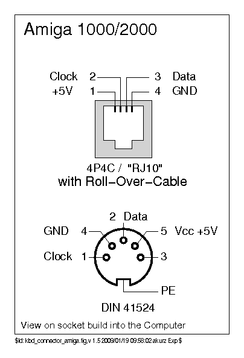
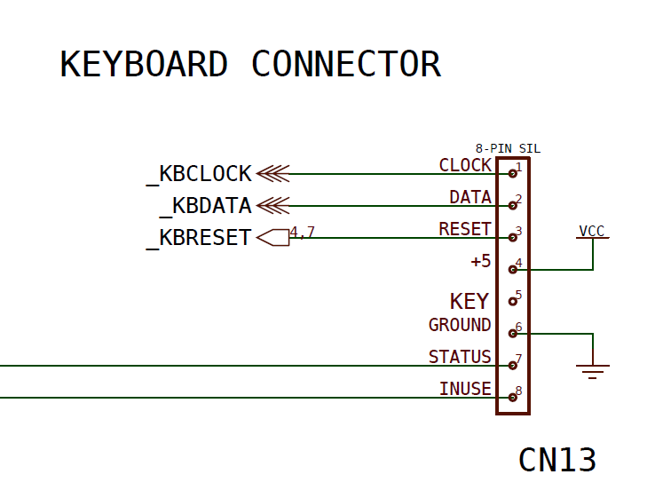

# Amiga Protocol

The Amiga keyboard protocol is a bidirectional serial protocol used in Commodore Amiga computers. Unlike simpler unidirectional protocols like the IBM XT, every byte the Amiga keyboard sends requires a handshake response from the host. If it doesn't receive one within 143ms, the keyboard enters a resynchronisation mode to recover, which ensures the keyboard and host stay in sync even if communication temporarily breaks down.

The protocol uses bit rotation—instead of transmitting bits in the usual 0-7 order, it sends them as 6-5-4-3-2-1-0-7. This means bit 7 (which indicates whether a key is pressed or released) is transmitted last. According to the Commodore Hardware Reference Manual, this design reduces problems from lost synchronisation.

---

## Historical Context

The Amiga keyboard protocol is consistent across the Amiga product line, with all models using the same core protocol: identical timing, handshake requirements, and bit rotation design. The protocol is well-documented in Commodore's official hardware reference manual (Appendix H).

### Protocol Variations

Whilst the core protocol remains consistent, there are practical differences between Amiga keyboard models:

**Physical Connectors**: Different Amiga models used various physical connectors (RJ-10, 5-pin DIN, internal headers), which means adapters may be needed when mixing keyboards and systems. The A500 keyboard is integrated into the computer's case and connects internally. External keyboards from other models can often be used interchangeably with appropriate cable adapters.

**Scancode Variations**: Core keys (letters, numbers, modifiers) are identical across all models. Differences appear in the numeric keypad and function keys—some models use different scancodes for the same physical keys. The A1000 lacks a Help key but supports the reset warning feature (CTRL + both Amiga keys). The A500 adds a Help key but doesn't support reset warning codes (using the RESET pin instead). When implementing support, verify scancode mappings for your specific keyboard model rather than assuming uniformity.

**Documentation Coverage**: The official Commodore Hardware Reference Manual documents the A1000, A500, A2000, and A3000. Later models like the A4000, A600, and A1200 aren't covered in that specification, so protocol compatibility for those models cannot be confirmed from official documentation.

---

## Protocol Overview

### Key Characteristics

**Bidirectional with Mandatory Handshake**:

- **Keyboard → Host**: Transmits scan codes serially (8 bits, ~60µs per bit)
- **Host → Keyboard**: Must respond with 85µs handshake pulse within 143ms
- **Failure Mode**: Missing handshake triggers resynchronisation (keyboard sends 1-bits until acknowledged)
- **Recovery**: After handshake received, keyboard sends 0xF9 (lost sync) and retransmits last byte

**Bit Rotation (6-5-4-3-2-1-0-7)**:

Transmitting bit 7 (key up/down flag) **last** prevents stuck-key failures:
- If sync lost mid-byte: Incomplete data interpreted as key-down
- Next sync point has bit 7 set (key-up)
- Result: Brief transient, not catastrophic stuck modifier

**Active-Low Logic**: HIGH=0, LOW=1 (open-drain design, noise immunity)

**Self-Clocked**: Keyboard generates timing (~17 kbit/s), host follows

---

## Physical Interface

### Connectors and Pinouts

**Important Note**: Different Amiga models used various physical connector types. The protocol is electrically identical across all models, but physical adapters may be required.



*Image credit: [KbdBabel Vintage Keyboard Documentation](http://kbdbabel.org/conn/index.html)*

**Standard 4-Wire Interface**

All Amiga keyboards use a 4-wire interface regardless of physical connector:

- **CLOCK** - Clock (keyboard drives, unidirectional output)
- **DATA** - Data (bidirectional: keyboard transmits, host acknowledges)
- **VCC** - +5V power supply
- **GND** - Ground reference (0V)

**Common Connector Types**

Amiga systems used various physical connectors across different models.

**A1000 - RJ-10 Connector (4P4C)**

The A1000 used a 4-position modular connector (RJ-10, 4P4C):

| Pin | Signal | Description |
|-----|--------|-------------|
|  1  | +5V    | Power supply (+5 volts) |
|  2  | CLOCK  | Keyboard Clock (output from keyboard) |
|  3  | DATA   | Keyboard Data (bidirectional) |
|  4  | GND    | Ground reference (0V) |

**A2000, A3000 - DIN-5 Connector (180° Configuration)**

These models used a 5-pin DIN connector (180° configuration):

| Pin | Signal | Description |
|-----|--------|-------------|
|  1  | CLOCK  | Keyboard Clock (output from keyboard) |
|  2  | DATA   | Keyboard Data (bidirectional) |
|  3  | NC     | Not Connected |
|  4  | GND    | Ground reference (0V) |
|  5  | +5V    | Power supply (+5 volts) |

**Note**: Some very early Amiga 2000 keyboards may have a different pinout.

**A4000T - DIN-5 Connector (180° Configuration)**

The A4000T uses a 5-pin DIN connector:

| Pin | Signal | Description |
|-----|--------|-------------|
|  1  | CLOCK  | Keyboard Clock (output from keyboard) |
|  2  | DATA   | Keyboard Data (bidirectional) |
|  3  | NC     | Not Connected |
|  4  | GND    | Ground reference (0V) |
|  5  | +5V    | Power supply (+5 volts) |

**A4000 - 6-Pin Mini-DIN Connector**

The A4000 uses a 6-pin mini-DIN connector (similar to PS/2 style):

| Pin | Signal | Description |
|-----|--------|-------------|
|  1  | I/O    | Input/Output (function varies by configuration) |
|  2  | NC     | Not Connected |
|  3  | GND    | Ground reference (0V) |
|  4  | +5V    | Power supply (+5 volts, 100mA) |
|  5  | CLOCK  | Keyboard Clock (output from keyboard) |
|  6  | NC     | Not Connected |

**Note**: The A4000 and A4000T are not covered in the official Commodore Hardware Manual specification, so protocol compatibility cannot be guaranteed.

**A500 - Internal 8-Pin Header**



The A500 used an internal 8-pin header connector:

| Pin | Signal    | Description |
|-----|-----------|------------- |
|  1  | CLOCK       | Keyboard Clock (output from keyboard) |
|  2  | DATA      | Keyboard Data (bidirectional) |
|  3  | RESET     | Reset signal |
|  4  | VCC       | Power supply (+5 volts) |
|  5  | KEY       | Keying pin (no connection) |
|  6  | GND       | Ground reference (0V) |
|  7  | Power LED | Power LED signal |
|  8  | Drive LED | Drive LED signal |

**Note**: LED signals on the A500 connector are optional and not required for basic keyboard operation. The protocol itself does not define LED control; if present, these are system-specific implementations.

**Wiring for Converter Projects**

For the RP2040 converter implementation, you need only the 4 essential signals:

1. **CLOCK** → Connect to GPIO (e.g., pin N + 1, must be adjacent to DATA)
2. **DATA** → Connect to GPIO (e.g., pin N, the base data pin)
3. **+5V** → Connect to 5V power supply
4. **GND** → Connect to ground

Additional pins on multi-pin connectors (RESET, LED signals, etc.) can be left unconnected for basic keyboard functionality.

**Connector Compatibility Note**

Whilst the protocol is identical, different physical connectors may require adapters or custom cables to connect a keyboard from one Amiga model to another Amiga system or to converter hardware. Always verify your specific keyboard's connector type before wiring.

### Electrical Characteristics

**Logic Levels (Active-Low)**:

```
HIGH (Logic 0 / Idle):
- Voltage: 4.5V to 5.5V
- Interpretation: No action, idle state

LOW (Logic 1 / Active):
- Voltage: 0V to 0.8V
- Interpretation: Active assertion, transmission

Pull-Up: Both CLOCK and DATA lines have pull-up resistors (4.7kΩ typical)
```

**Signal Characteristics**:

```
Type: Open-Drain (or Open-Collector)
Pull-Up Location: Host motherboard (not in keyboard)
Idle State: Both CLOCK and DATA HIGH (pulled up)
Active State: Keyboard or host pulls line LOW (sinks current)
```

**Power Requirements**:

```
Voltage: +5V ±5% (4.75V to 5.25V)
Current: 30-80mA typical (varies by keyboard model)
Startup: May draw up to 150mA during power-on initialisation
```

**Timing Characteristics**:

| Parameter | Value | Notes |
|-----------|-------|-------|
| **Bit Period** | ~60µs | Keyboard-generated (approximately 16.7 kHz) |
| **Setup Phase** | ~20µs | CLOCK HIGH, DATA stable before transition |
| **Clock Low** | ~20µs | CLOCK LOW, data active |
| **Clock High** | ~20µs | CLOCK HIGH, host samples DATA |
| **Handshake Duration** | 85µs min, 110µs actual | Our PIO: 100µs calculated, 110µs measured |
| **Handshake Timeout** | 143ms | Keyboard enters resync if no response |
| **PIO Clock Divider** | 500 | 4µs per cycle (125 MHz / 500) |

### Signal Integrity

**Cable Considerations**:

- **Maximum Length**: 1-2 meters recommended (longer cables increase noise)
- **Shielding**: Not required for typical installations, but helps in noisy environments
- **Capacitance**: Keep cable capacitance low (< 100pF) for clean signals

**Noise Immunity**:

The active-low open-drain architecture provides good noise immunity:
- Pull-up resistors provide HIGH default state
- LOW states actively driven (strong signal)
- Open-drain prevents bus conflicts (both sides can drive LOW safely)

**Recommended Protection**:

```
- Series resistors: 100Ω on CLOCK and DATA (limit current, protect against shorts)
- ESD protection: Transient voltage suppressors (TVS diodes) on signal lines
- Power filtering: 0.1µF ceramic + 10µF electrolytic capacitors near keyboard
```

---

## Communication Protocol

### Bit Timing and Frame Structure

Each byte transmission consists of **8 bits transmitted in rotated order** with precise timing defined in the Commodore Amiga Hardware Reference Manual:

> **From Official Specification** *(using Commodore's original signal names CLOCK/DATA)*:  
> "The keyboard processor sets the DATA line about **20 microseconds** before it pulls CLOCK low. CLOCK stays low for about **20 microseconds**, then goes high again. The processor waits another **20 microseconds** before changing DATA. Therefore, the bit rate during transmission is about **60 microseconds per bit**, or 17 kbits/sec."  
> — *Amiga Hardware Reference Manual, Appendix H*
> 
> **Note**: For consistency across our project, we use **CLOCK** and **DATA** instead of the original KCLK/KDAT naming.

```
Timing Diagram (One Bit Period ~60µs):

         Setup      Data Low    Data High
       |←20µs→|     |←20µs→|     |←20µs→|
       ________     ________     ________
CLOCK          \___/        \___/
       
       _______________________
DATA   ______________________/     (Example: Transmitting 1-bit)

Phase 1: Setup     - CLOCK HIGH, DATA transitions to value (20µs)
Phase 2: Data Low  - CLOCK falls, DATA stable (20µs)
Phase 3: Data High - CLOCK rises, host samples DATA (20µs)
Total bit period: 60µs (as specified in hardware manual)
```

**Bit Transmission Sequence**:

```
For byte value 0x3C (00111100 binary):
Bit positions:    7  6  5  4  3  2  1  0
Bit values:       0  0  1  1  1  1  0  0

Transmission order: 6 → 5 → 4 → 3 → 2 → 1 → 0 → 7
Actual sequence:    0 → 1 → 1 → 1 → 1 → 0 → 0 → 0

Timeline:
Bit 1 (bit 6=0): 60µs
Bit 2 (bit 5=1): 60µs
Bit 3 (bit 4=1): 60µs
Bit 4 (bit 3=1): 60µs
Bit 5 (bit 2=1): 60µs
Bit 6 (bit 1=0): 60µs
Bit 7 (bit 0=0): 60µs
Bit 8 (bit 7=0): 60µs
Total: 480µs per byte
```

### Signal Timing Diagrams

**Complete 8-Bit Transmission**:

```
Normal Byte Transmission (Keyboard → Host):

      ___   ___   ___   ___   ___   ___   ___   ___   _______
CLOCK    \_/   \_/   \_/   \_/   \_/   \_/   \_/   \_/

      _______________________________________________________
DATA        \_____x_____x_____x_____x_____x_____x_____x_____/
              (6)   (5)   (4)   (3)   (2)   (1)   (0)   (7)

         First bit                               Last bit
         transmitted                             transmitted

Timing per bit:
- Bit setup:   ~20µs (DATA stable before CLOCK falls)
- Clock low:   ~20µs (CLOCK held low)
- Clock high:  ~20µs (CLOCK returns high, data sampled)
- Total:       ~60µs per bit
- Bit rate:    ~16.67 kHz (approximately 17 kbit/sec)
```

**Handshake Response (Host → Keyboard)**:

```
Host Acknowledgment After Receiving Byte:

      __________________________________________________
CLOCK                                                ↑
                                             8th rising edge

      _____________________             ________________
DATA                       \___________/
                           ↑           ↑
                           |           |
                        Start         End
                 (within 1µs)         (85µs minimum hold)

Handshake Requirements:
- Start: Within 1µs of 8th CLOCK rising edge
- Duration: 85µs minimum (mandatory for all keyboard models)
- Hardware detection: Keyboard latches pulses ≥1µs
- Release: DATA returns HIGH via pull-up resistor
```

**Power-Up Synchronisation Sequence**:

```
Keyboard Power-On (Finding Sync):

      ___     ___     ___     ___     ___     ___
CLOCK    \___/   \___/   \___/   \___/   \___/   \___  (Continuous 1-bits)

      _______     _______     _______     _______
DATA         \___/       \___/       \___/       \___  (Waiting for handshake)

Process:
1. Keyboard clocks out 1-bits slowly (~60µs per bit)
2. Host may be booting (could take seconds or minutes)
3. Keyboard continues clocking until handshake received
4. Maximum 8 clocks if keyboard plugged into running system

After Handshake Received:

      __________________________________________________
CLOCK                                                   (Idle)

      _____________________             ________________
DATA                       \___________/
                           ↑           ↑
                        Handshake   Sync Achieved

Result: Keyboard and host now synchronised, normal operation begins
```

**Complete Transaction Example (Key Press)**:

```
Example: "B" Key Pressed (Scancode 0x35 = 00110101 binary)

Transmitted order after rotation: 01101010

      ___   ___   ___   ___   ___   ___   ___   ___   ______
CLOCK    \_/   \_/   \_/   \_/   \_/   \_/   \_/   \_/

      _______            ______      ______      ___________
DATA         \__________/      \____/      \____/

           0     1     1     0     1     0     1     0

Bit sequence sent: 6→5→4→3→2→1→0→7 = 0,1,1,0,1,0,1,0

After receiving all 8 bits, host sends handshake:
      _________________________________________________
CLOCK

      __________________            ___________________
DATA                    \__________/
                          ← 85µs →
```

### Handshake Protocol

After transmitting all 8 bits, the keyboard **immediately** waits for host acknowledgment:

```
Complete Transaction Timing:

Keyboard transmits 8 bits (480µs)
         ↓
Keyboard waits for handshake (0-143ms timeout)
         ↓
Host pulls DATA LOW for 85µs minimum
         ↓
Host releases DATA (goes HIGH)
         ↓
Keyboard ready for next transmission
```

**Handshake Requirements**:

| Parameter | Value | Notes |
|-----------|-------|-------|
| **Protocol Minimum** | 85µs | Mandatory for all keyboard models |
| **Hardware Detection** | ≥1µs | Keyboard latch threshold |
| **Implementation** | ~110µs | PIO: 100µs calculated, 110µs measured |
| **Maximum Delay** | 143ms | Timeout triggers resync mode |

**Why 85µs?** Whilst hardware detects ≥1µs pulses, different keyboard models vary. The 85µs spec ensures universal compatibility (A1000/A500/A2000/A3000). Our 110µs provides +29% safety margin.

#### No Frame Validation Required

**Critical Protocol Characteristic**: The official Commodore Amiga Hardware Reference Manual specifies **no parity checking, no checksums, and no error detection mechanism** for individual data frames. The host must always send the handshake pulse after receiving 8 clock pulses, regardless of data validity.

**From Official Specification**:
> "When the computer has received the eighth bit, it must pulse KDAT low for at least 1 (one) microsecond, as a handshake signal to the keyboard."
> — *Amiga Hardware Reference Manual, Appendix H*

The specification provides no conditions under which the handshake should be withheld. The host acknowledges reception of 8 bits, not validation of data correctness.

**Error Detection Mechanism**: The protocol's error recovery relies entirely on **timing**, not data validation:

| Condition | Detection Method | Recovery Action |
|-----------|------------------|------------------|
| **Bad data** | None - not detected | Host accepts whatever was received |
| **Missing handshake** | 143ms timeout (keyboard-side) | Keyboard enters resync mode |
| **Lost sync** | Handshake timeout during transmission | Keyboard sends 0xF9, retransmits byte |

The keyboard's 143ms timeout is the **only error detection mechanism** in the protocol. If the keyboard doesn't receive the handshake pulse within 143ms, it assumes synchronisation is lost and enters resynchronisation mode (transmitting continuous 1-bits until acknowledged).

**Implementation Consequence**: Hardware implementations (such as PIO-based receivers) can safely acknowledge every received byte automatically without software validation. The protocol specification requires this behaviour.

### Error Recovery: Resynchronisation Mode

If handshake timeout (143ms) occurs, keyboard enters resync mode:

1. Transmits continuous 1-bits (~60µs each) until handshake received
2. Host sends 85µs handshake
3. Keyboard exits resync, sends 0xF9 (Lost Sync code)
4. Keyboard retransmits original byte
5. Normal operation resumes

The 0xF9 code notifies host to discard partial data and reset receive state.

**Timing-Based Recovery**: Resynchronisation is triggered **only** by missing handshake timeout, not by detecting bad data. The protocol has no mechanism for the keyboard to determine if transmitted data was corrupted. The keyboard assumes:

- If handshake received: Host successfully received the byte (regardless of actual data quality)
- If handshake not received within 143ms: Communication failure, enter resync

Noise or glitches that corrupt data bits but don't prevent the host from sending the handshake will result in the corrupted data being accepted by both keyboard and host.

---

## Keyboard Operation

### Power-On Initialisation

**Complete Power-Up Sequence**:

```
Step 1: Power-On Self-Test
- Keyboard receives +5V power from host
- Internal microcontroller boots and initialises
- Self-test executes (duration varies by keyboard model):
  a. ROM checksum verification
  b. RAM read/write test  
  c. Watchdog timer test
  d. Key matrix row line check (detecting shorts)

Step 2: Self-Test Results
SUCCESS:
  → Proceed to synchronisation
  
FAILURE:
  → Send 0xFC (self-test failed) code
  → Enter LED blink error indication mode
  → Keyboard will NOT respond to key presses
  
Step 3: Synchronisation
- Keyboard clocks out 1-bits slowly (~60µs per bit)
- Waits for host to send handshake
- May continue for seconds/minutes if host still booting
- Maximum 8 clocks needed if plugged into running system

Step 4: Power-Up Key Stream
- Send 0xFD (initiate power-up key stream)
- Send codes for ANY keys currently held down
  (bit 7=0 for each, indicating "pressed")
- Send 0xFE (terminate power-up key stream)
- Turn off CAPS LOCK LED
- Enter normal operation mode

Typical sequence: Power → Self-test → Sync → 0xFD → 0xFE → Ready
```

**Self-Test LED Blink Codes**:

If self-test fails, the keyboard enters an error state and blinks the CAPS LOCK LED:

| Blink Pattern | Meaning | Description |
|---------------|---------|-------------|
| **1 blink** | ROM checksum failure | Firmware corrupted, keyboard non-functional |
| **2 blinks** | RAM test failed | Internal memory defective |
| **3 blinks** | Watchdog timer failure | Microcontroller timing malfunction |
| **4 blinks** | Row line short | Physical short between keyboard matrix rows |

**Blink Rate**: Approximately one burst per second (e.g., 1 blink → pause → 1 blink → pause...)

**Recovery**: Self-test failures are fatal—keyboard will not function until repaired. These indicate hardware problems, not communication issues.

**Important**: Unlike some protocols, Amiga keyboards do **not** send a "BAT Passed" (0xAA) code after successful self-test. Instead, they enter synchronisation mode and wait for the host to handshake, confirming bidirectional communication works.

### Scan Code Transmission

```
Normal Operation Loop:

1. Keyboard scans key matrix (continuous polling)
2. Detects key state change:
   - Key pressed: Bit 7 = 0, bits 6-0 = key code
   - Key released: Bit 7 = 1, bits 6-0 = key code
3. Transmits scan code (8 bits in rotated order: 6-5-4-3-2-1-0-7)
4. Waits for handshake (up to 143ms)
5. If handshake received:
   - Acknowledges, ready for next key event
6. If handshake timeout:
   - Enter resync mode (transmit 1-bits)
   - Wait for handshake
   - Send 0xF9 (lost sync)
   - Retransmit original byte
7. Return to step 1
```

### Scan Code Format

```
Bit Layout:
7  6  5  4  3  2  1  0
|  |              |
|  └──────────────┴─ Key code (0x00 to 0x7F)
└─ Key state: 0=pressed, 1=released

Examples:
0x33 = 00110011 binary → Key 0x33 pressed (bit 7=0)
0xB3 = 10110011 binary → Key 0x33 released (bit 7=1)

0x50 = 01010000 binary → Key 0x50 pressed
0xD0 = 11010000 binary → Key 0x50 released
```

**Key Code Range**:
- **0x00 - 0x67**: Standard key codes (104 keys max)
- **0x78**: Reset warning (see Special Features section)
- **0xF9**: Lost synchronisation (error recovery)
- **0xFA**: Keyboard buffer overflow (too many simultaneous keys)
- **0xFC**: Self-test failed (hardware error)
- **0xFD**: Initiate power-up key stream (internal use)
- **0xFE**: Terminate key stream (internal use)

### Scan Code Set

The Amiga uses a **custom scan code set** based on the physical keyboard matrix layout.

**Matrix Organisation**:

```
Structure: 6 rows × 16 columns = 96 possible key positions
Encoding: Column (bits 6-4) | Row (bits 3-2) | Always 0 (bits 1-0)
Range: 0x00 to 0x67 (104 possible codes, not all used)
```

**Standard Keycode Format**:

```
Make Code (Key Press):
  Bit 7: 0 (pressed)
  Bits 6-0: Key identification

Break Code (Key Release):  
  Bit 7: 1 (released)
  Bits 6-0: Key identification

Example:
  0x35 = B key pressed
  0xB5 = B key released (0x35 | 0x80)
```

**Note**: For complete scancode tables including all keys, modifiers, function keys, and keyboard variants, see the **[Amiga Scancode Set](../scancodes/amiga.md)** documentation.

---

## Special Features

### CAPS LOCK LED Control

Amiga keyboards handle CAPS LOCK with unique behaviour requiring sophisticated synchronisation:

**Keyboard Behaviour**:
- CAPS LOCK LED is physically in the keyboard
- Keyboard sends event **only on key press** (never on release)
- Bit 7 indicates **LED state** (not key state):
  - **Bit 7 = 0** (0x62): LED is **ON** (CAPS LOCK active)
  - **Bit 7 = 1** (0xE2): LED is **OFF** (CAPS LOCK inactive)

**USB HID Behaviour**:
- Host computer controls CAPS LOCK via HID reports
- Press+release cycle toggles the state
- Host sends LED state back to device

**Synchronisation Challenge**:

The converter must keep keyboard LED state and USB HID state synchronised, especially after reboot:

| Keyboard LED | USB HID | Converter Action | Reason |
|--------------|---------|------------------|--------|
| OFF | OFF | **SKIP** toggle | Already synchronised |
| OFF | ON | **SEND** toggle | Need to turn USB OFF |
| ON | OFF | **SEND** toggle | Need to turn USB ON |
| ON | ON | **SKIP** toggle | Already synchronised |

**Implementation Strategy**:

The converter implements smart synchronisation by comparing keyboard LED state against USB HID state. Only when states differ does it queue a press+release toggle sequence. A 125ms hold time between press and release ensures macOS compatibility.

**Synchronisation Logic**:
```c
// Extract from keyboard_interface.c (lines 266-292)
bool kbd_led_on = (data_byte & AMIGA_BREAK_BIT_MASK) == 0;  // Bit 7=0 means LED ON
bool hid_caps_on = lock_leds.keys.capsLock; // Current USB HID state

if (kbd_led_on == hid_caps_on) {
    // States match - keyboard and HID are synchronised
    // Do nothing - no HID events needed
} else {
    // States differ - need to toggle HID to synchronise
    // Queue press event (bit 7=0)
    if (!ringbuf_is_full()) {
        ringbuf_put(AMIGA_CAPSLOCK_KEY);        // Press (0x62)
        // Start timing state machine - release will be sent after delay
        caps_lock_timing.state = CAPS_PRESS_SENT;
        caps_lock_timing.press_time_ms = to_ms_since_boot(get_absolute_time());
    }
}
```

- **Implementation Note**: See [`keyboard_interface.c`](../../src/protocols/amiga/keyboard_interface.c) lines 266-305 for complete state comparison logic and non-blocking timing state machine

**Example: Reboot Desync Recovery**

1. Before reboot: Keyboard LED **ON**, USB HID **ON** (synchronised)
2. Converter reboots: Keyboard LED **ON** (still powered), USB HID **OFF** (reset)
3. User presses CAPS LOCK: Keyboard sends 0xE2 (LED turning **OFF**)
4. Converter checks: `kbd_led_on=false`, `hid_caps_on=false` → **States match!**
5. Result: No toggle sent (already synchronised at OFF)

Without this check, the converter would blindly send a toggle, causing USB to go OFF→ON (wrong direction).

### Reset Warning System

The Amiga protocol includes a graceful reset mechanism preventing accidental data loss:

**Trigger**: CTRL + Left Amiga + Right Amiga simultaneously

**Protocol Sequence**:

1. **First 0x78**: Keyboard sends first reset warning → Host **must** handshake normally (85µs)
2. **Second 0x78**: Keyboard sends second warning → Host **must** pull DATA LOW within 250ms
3. **Grace Period**: Host keeps DATA LOW for up to 10 seconds (emergency cleanup time)
4. **Completion**:
   - User holds keys 10 seconds → Hard reset (keyboard pulls CLOCK LOW for 500ms)
   - User releases keys → Keyboard sends 0xF8 (reset aborted), normal operation resumes
   - Host pulls DATA HIGH → Immediate hard reset

**Compatibility**: A500 keyboards do **not** support reset warning (no 0x78 codes)

### Special Codes Summary

| Code | Value | Description |
|------|-------|-------------|
| **Reset Warning** | 0x78 | CTRL + both Amiga keys pressed, 10s countdown starts |
| **Reset Abort** | 0xF8 | User released keys during countdown, reset aborted |
| **Lost Sync** | 0xF9 | Resynchronisation completed, about to retransmit byte |
| **Buffer Overflow** | 0xFA | Too many simultaneous keys, keyboard buffer full |
| **Self-Test Failed** | 0xFC | Hardware error detected during power-on test |
| **Initiate Stream** | 0xFD | Power-up key stream start (internal protocol use) |
| **Terminate Stream** | 0xFE | Power-up key stream end (internal protocol use) |

---

## Implementation Notes

### Overview

This implementation handles the Amiga protocol almost entirely in hardware using the RP2040's PIO (Programmable I/O) peripheral. The PIO does the heavy lifting—receiving the 8 bits in their rotated order and automatically sending the handshake pulse. Software overhead is minimal.

The architecture is simple: the PIO state machine receives each byte and generates the 100µs handshake pulse entirely in hardware—before the interrupt handler even fires. When a complete byte arrives, an interrupt handler fires to de-rotate the bits back into normal order, check for any special codes, and queue the result into a ring buffer. The main loop then processes these scan codes whenever the USB HID interface is ready to accept them.

The state machine itself is deliberately simple—just two states: UNINITIALISED (waiting for the first byte after power-up) and INITIALISED (normal operation). The transition happens on the first byte received, whatever that may be. Special codes like 0xF9 (lost sync) or 0x78 (reset warning) are handled in the event processor rather than as separate states, which keeps the logic clean and maintainable.

### Key Implementation Files

- **[`keyboard_interface.pio`](../../src/protocols/amiga/keyboard_interface.pio)**: PIO assembly for bit reception and handshake
- **[`keyboard_interface.h`](../../src/protocols/amiga/keyboard_interface.h)**: Protocol constants and inline helpers
- **[`keyboard_interface.c`](../../src/protocols/amiga/keyboard_interface.c)**: State machine and event processing
- **[Amiga Scancode Set](../scancodes/amiga.md)**: Scancode to HID keycode translation

### Bit De-Rotation

Since the Amiga keyboard transmits bits in rotated order (6-5-4-3-2-1-0-7 instead of the standard 0-7 sequence), we need to de-rotate them back to normal byte order before processing. The PIO receives the bits exactly as transmitted, and the interrupt handler performs the de-rotation using a simple inline helper function.

The rotation exists to prevent stuck keys when synchronisation is lost—bit 7 (which indicates key up/down) is transmitted last, so incomplete bytes are more likely to be interpreted as transient key presses rather than stuck modifiers. But for our scancode processing, we need the bits back in standard order where bit 7 is in its normal position.

```c
// Inline helper from keyboard_interface.h
static inline uint8_t amiga_derotate_byte(uint8_t rotated) {
    // Received: [6 5 4 3 2 1 0 7]
    // Target:   [7 6 5 4 3 2 1 0]
    uint8_t original = 0;
    original |= (rotated & 0x01) << 7;  // Bit 0 → Bit 7
    original |= (rotated & 0xFE) >> 1;  // Bits 7-1 → Bits 6-0
    return original;
}
```

This de-rotation happens once per byte in the interrupt handler, keeping it fast and efficient.

### PIO Handshake Implementation

The handshake pulse is generated entirely in PIO hardware immediately after receiving all 8 bits. This is where the RP2040's PIO peripheral really shines—we can generate precise timing without any software intervention, which means no blocking operations in the main code and deterministic timing regardless of what else the CPU is doing.

```assembly
; From keyboard_interface.pio
; After 8 bits received, send 100µs handshake pulse

set pins, 0         ; Pull DATA low
set pindirs, 1      ; Set DATA as output
set x, 24           ; Loop counter (25 iterations: 24→0)

handshake_loop:
    jmp x--, handshake_loop  ; 1 cycle per iteration

set pindirs, 0      ; Release DATA (goes high via pull-up)
```

The timing works out like this: we're using a clock divider of 500, which gives us 4µs per PIO cycle (125 MHz ÷ 500). The loop runs 25 iterations (counting from 24 down to 0), which gives us exactly 100µs for the handshake pulse.

**Timing Calculation**:
- Clock divider: 500 (optimised for 20µs CLOCK pulse detection)
- PIO cycle time: 125 MHz / 500 = 4µs per cycle
- Loop iterations: 25 (counts 24→0)
- Handshake duration: 25 × 4µs = 100µs

This meets all the requirements: it's well above the 85µs minimum the keyboard needs, comfortably below the 143ms timeout, and because it's pure hardware, there are no blocking operations in software and the timing is absolutely precise.

### State Machine

The state machine is deliberately kept simple with just two states. There's no need for complex state tracking here because the PIO and interrupt handler take care of the protocol mechanics.

```c
// From keyboard_interface.c (lines 119-128)
static enum {
  UNINITIALISED,    // Initial state, waiting for first byte
  INITIALISED       // Normal operation
} keyboard_state = UNINITIALISED;
```

When the converter powers up, it starts in UNINITIALISED state. The keyboard will be sending synchronisation pulses (1-bits) until it receives a handshake from the PIO. Once we get that first valid byte—whatever it may be—we transition to INITIALISED state (lines 205-207). From that point on, it's just normal operation—receiving scancodes and processing them.

You might expect to see separate states for things like "waiting for handshake" or "processing special codes", but those are handled elsewhere. The PIO takes care of handshaking automatically in hardware (before the ISR even fires), and special codes (like 0xF9 for lost sync or 0x78 for reset warning) are processed in the event handler based on the received byte value rather than as distinct state machine states. This keeps the state machine focused on initialisation vs. normal operation, which makes the code easier to follow and maintain.

---

## Troubleshooting

The Amiga protocol's bidirectional handshake requires correct timing and connector pinout (several different connectors exist across the Amiga line). For general hardware setup troubleshooting, check the **[Hardware Setup Guide](../getting-started/hardware-setup.md)**.

**Basic voltage checks with a multimeter:**
- VCC: 5.0V ±5%
- GND: 0V
- Idle CLOCK/DATA: ~5V (pulled HIGH)

### Common Issues

| Symptom | Likely Cause | What to Check |
|---------|--------------|---------------|
| No response | Power issue, bad connections | Check VCC, GND, verify connector pinout |
| Continuous resync (0xF9) | Missing handshake | Verify PIO handshake pulse (100µs), check DATA output |
| Garbled scancodes | Wrong bit order, no de-rotation | Verify bit de-rotation (6-5-4-3-2-1-0-7 → 7-6-5-4-3-2-1-0) |
| CAPS LOCK desync | LED encoding mismatch | Check bit 7 manipulation for LED state |
| Missing key events | Handshake too short | Ensure handshake ≥ 85µs (implementation uses 100µs) |
| Initialisation fails | Wrong connector | Verify pinout: RJ-10 (A1000), DIN-5 (A2000/A3000), header (A500) |
| Reset warning issues | Model doesn't support | A500 doesn't support 0x78 codes, uses RESET pin instead |

---

## Related Documentation

- **[Hardware Setup](../hardware/README.md)** - Physical connections and wiring
- **[Keyboards](../keyboards/README.md)** - Supported Amiga keyboards
- **[Amiga Scancode Set](../scancodes/amiga.md)** - Complete scancode reference

---

## References

### Official Commodore Documentation

1. **[Commodore Amiga Hardware Reference Manual - Appendix H](http://amigadev.elowar.com/read/ADCD_2.1/Hardware_Manual_guide/node0172.html)** - Official keyboard interface specification (Amiga Developer CD 2.1)
   - [Keyboard Communications](http://amigadev.elowar.com/read/ADCD_2.1/Hardware_Manual_guide/node0173.html) - Complete timing specifications:
     * 20µs setup, clock low, clock high phases (60µs bit period)
     * 85µs minimum handshake pulse requirement  
     * 143ms handshake timeout
     * Bit rotation specification (6-5-4-3-2-1-0-7 transmission order)
   - [Out-of-Sync Condition](http://amigadev.elowar.com/read/ADCD_2.1/Hardware_Manual_guide/node0176.html) - Resynchronisation behaviour
   - [Special Codes](http://amigadev.elowar.com/read/ADCD_2.1/Hardware_Manual_guide/node017B.html) - Protocol special codes (0x78, 0xF9, 0xFA, 0xFC, 0xFD, 0xFE)

### Historical and Hardware Information

2. **[Big Book of Amiga Hardware - A4000T](https://bigbookofamigahardware.com/bboah/product.aspx?id=4)** - Verified DIN-5 keyboard connector on A4000T

3. **[KbdBabel Vintage Keyboard Documentation](http://kbdbabel.org/conn/index.html)** - Connector pinout information and diagrams

4. **[SACC Amiga Keyboard Documentation](https://sacc.org/demo/keyboard/a-keyboard.html)** - Detailed pinout information for various Amiga models (A1000, A2000, A3000, A4000, CDTV, CD32)

### Our Implementation

This converter implementation is based entirely on the official Commodore specifications with no reverse-engineering required:

5. **[`keyboard_interface.pio`](../../src/protocols/amiga/keyboard_interface.pio)** - RP2040 PIO state machine implementing:
   - 8-bit serial reception with CLOCK monitoring
   - Automatic 100µs handshake pulse (exceeds 85µs minimum requirement)
   - Timing calculations verified against 60µs bit period specification

6. **[`keyboard_interface.c`](../../src/protocols/amiga/keyboard_interface.c)** - Protocol implementation:
   - Bit de-rotation (received 6-5-4-3-2-1-0-7 → standard 7-6-5-4-3-2-1-0)
   - CAPS LOCK synchronisation logic (handles keyboard LED encoding)
   - Special code processing (0xF9 resync, 0x78 reset warning, etc.)
   - State machine for keyboard initialisation sequence

7. **[`keyboard_interface.h`](../../src/protocols/amiga/keyboard_interface.h)** - Protocol constants from official specification:
   - Timing constants (85µs handshake, 143ms timeout)
   - Special code definitions
   - Inline bit de-rotation helper function

### Implementation Validation

8. All timing specifications implemented per official Commodore documentation
9. Handshake pulse (100µs actual) exceeds 85µs minimum requirement with safety margin
10. Special codes handling matches Appendix H specification
11. Tested with actual Amiga keyboards (implementation validated against hardware)

---

**Questions or stuck on something?**  
Pop into [GitHub Discussions](https://github.com/PaulW/rp2040-keyboard-converter/discussions) or [report a bug](https://github.com/PaulW/rp2040-keyboard-converter/issues) if you've found an issue.

