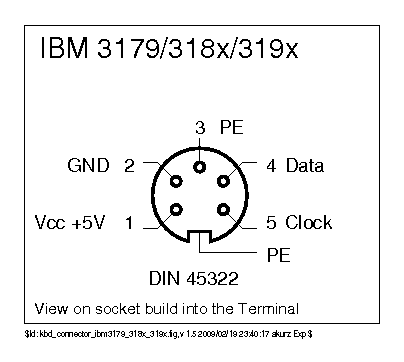
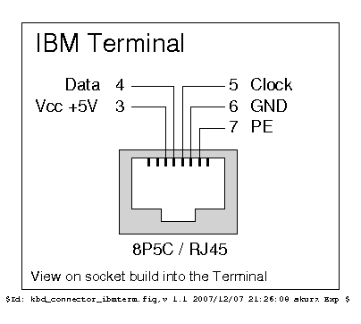

# AT/PS2 Protocol

**Status**: ✅ Production | **Last Updated**: 28 October 2025

The AT/PS2 protocol is a bidirectional, synchronous serial communication protocol that revolutionized PC peripherals in the 1980s. Originally developed for the IBM PC/AT keyboard in 1984, it was later standardized with the PS/2 connector in 1987 and became the universal interface for both keyboards and mice until USB adoption in the late 1990s.

---

## Table of Contents

- [Historical Context](#historical-context)
- [Protocol Overview](#protocol-overview)
- [Physical Interface](#physical-interface)
- [Communication Protocol](#communication-protocol)
- [Keyboard Implementation](#keyboard-implementation)
- [Mouse Implementation](#mouse-implementation)
- [Implementation Notes](#implementation-notes)
- [Troubleshooting](#troubleshooting)

---

## Historical Context

### The Evolution of PC Input Devices

**1981 - IBM PC**: The original IBM PC used a simple unidirectional protocol (later known as XT protocol) where the keyboard could only send data to the computer. The host had no ability to communicate back—no LED control, no configuration, no error recovery.

**1984 - IBM PC/AT Revolution**: The introduction of the IBM PC/AT brought a revolutionary new keyboard protocol. For the first time, communication was bidirectional—the computer could send commands to the keyboard, enabling LED control, scan code set selection, and sophisticated error handling. This represented a massive improvement in functionality and reliability.

**1987 - PS/2 Standardization**: IBM's PS/2 line of computers standardized the interface with a new, smaller 6-pin mini-DIN connector (compared to the larger 5-pin DIN used on AT keyboards). The connector design prevented incorrect insertion and provided a more robust mechanical connection. The protocol remained largely unchanged from AT, ensuring backward compatibility.

**1990s - Universal Adoption**: Throughout the 1990s and early 2000s, the PS/2 interface became ubiquitous. Nearly every PC motherboard included PS/2 ports (often color-coded: purple for keyboard, green for mouse), and countless millions of keyboards and mice used this protocol. Its robustness, simplicity, and well-defined specification made it the de facto standard.

**2000s - USB Transition**: As USB emerged and matured, PS/2 gradually declined. However, the protocol's influence persists—many USB keyboards still use PS/2-style scan codes internally, and USB HID specifications drew heavily from PS/2 concepts. Even today, PS/2 remains relevant for BIOS/UEFI firmware, retro computing, and embedded systems.

**Present Day**: While new keyboards rarely feature PS/2 connectors, millions of vintage and collectible keyboards still use this protocol. The converter project preserves these devices, allowing enthusiasts to use premium mechanical keyboards from the golden age of PC peripherals on modern systems.

---

## Protocol Overview

### Key Characteristics

The AT/PS2 protocol is fundamentally different from its predecessor (XT) and successors (USB):

**Bidirectional Communication**: Unlike the unidirectional XT protocol, both the host (computer) and device (keyboard/mouse) can initiate communication. This enables:
- Host commands: LED control, configuration changes, device identification requests
- Device responses: Acknowledgments, error codes, status information
- Error recovery: The host can request retransmission if parity errors occur

**Synchronous Serial Protocol**: Data transmission is synchronized to a clock signal, ensuring reliable timing:
- **Clock**: Generated by the device (keyboard/mouse), not the host
- **Data**: Sampled on clock edges, providing noise immunity
- **Frame-Based**: Each byte transmitted as an 11-bit frame with start, parity, and stop bits

**Open-Drain Signalling**: Both CLK and DATA lines use open-drain outputs with pull-up resistors:
- Either device can pull lines LOW (active drive)
- Neither device drives lines HIGH (passive pull-up)
- This allows bidirectional communication without direction control signals
- Prevents bus conflicts—if both devices drive LOW simultaneously, no damage occurs

**Error Detection**: Odd parity bit ensures data integrity:
- Parity calculated over 8 data bits
- Receiver verifies parity and can request retransmission on error
- Framing errors detected by invalid start/stop bits

**Flow Control**: Hardware-level inhibit mechanism:
- Host can hold CLOCK LOW indefinitely to prevent device transmission
- Device acknowledges host commands by briefly pulling DATA LOW
- Provides reliable handshaking without complex protocols

### Why This Protocol Succeeded

The AT/PS2 protocol's longevity stems from several design strengths:

1. **Simplicity**: Two-wire interface (plus power/ground) keeps hardware costs low
2. **Robustness**: Clock-synchronized transmission immune to timing variations between devices
3. **Flexibility**: Bidirectional communication enables sophisticated features without redesigning hardware
4. **Error Handling**: Parity checking and retransmission prevent data corruption
5. **Low Latency**: Direct hardware interface with microsecond-level response times
6. **Universal Compatibility**: Standardized connector and protocol ensure interoperability

---

## Physical Interface

### Connectors and Pinouts

The AT/PS2 interface uses two connector types with identical electrical characteristics:

**PS/2 Connector (6-pin mini-DIN)** - Standard from 1987 onward


*Image credit: [KbdBabel Vintage Keyboard Documentation](http://kbdbabel.org/conn/index.html)*

Used by most AT/PS2 keyboards and all PS/2 mice. The compact mini-DIN connector provides a reliable mechanical connection with positive locking.

**Pinout** (looking at female socket on cable):
- Pin 1: DATA - Data line (open-drain, bidirectional)
- Pin 2: N/C - Not connected (reserved for future use)
- Pin 3: GND - Ground (0V reference)
- Pin 4: VCC - Power supply (+5V, typically 100-150mA)
- Pin 5: CLK - Clock line (open-drain, bidirectional)
- Pin 6: N/C - Not connected (reserved for future use)

**Color Coding** (on PC motherboards):
- **Purple** connector: Keyboard
- **Green** connector: Mouse
- Electrically identical—color only indicates intended use

**Availability**: Very common, inexpensive panel-mount sockets or cables readily available from electronics suppliers.

**Note**: Mechanically identical to SDL connector but may have different pinout—always verify before connecting.

---

**DIN-5 Connector (180° or 270°)** - Original AT keyboards (1984-1987)


*Image credit: [KbdBabel Vintage Keyboard Documentation](http://kbdbabel.org/conn/index.html)*

Larger 5-pin DIN connector used before PS/2 standardization. Two variants exist with different pin arrangements (180° and 270°).

**Pinout** (both variants):
- Pin 1: CLK - Clock line
- Pin 2: DATA - Data line  
- Pin 3: N/C - Not connected (or +5V reset on some keyboards)
- Pin 4: GND - Ground
- Pin 5: VCC - Power supply (+5V)

**Important**: 180° and 270° DIN connectors are NOT mechanically interchangeable—the plug will not physically fit the wrong socket. Always verify which type your keyboard uses before ordering connectors.

**Availability**: More difficult to source than PS/2, check vintage electronics suppliers or salvage from old motherboards.

---

**IBM Terminal Connectors** - IBM 3179, 318x, 319x Terminals

IBM terminals used specialized connectors that also support the AT protocol:

**270° DIN-5 Terminal Connector**



*Image credit: [KbdBabel Vintage Keyboard Documentation](http://kbdbabel.org/conn/index.html)*

**Pinout**:
- Pin 1: VCC - Power supply (+5V)
- Pin 2: GND - Ground
- Pin 3: PE - Protective Earth (not used by converter)
- Pin 4: DATA - Data line
- Pin 5: CLK - Clock line

**RJ45 Terminal Connector**



*Image credit: [KbdBabel Vintage Keyboard Documentation](http://kbdbabel.org/conn/index.html)*

**Pinout**:
- Pin 1: N/C - Not connected
- Pin 2: N/C - Not connected
- Pin 3: VCC - Power supply (+5V)
- Pin 4: DATA - Data line
- Pin 5: CLK - Clock line
- Pin 6: GND - Ground
- Pin 7: PE - Protective Earth (not used by converter)
- Pin 8: N/C - Not connected

**Availability**: Both terminal connectors are rare. May require custom cables or adapters from terminal keyboard cables.

### Electrical Characteristics

**Logic Levels:**
- **LOW (logic 0)**: 0V to 0.8V
- **HIGH (logic 1)**: 2.0V to 5.5V (typically 5V with pull-ups)
- **Open-Drain**: Neither device actively drives HIGH; pull-up resistors provide HIGH level

**Pull-up Resistors:**
- **Value**: 10kΩ typical (5kΩ to 22kΩ acceptable range)
- **Location**: Usually on motherboard (host side)
- **Purpose**: Return lines to HIGH when neither device drives LOW

**Timing Specifications:**
- **Clock Frequency**: 10-16.7 kHz typical (most devices ~12 kHz)
- **Clock Period**: 60-100µs per bit
- **Clock Pulse Width**: Minimum 30µs per IBM specification
- **Data Setup/Hold**: Minimum 5µs before/after clock edge
- **Frame Spacing**: Minimum 50µs between consecutive frames
- **Host Inhibit**: 96µs minimum (CLK held LOW to stop device transmission)

**Power Requirements:**
- **Voltage**: +5V ±5% (4.75V to 5.25V)
- **Current**: 
  - Keyboard: 50-150mA typical (peak 275mA during startup)
  - Mouse: 10-100mA typical
  - Combined: < 300mA total (well within USB 500mA limit)

**Signal Integrity Considerations:**
- **Cable Length**: Up to 6 meters typical (20 feet)—longer cables may require termination or buffering
- **Capacitance**: Keep total CLK/DATA capacitance below 1000pF for reliable operation
- **EMI Protection**: Shielded cables recommended for long runs or electrically noisy environments
- **Connector Durability**: PS/2 connectors rated for 1,000+ insertion cycles

---

## Communication Protocol

### Frame Structure

Every data transmission—whether keyboard scancodes, mouse movement, commands, or responses—uses the same 11-bit frame format. This consistency simplifies implementation and ensures universal compatibility.

**Frame Composition:**

```
Bit:     0  |  1  2  3  4  5  6  7  8 | 9  | 10
Content: S  | D0 D1 D2 D3 D4 D5 D6 D7 | P  | s

S  = Start Bit (always 0)
D0-D7 = Data Bits (LSB-first: D0 transmitted first, D7 last)
P  = Parity Bit (odd parity over D0-D7)
s  = Stop Bit (always 1)
```

**Bit Timing:**
- Each bit period: 60-100µs (1 clock cycle)
- Total frame time: ~1.1ms (11 bits × 100µs)
- Maximum data rate: ~900 bytes/second (rarely achieved—typical rates much lower)

**Start Bit (0):**
- Always logic 0 (DATA line pulled LOW)
- Signals beginning of frame
- Receiver synchronizes to falling edge of CLOCK when DATA is LOW

**Data Bits (D0-D7):**
- Transmitted LSB-first (least significant bit first)
- D0 sent first, D7 sent last
- Sampled by receiver on falling edge of CLOCK
- Bit order example: To send 0x1C (00011100 binary), transmit: 0-0-1-1-1-0-0-0

**Parity Bit (P):**
- Odd parity calculated over data byte
- Ensures odd total number of 1-bits (data bits + parity bit)
- Example calculation:
  ```c
  uint8_t parity = 0;
  for (int i = 0; i < 8; i++) {
      if (data & (1 << i)) parity++;
  }
  parity_bit = (parity & 1) ^ 1;  // XOR with 1 to ensure odd count
  ```
- **Implementation Note**: This converter uses a precomputed 256-byte lookup table ([`interface_parity_table`](../../src/protocols/at-ps2/common_interface.c)) for O(1) parity calculation instead of runtime computation, significantly improving performance
- Example: For data 0x1C (3 ones), parity bit = 0 (3 is already odd)

**Stop Bit (1):**
- Always logic 1 (DATA line HIGH)
- Signals end of frame
- Provides idle time before next frame
- Some early devices may use 0 (non-standard)—implementation should handle both

### Device-to-Host Communication (Normal Operation)

When a keyboard sends a scancode or a mouse sends movement data, the device controls the clock and timing. This is the most common communication direction—devices typically send data frequently, while host commands are rare.

**Timing Diagram:**

```
    ____ 1 _ 2 _ 3 _ 4 _ 5 _ 6 _ 7 _ 8 _ 9 _ A _ B _____
CLK     \_/ \_/ \_/ \_/ \_/ \_/ \_/ \_/ \_/ \_/ \_/
    ___     ___ ___ ___ ___ ___ ___ ___ ___ ___ ________
DATA   \___/___X___X___X___X___X___X___X___X___/
         S   D0  D1  D2  D3  D4  D5  D6  D7  P   s

Legend:
CLK   = Clock line (device generates pulses)
DATA  = Data line (device sets value before each clock edge)
S     = Start bit (0)
D0-D7 = Data bits (LSB-first)
P     = Parity bit
s     = Stop bit (1)
```

**Transmission Sequence:**

1. **Idle State**: Both CLK and DATA are HIGH (pulled up by resistors)

2. **Frame Start**:
   - Device pulls DATA LOW (start bit = 0)
   - Device pulls CLK LOW (begin first clock pulse)
   - Host detects falling CLK edge, samples DATA (reads start bit)

3. **Data Transmission**:
   - For each of 8 data bits (D0-D7):
     - Device sets DATA to bit value (0 or 1)
     - Device releases CLK HIGH (rising edge)
     - **Critical timing**: DATA must be stable 5µs before falling CLK edge
     - Device pulls CLK LOW (falling edge)
     - Host samples DATA on falling CLK edge
     - Repeat for next bit

4. **Parity Bit**:
   - Device sets DATA to parity value
   - Device generates CLK pulse
   - Host samples parity on falling CLK edge
   - Host verifies parity matches data

5. **Stop Bit**:
   - Device sets DATA HIGH (stop bit = 1)
   - Device generates final CLK pulse
   - Host samples stop bit on falling CLK edge

6. **Return to Idle**:
   - Device releases both CLK and DATA
   - Pull-ups return lines to HIGH
   - Frame complete, ready for next transmission

**Error Conditions:**
- **Parity Error**: Host requests retransmission (sends 0xFE Resend command)
- **Framing Error**: Invalid start or stop bit—frame discarded, possible Resend request
- **Timeout**: If no data received within expected time, host may reset communication

### Host-to-Device Communication (Commands)

When the host needs to send commands (LED control, configuration, device ID request), it must "seize" the bus from the device. This is less common but essential for bidirectional functionality.

**The Challenge**: Normally, the device controls the clock. To send commands, the host must signal its intent, wait for the device to yield control, then transmit data synchronized to the device's clock (device still generates clock pulses even while receiving).

**Timing Diagram:**

```
    __ I__R _ 1 _ 2 _ 3 _ 4 _ 5 _ 6 _ 7 _ 8 _ 9 _ A __ B _____
CLK   \____/ \_/ \_/ \_/ \_/ \_/ \_/ \_/ \_/ \_/ \_/  \_/
    ______     ___ ___ ___ ___ ___ ___ ___ ___ ______     ____
DATA      \___/___X___X___X___X___X___X___X___X___/  \___/
       H   I R  D0  D1  D2  D3  D4  D5  D6  D7  P   s ACK

Legend:
H   = Host/Idle state (both lines HIGH)
I   = Inhibit phase (CLK held LOW by host, ~96µs)
R   = Request-to-Send (DATA LOW, CLK released, doubles as start bit)
D0-D7 = Data bits (LSB-first)
P   = Parity bit  
s   = Stop bit
ACK = Device acknowledgment (DATA briefly pulled LOW)
```

**Transmission Sequence:**

**Phase 1: Inhibit** (~96µs)
- **Purpose**: Signal to device that host wants to transmit
- Host pulls CLK LOW (inhibits device transmission)
- Duration: ~96µs (must exceed typical bit period of 60-100µs)
- Device stops any pending transmission when it detects sustained CLK LOW
- Host maintains DATA HIGH during inhibit

**Phase 2: Request-to-Send**
- Host pulls DATA LOW (serves dual purpose: RTS signal and start bit)
- Host releases CLK (returns HIGH via pull-up)
- Device detects CLK HIGH with DATA LOW—recognizes host wants to send
- Device prepares to receive and begins generating clock pulses

**Phase 3: Data Transmission**
- Device generates clock pulses (device still controls clock timing)
- Host places data bits on DATA line before each clock falling edge
- 8 data bits transmitted LSB-first (D0 first, D7 last)
- Host places parity bit after last data bit
- Host maintains timing: DATA stable 5µs before clock edge

**Phase 4: Stop Bit**
- Host sets DATA HIGH (stop bit = 1)
- Device generates clock pulse
- Device samples stop bit

**Phase 5: Acknowledgment**
- Host releases DATA (sets to input mode)
- Device briefly pulls DATA LOW (~50µs)—this is the ACK response
- Device releases DATA (returns HIGH)
- ACK LOW pulse confirms device successfully received command

**Phase 6: Response** (if command expects data)
- Device may send response byte(s) using normal device-to-host protocol
- Example: 0xF2 (Get Device ID) command → device responds with ID bytes
- Host processes response, may send additional commands

**RP2040 Implementation:**

The PIO implementation ([`interface.pio`](../../src/protocols/at-ps2/interface.pio)) handles the complete transmission sequence:

```pio
bitLoopOut:
    ; Inhibit Phase: Drive both CLK and DATA LOW for ~96µs
    ; Clock divider 750 → 6µs per cycle, 16 cycles = 96µs
    set pindirs 3 [15]  ; Set both DATA (Pin 0) and CLK (Pin 1) to output
    set pins, 0 [15]    ; Drive both LOW: CLK=Inhibit, DATA=RTS/Start Bit

    ; Release CLK, keep DATA LOW
    ; Keyboard detects CLK release and begins generating clock pulses
    set pindirs 1       ; CLK → input (released HIGH), DATA → output (LOW)

    ; Send 8 data bits + 1 parity bit (9 total from OSR, LSB first)
    ; Start bit (0) is implicit in DATA LOW state from RTS phase
    set x, 8

bitLoopOutLoop:
    ; Wait for keyboard to generate clock edges, output data bits LSB-first
    wait 0 pin 1 [1]
    out pins, 1         ; Output next bit from OSR to DATA (Pin 0)
    wait 1 pin 1
    jmp x--, bitLoopOutLoop

    ; Send Stop bit (DATA HIGH)
    wait 0 pin 1 [1]
    set pins, 1         ; Drive DATA HIGH (Stop Bit = 1)
    wait 1 pin 1

    ; Wait for ACK (keyboard pulls DATA LOW briefly)
    set pindirs, 0      ; Release DATA (set to input to read ACK)
    wait 0 pin 0 [1]
    wait 1 pin 0 [5]    ; Extra delay [5] for keyboard timing variations

    ; Transmission complete, return to idle
    jmp check
```

**Special Cases:**

**Variant Keyboards** (e.g., Zenith Z-150):
- Some keyboards have irregular ACK timing
- ACK may be delayed or clock may stop briefly
- Implementation should timeout gracefully (15ms) and retry if needed

**Device Not Ready**:
- If device doesn't respond to inhibit, host timeout (~20ms)
- Retry mechanism: Re-attempt inhibit sequence up to 3 times
- Ultimate fallback: Device reset (send 0xFF command)

---

## Keyboard Implementation

### Keyboard-Specific Features

While the underlying protocol is shared, keyboards have unique commands, data formats, and behaviors that distinguish them from mice.

### Scancode Sets

AT/PS2 keyboards support three different scancode sets (also called translation tables). These define how physical key presses map to transmitted byte values.

**Set 1 (XT-Compatible)**:
- Inherited from original IBM PC/XT protocol
- Make code: Single byte for most keys (0x01-0x59)
- Break code: Make code + 0x80 (e.g., 0x1C → 0x9C)
- Extended keys: Prefix 0xE0 before scancode
- Used by: Some older keyboards, BIOS/firmware for compatibility

**Set 2 (Default)**:
- Most common, default for PS/2 keyboards
- Make code: 1-2 bytes (base scancode or 0xE0 + scancode)
- Break code: 0xF0 + make code (e.g., 0x1C → 0xF0 0x1C)
- Extended keys: 0xE0 prefix (some keys: 0xE0 0xF0 for break)
- Pause key: Special 8-byte sequence (0xE1 0x14 0x77 ...)
- Used by: Most keyboards, best documentation, most flexible

**Set 3 (Terminal Keyboards)**:
- Designed for simplicity and consistency
- Make/break structure: All keys have 1-byte make, 1-byte break (0xF0 + make)
- No extended prefixes for most keys
- Used by: Terminal keyboards (Various ISO/ANSI and 122-key models like IBM 3179, 318x, 319x)
- Less common in PC keyboards, but standard for terminal applications

**Selecting Scancode Set:**
```
Host sends: 0xF0 (Set Scancode Set command)
Device responds: 0xFA (ACK)
Host sends: 0x02 (Set 2) or 0x01 (Set 1) or 0x03 (Set 3)
Device responds: 0xFA (ACK)
```

**Query Current Set:**
```
Host sends: 0xF0 (Set Scancode Set command)
Device responds: 0xFA (ACK)
Host sends: 0x00 (Query)
Device responds: 0xFA (ACK), then current set number (0x01/0x02/0x03)
```

**Note**: Not all keyboards support the query command (0xF0 0x00). Some keyboards may return incorrect values or fail to respond. It's often more reliable to explicitly set the desired scancode set rather than relying on the query function.

### LED Control

AT/PS2 keyboards typically have three LED indicators that the host controls via commands. This provides visual feedback for lock key states (Caps Lock, Num Lock, Scroll Lock).

**LED State Byte Format:**

```
Bit 7 6 5 4 3 2 1 0
    - - - - - S N C

C = Caps Lock LED (1 = on, 0 = off)
N = Num Lock LED (1 = on, 0 = off)
S = Scroll Lock LED (1 = on, 0 = off)
Bits 3-7 = Reserved (should be 0)
```

**LED Control Sequence:**

```
Host sends: 0xED (Set LEDs command)
Device responds: 0xFA (ACK)
Host sends: LED state byte (e.g., 0x07 = all LEDs on)
Device responds: 0xFA (ACK)
LEDs: Update to reflect new state
```

**Examples:**

| State | Byte | LEDs |
|-------|------|------|
| All off | 0x00 | Caps:OFF, Num:OFF, Scroll:OFF |
| Caps Lock only | 0x04 | Caps:ON, Num:OFF, Scroll:OFF |
| Num Lock only | 0x02 | Caps:OFF, Num:ON, Scroll:OFF |
| Caps + Num | 0x06 | Caps:ON, Num:ON, Scroll:OFF |
| All on | 0x07 | Caps:ON, Num:ON, Scroll:ON |

**Implementation Notes:**
- LED updates should be non-blocking (don't wait for ACK in main loop)
- Queue LED commands to avoid interfering with scancode reception
- Some keyboards may take 10-20ms to update LEDs—don't flood with rapid changes
- If ACK not received within 20ms, retry once then skip (degraded mode)

### Keyboard Commands

**Common Commands:**

| Command | Value | Parameters | Response | Description |
|---------|-------|------------|----------|-------------|
| **Set LEDs** | 0xED | LED state byte | ACK, ACK | Control Caps/Num/Scroll Lock LEDs |
| **Echo** | 0xEE | None | 0xEE | Diagnostic test—keyboard echoes command |
| **Set Scancode Set** | 0xF0 | Set number (0/1/2/3) | ACK, ACK/set# | Change or query scancode set |
| **Get Device ID** | 0xF2 | None | ACK, ID bytes | Request keyboard identification |
| **Set Typematic** | 0xF3 | Rate/delay byte | ACK, ACK | Configure auto-repeat rate and delay |
| **Enable** | 0xF4 | None | ACK | Enable key scanning |
| **Disable** | 0xF5 | None | ACK | Disable key scanning (except 0xFF) |
| **Set Defaults** | 0xF6 | None | ACK | Restore factory default settings |
| **Resend** | 0xFE | None | Previous byte | Request retransmission of last byte |
| **Reset** | 0xFF | None | ACK, 0xAA, ID | Full device reset + self-test |

**Device Responses:**

| Response | Value | Meaning |
|----------|-------|---------|
| **ACK** | 0xFA | Command acknowledged, executed successfully |
| **Resend** | 0xFE | Request retransmit—parity error or command not understood |
| **Error** | 0xFC | Internal error or buffer overflow |
| **BAT Passed** | 0xAA | Basic Assurance Test completed successfully (after reset) |
| **BAT Failed** | 0xFC | Basic Assurance Test failed (rare, indicates hardware problem) |

### Keyboard Initialization Sequence

**Power-On Self-Test (POST):**

```
1. Device powers on
2. Device performs internal self-test (~500ms)
3. Device sends 0xAA (BAT passed) or 0xFC (BAT failed)
4. Device sends 2-byte ID (e.g., 0xAB 0x83 for enhanced keyboard)
5. Device enters idle state, ready to send scancodes
```

**Host Initialization (Typical):**

```
1. Wait for BAT completion (0xAA received)
2. Send 0xF2 (Get Device ID) to confirm keyboard present
3. Wait for ACK + ID bytes
4. Send 0xF0 0x00 (Query scancode set) to determine current mode
5. Optional: Send 0xF0 0x02 (Set to scancode set 2) for consistency
6. Send 0xF4 (Enable) to start scancode transmission
7. Begin processing scancodes from keyboard
```

**Graceful Handling of Hot-Plug** (Not Recommended, but possible):

While hot-swapping keyboards can cause state machine issues, graceful detection is possible:
- Monitor for unexpected 0xAA (indicates device reset/reconnection)
- On detection: Re-run initialization sequence
- Clear scancode processor state (discard any partial multi-byte sequences)
- Note: This project currently does not implement hot-swap detection

### Keyboard Device IDs

| Device Type | ID Bytes | Description |
|-------------|----------|-------------|
| **Standard AT** | 0xAB 0x41 | Basic AT keyboard (83-key) |
| **Enhanced AT/PS2** | 0xAB 0x83 | Enhanced keyboard (101/104-key, most common) |
| **Japanese** | 0xAB 0x90 or 0xAB 0x91 | Japanese layout variations |
| **NCD N-97** | 0xAF 0xBF | NCD N-97 keyboard (rare) |
| **Unknown** | Various | Non-standard keyboards may return different IDs |

---

## Mouse Implementation

### Mouse-Specific Features

While using the same underlying AT/PS2 protocol, mice have distinct packet formats, command sets, and operational modes.

### Mouse Types and Packet Formats

**Standard PS/2 Mouse (3-byte packets):**

The most basic mouse type, supporting position tracking and three buttons.

```
Packet format:
┌────────┬────────┬────────┐
│ Byte 1 │ Byte 2 │ Byte 3 │
│ Status │   X    │   Y    │
└────────┴────────┴────────┘

Byte 1 (Status):
Bit 7: Y overflow (1 = movement > ±255)
Bit 6: X overflow (1 = movement > ±255)
Bit 5: Y sign (1 = negative)
Bit 4: X sign (1 = negative)
Bit 3: Always 1 (packet identifier)
Bit 2: Middle button (1 = pressed)
Bit 1: Right button (1 = pressed)
Bit 0: Left button (1 = pressed)

Byte 2 (X Movement):
Signed 8-bit value: -128 to +127 (with sign in Byte 1 bit 4)
Positive = right, Negative = left
Combined with sign bit: -255 to +255 range

Byte 3 (Y Movement):
Signed 8-bit value: -128 to +127 (with sign in Byte 1 bit 5)
Positive = up, Negative = down  
Combined with sign bit: -255 to +255 range
```

**IntelliMouse (4-byte packets):**

Microsoft IntelliMouse added a scroll wheel, requiring extended packet format.

```
Packet format:
┌────────┬────────┬────────┬────────┐
│ Byte 1 │ Byte 2 │ Byte 3 │ Byte 4 │
│ Status │   X    │   Y    │   Z    │
└────────┴────────┴────────┴────────┘

Bytes 1-3: Same as standard mouse
Byte 4 (Z Movement / Scroll Wheel):
Signed 8-bit value: -128 to +127
Positive = scroll up/away from user
Negative = scroll down/toward user
Typical values: ±1 per scroll wheel detent
```

**IntelliMouse Explorer (4-byte packets with extra buttons):**

Added two extra buttons (Button 4 and Button 5) for web navigation.

```
Packet format:
┌────────┬────────┬────────┬────────┐
│ Byte 1 │ Byte 2 │ Byte 3 │ Byte 4 │
│ Status │   X    │   Y    │ Z+Btn  │
└────────┴────────┴────────┴────────┘

Bytes 1-3: Same as standard mouse
Byte 4 (Z Movement + Extra Buttons):
Bit 7-4: Scroll wheel movement (signed 4-bit: -8 to +7)
Bit 3-2: Reserved (usually 0)
Bit 1: Button 5 (1 = pressed)
Bit 0: Button 4 (1 = pressed)

Note: Reduced scroll wheel resolution (4-bit vs 8-bit)
```

### Mouse Type Detection

Mice identify themselves differently from keyboards and require special "magic" sequences to enable IntelliMouse modes.

**Detection Sequence:**

```
1. Power-on: Mouse sends 0xAA (BAT passed), then 0x00 (device ID)
2. Host sends: 0xF2 (Get Device ID)
3. Mouse responds: 0xFA (ACK), then 0x00 (standard mouse)
4. To enable IntelliMouse mode (scroll wheel):
   a. Set sample rate 200: 0xF3, 0xFA, 0xC8, 0xFA
   b. Set sample rate 100: 0xF3, 0xFA, 0x64, 0xFA
   c. Set sample rate 80:  0xF3, 0xFA, 0x50, 0xFA
   d. Get ID: 0xF2, 0xFA, 0x03 (now reports as IntelliMouse)
5. To enable IntelliMouse Explorer (5 buttons):
   a. Set sample rate 200: 0xF3, 0xFA, 0xC8, 0xFA
   b. Set sample rate 200: 0xF3, 0xFA, 0xC8, 0xFA
   c. Set sample rate 80:  0xF3, 0xFA, 0x50, 0xFA
   d. Get ID: 0xF2, 0xFA, 0x04 (now reports as Explorer)
```

**This Project's Approach:**

The converter automatically detects and enables the highest supported mouse mode:
1. Attempt IntelliMouse Explorer detection (200-200-80 sequence)
2. If ID = 0x04: Use 4-byte Explorer format
3. If ID ≠ 0x04: Attempt standard IntelliMouse (200-100-80 sequence)
4. If ID = 0x03: Use 4-byte IntelliMouse format
5. If ID = 0x00: Use 3-byte standard format
6. Store detected mode for packet processing

### Mouse Commands

| Command | Value | Parameters | Response | Description |
|---------|-------|------------|----------|-------------|
| **Set Scaling 1:1** | 0xE6 | None | ACK | Disable acceleration (linear movement) |
| **Set Scaling 2:1** | 0xE7 | None | ACK | Enable 2:1 acceleration at high speeds |
| **Set Resolution** | 0xE8 | Resolution code | ACK, ACK | Set counts per mm (0-3) |
| **Status Request** | 0xE9 | None | ACK, 3 bytes | Request mouse status information |
| **Set Stream Mode** | 0xEA | None | ACK | Enable continuous data reporting |
| **Read Data** | 0xEB | None | ACK, packet | Request single data packet (remote mode) |
| **Set Remote Mode** | 0xF0 | None | ACK | Disable continuous reporting |
| **Get Device ID** | 0xF2 | None | ACK, ID byte | Request mouse identification |
| **Set Sample Rate** | 0xF3 | Rate (10-200 Hz) | ACK, ACK | Set reporting frequency |
| **Enable Reporting** | 0xF4 | None | ACK | Start sending movement data |
| **Disable Reporting** | 0xF5 | None | ACK | Stop sending movement data |
| **Set Defaults** | 0xF6 | None | ACK | Restore factory settings |
| **Resend** | 0xFE | None | Previous byte | Request retransmission |
| **Reset** | 0xFF | None | ACK, 0xAA, ID | Full device reset + self-test |

**Resolution Codes** (for 0xE8 Set Resolution):

| Code | Resolution | Description |
|------|------------|-------------|
| 0x00 | 1 count/mm | Lowest sensitivity |
| 0x01 | 2 count/mm | Low sensitivity |
| 0x02 | 4 count/mm | Medium sensitivity |
| 0x03 | 8 count/mm | High sensitivity (most common) |

**Sample Rate Values** (for 0xF3 Set Sample Rate):

Common rates (Hz): 10, 20, 40, 60, 80, 100, 200

Used for both configuration and IntelliMouse detection sequences.

### Mouse Initialization Sequence

**Standard Initialization:**

```
1. Wait for BAT (0xAA) and device ID (0x00)
2. Detect mouse type (attempt IntelliMouse modes as described above)
3. Send 0xE8 0x03 (Set Resolution to 8 counts/mm)
4. Send 0xE6 (Set Scaling 1:1 for predictable movement)
5. Send 0xF3 0x64 (Set Sample Rate to 100 Hz)
6. Send 0xF4 (Enable Reporting)
7. Begin processing movement packets
```

**This Project's Implementation:**

See [`src/protocols/at-ps2/mouse_interface.c`](../../src/protocols/at-ps2/mouse_interface.c) for complete initialization with type detection, configuration, and error handling.

---

## Implementation Notes

### RP2040 PIO Implementation

The converter uses RP2040's Programmable I/O (PIO) state machines for hardware-level protocol handling, providing microsecond-precision timing without CPU intervention.

**Architecture:**

```
Keyboard                    Mouse
   ↓                          ↓
PIO SM (RX)              PIO SM (RX)
PIO SM (TX)              PIO SM (TX)
   ↓                          ↓
Ring Buffer (32B)        Ring Buffer (32B)
   ↓                          ↓
Protocol Handler         Protocol Handler
   ↓                          ↓
Scancode Processor       Packet Processor
   ↓                          ↓
      USB HID Interface
```

**Key Features:**
- **Independent State Machines**: Keyboard and mouse operate completely independently
- **Non-Blocking**: PIO handles timing, main loop processes data without waiting
- **Hardware IRQ**: PIO fires interrupt when frame received, queues to ring buffer
- **Separate GPIO**: Keyboard and mouse operate on different pins (no conflicts)

**Clock Divider Calculation:**

The converter uses the `calculate_clock_divider()` function from [`src/common/lib/pio_helper.c`](../../src/common/lib/pio_helper.c) to determine the optimal PIO clock divider:

```c
// AT/PS2 timing: 30µs minimum pulse width per IBM Technical Reference
float clock_div = calculate_clock_divider(ATPS2_TIMING_CLOCK_MIN_US);
```

The function calculates the divider using 5× oversampling for reliable edge detection:

```c
// Calculation logic (from pio_helper.c):
// 1. System clock: 125 MHz (125,000 kHz)
// 2. Shortest pulse: 30µs → 33.33 kHz
// 3. Target sampling: 33.33 kHz × 5 = 166.67 kHz
// 4. Clock divider: 125,000 / 166.67 = 750
```

This results in a 6µs PIO cycle time, enabling the 96µs inhibit phase (16 cycles × 6µs) and reliable signal sampling.

**Shared PIO Program:**

Both keyboard and mouse use the same PIO program ([`interface.pio`](../../src/protocols/at-ps2/interface.pio)) loaded into separate state machines. The program handles:
- Device-to-host reception (11-bit frames: Start + 8 Data + Parity + Stop)
- Host-to-device transmission (Inhibit + Data + ACK)
- Z-150 keyboard compatibility (non-standard stop bit)
- Irregular ACK clock timing on some keyboards

**Device-to-Host Reception:**

```pio
check:
    ; Wait for incoming data, but jump to bitLoopOut if OSR has data to send
    jmp !OSRE, bitLoopOut
    jmp pin, check      ; Loop if CLK still high

    ; Read Start bit
    in pins, 1
    ; Wait for Clock to go High
    wait 1 pin 1

    ; Set x to 9 (to read in 8 x Data bits, 1 x Parity and 1 x Stop bit)
    set x, 9

bitLoopIn:
    ; Wait for clock signal to go low
    wait 0 pin 1 [1]
    ; Read data pin and store in ISR
    in pins, 1
    ; Wait for clock signal to go high
    wait 1 pin 1
    ; Decrement x and jump back to bitLoopIn if it's not zero
    jmp x--, bitLoopIn

    ; Jump back to check now all data read
    jmp check
```

**Host-to-Device Transmission:**

See PIO code in previous section for complete transmission sequence.

See [`interface.pio`](../../src/protocols/at-ps2/interface.pio) for the complete implementation.

### Ring Buffer Architecture

**Lock-Free SPSC (Single-Producer, Single-Consumer):**
- **Producer**: PIO IRQ handler writes received bytes
- **Consumer**: Main loop reads bytes for processing
- **Size**: 32 bytes (adequate for burst typing/movement)
- **Overflow Handling**: Oldest data discarded if full (rare—only during sustained 30+ CPS typing)

**Thread Safety:**
- No locks or mutexes (lock-free design)
- Atomic head/tail pointer updates
- Memory barriers (`__dmb()`) ensure visibility across contexts

### Signal Quality and Troubleshooting

**Common Problems:**

**Intermittent Key Presses / Missed Movement:**
- **Cause**: Poor electrical connections, loose breadboard contacts
- **Solution**: Check all connections, reseat jumper wires, verify solder joints on permanent builds

**No Communication:**
- **Cause**: Incorrect wiring, damaged level shifter, wrong GPIO pins
- **Solution**: Verify pinout with multimeter, test level shifter with logic analyzer
- **Debug**: Check that CLK and DATA lines idle HIGH (5V on keyboard side, 3.3V on RP2040 side)

**Parity Errors:**
- **Cause**: Electrical noise, incorrect clock timing, failing level shifter
- **Solution**: Shorter cables, shielded cables, verify clock frequency within 10-16.7 kHz
- **Debug**: Logic analyzer to capture CLK/DATA signals, check timing against specification

**Keys Repeat or Stick:**
- **Cause**: Missing break codes, scancode processor state machine confused
- **Solution**: Power cycle keyboard, check for hot-swap during operation

**LED Control Not Working:**
- **Cause**: Keyboard doesn't support LEDs (XT protocol), host-to-device timing incorrect
- **Solution**: Verify keyboard protocol (AT/PS2 required for LED control), check PIO TX program timing

---

## Troubleshooting

### Diagnostic Tools

**Logic Analyzer:**
Capture CLK and DATA lines to verify:
- Clock frequency: 10-16.7 kHz
- Pulse width: ≥30µs
- Data setup/hold times: ≥5µs
- Frame structure: Start=0, Parity correct, Stop=1

**Multimeter:**
Verify voltage levels:
- Keyboard VCC: 4.75-5.25V
- Idle CLK/DATA (keyboard side): ~5V
- Idle CLK/DATA (RP2040 side): ~3.3V
- Level shifter powered: LV=3.3V, HV=5V

### Common Issues and Solutions

| Symptom | Possible Cause | Solution |
|---------|---------------|----------|
| No response | Power issue, bad connections | Check VCC, GND, verify continuity |
| Random characters | Parity errors, noise | Shorter cables, shielded cables, check level shifter |
| Missing keypresses | Ring buffer overflow, bad connections | Improve connections, verify signal quality |
| LEDs don't work | XT protocol, TX timing wrong | Verify AT/PS2 protocol, check PIO TX program |
| Mouse not detected | Wrong connector, bad wiring | Verify pinout, check mouse power (VCC/GND) |
| Scroll wheel not working | Standard PS/2 mouse | Use IntelliMouse-compatible mouse |

---

## Related Documentation

- **[Hardware Setup](../hardware/README.md)** - Physical connections and level shifters
- **[Custom PCB](../hardware/custom-pcb.md)** - Example internal installation
- **[Keyboards](../keyboards/README.md)** - Supported AT/PS2 keyboards
- **[Scancode Set 2](../../src/scancodes/set2/README.md)** - Scancode translation tables
- **[Advanced Topics](../advanced/README.md)** - Architecture and implementation details

---

## References

### Official Documentation

1. **IBM Technical Reference Manual** - PC/AT (1984) - AT keyboard protocol specification
2. **IBM PS/2 Hardware Technical Reference** - PS/2 specification (1987) - Standardized connector and protocol
3. **Microsoft PS/2 Mouse Programmer's Reference** - Mouse protocol details and IntelliMouse extensions
4. **Intel 8042 Controller Datasheet** - Keyboard controller implementation reference
5. **IBM 84F9735** - PS/2 Hardware Interface Technical Reference (timing specifications)

### Implementation References

6. **[KbdBabel Vintage Keyboard Documentation](http://kbdbabel.org/)** - Connector pinouts and protocol specifications

### Our Implementation

7. **[`interface.pio`](../../src/protocols/at-ps2/interface.pio)** - RP2040 PIO state machine for AT/PS2 protocol
8. **[`keyboard_interface.c`](../../src/protocols/at-ps2/keyboard_interface.c)** - Keyboard C implementation, IRQ handlers, and state machine
9. **[`mouse_interface.c`](../../src/protocols/at-ps2/mouse_interface.c)** - Mouse C implementation and packet processing
10. **[`common_interface.c`](../../src/protocols/at-ps2/common_interface.c)** - Shared protocol functions and parity lookup table
11. **[`pio_helper.c`](../../src/common/lib/pio_helper.c)** - Clock divider calculation utility

---

**Status**: This protocol is fully implemented and tested with multiple keyboards and mice. The converter reliably handles standard PS/2 mice, IntelliMouse (scroll wheel), and IntelliMouse Explorer (5-button) devices.
