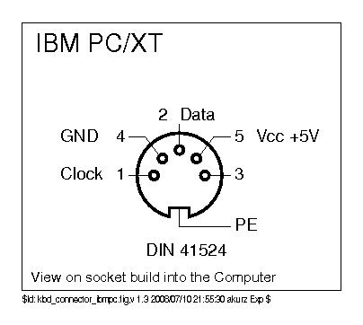

# IBM XT Protocol

The IBM XT keyboard protocol was used in the original IBM PC and PC/XT systems. The protocol uses scan codes, synchronous serial communication with a dedicated clock signal, and unidirectional keyboard-to-host data flow.

The XT protocol uses strictly unidirectional communication with no host commands, no acknowledgments, no LED control, and no error detection.

---

## Historical Context

The protocol is event-driven: key press generates a "make code", key release generates a "break code" (make code with bit 7 set, equivalent to adding 0x80). These scancodes were later designated "Scancode Set 1" when AT keyboards introduced support for multiple scancode sets.

**Type 1 vs Type 2 XT Keyboards**

IBM produced two XT keyboard variants with different reset mechanisms:

- **Type 1 (Early PC)**: Uses pin 3 of the 5-pin DIN connector for hardware reset
- **Type 2 (Later PC/XT)**: Uses a soft reset sequence on CLOCK and DATA lines—no dedicated reset pin

Data transmission, timing, frame structure, and scancodes are identical between variants. The reset mechanism is the only difference.

This converter implements the Type 2 soft reset method (pulling CLOCK and DATA LOW during initialisation). Type 1 keyboards have not been tested—compatibility with Type 1 reset mechanism cannot be confirmed.

**Note**: The Type 1/Type 2 distinction is documented only for IBM keyboards. Whether other manufacturers (clones, third-party keyboards) implemented Type 1, Type 2, or some other variation is not known. The Type 2 soft reset mechanism appears to be the most common implementation based on available documentation.

**Successor Protocol**

The IBM PC/AT introduced a bidirectional protocol with command support, LED control, and error detection. AT keyboards can switch scancode sets and respond to host requests. See **[AT/PS2 Protocol](at-ps2.md)** for the bidirectional specification.

---

## Protocol Overview

### Key Characteristics

The XT protocol sits somewhere between the simple typewriter-style direct wiring that came before it and the more sophisticated bidirectional protocols that followed.

**Strictly Unidirectional**

Data flows one way only—keyboard to host. There's no mechanism for the host to send commands back to the keyboard. This means:
- No LED control (Caps Lock and Num Lock indicators don't exist on XT keyboards)
- No configuration commands (scan code set is fixed, no changing it)
- No error recovery (no way to ask for retransmission if something goes wrong)
- No acknowledgments (keyboard has no idea if the host actually received the data)

**Event-Driven Synchronous Serial Communication**

The protocol is synchronous—it uses a dedicated clock signal for data transmission. The keyboard sends scancodes whenever keys are pressed (event-driven), but all data transmission is synchronized to the clock signal:
- **Clock Signal**: Keyboard provides a CLOCK line for bit-level synchronization
- **Data Signal**: Separate DATA line carries the actual scancodes
- **Synchronous Transmission**: Each bit is clocked out on a dedicated CLOCK line (not a predetermined baud rate)
- **Event-Driven Protocol**: Keyboard transmits whenever key events occur (no fixed timing between scancodes)
- **Start Bit Detection**: 1 or 2 start bits depending on whether it's a genuine IBM or clone keyboard
- **LSB-First**: Data bits transmitted least-significant-bit first
- **No Parity/Stop**: No error detection or stop bits

**Frame Structure**

Each transmission consists of:
- **Start bit(s)**: 1 bit (clones) or 2 bits (genuine IBM XT)
- **Data bits**: 8 bits containing the actual scan code
- **Total**: 9 bits per frame (8 data + 1 start bit in the interrupt handler)

**Timing Characteristics**

- **Clock Rate**: ~10 kHz (roughly 100µs per bit)
- **Variable Timing**: Different keyboards can vary within ±20% tolerance
- **Self-Contained**: Keyboard generates its own timing, host needs to keep up

---

## Physical Interface

### Connector and Pinout

XT keyboards use a **5-pin DIN connector** with 180° orientation:



**Pinout** (looking at the female socket on the keyboard):
- Pin 1: CLOCK - Clock line (keyboard generates timing reference)
- Pin 2: DATA - Data line (keyboard transmits scancodes)
- Pin 3: N/C - Not connected or +5V reset on some keyboards
- Pin 4: GND - Ground (0V reference)
- Pin 5: VCC - Power supply (+5V from host computer)

**Important Connector Notes:**

The 5-pin DIN comes in two variants—**180° and 240°**—and they're **NOT mechanically interchangeable**:
- **180° DIN**: Pin 3 at top center (standard for PC/XT/AT keyboards)
- **240° DIN**: Pin arrangement rotated 60° from the 180° layout

Always verify which type your keyboard uses before ordering connectors or cables. The plug simply won't fit the wrong socket orientation.

### Electrical Characteristics

**Logic Levels:**
- **HIGH (logic 1)**: 2.0V to 5.5V (typically 5V with pull-up resistor)
- **LOW (logic 0)**: 0V to 0.8V
- **Signal Levels**: TTL compatible (0-0.8V low, 2.0-5.5V high)

**Signal Characteristics:**
- **Open-Drain**: DATA line uses open-drain (or open-collector) output
- **Pull-Up**: Host has pull-up resistor on DATA line (typically 1-10kΩ, 4.7kΩ typical)
- **Pull-Up Location**: Resistor on host motherboard, not in keyboard
- **Idle State**: DATA line HIGH when keyboard not transmitting

**Power Requirements:**
- **Voltage**: +5V ±5% (4.75V to 5.25V)
- **Current**: 50-150mA typical (varies by keyboard model)
- **Startup Peak**: Up to 275mA during power-on self-test

**Signal Integrity:**
- **Cable Length**: Typically works well up to 1-2 meters (source: hardware testing)
- **Noise Immunity**: Reasonable for office environments
- **EMI**: Unshielded cables acceptable for most installations

---

## Communication Protocol

### Frame Structure

The XT protocol uses **9-bit frames** consisting of start bit(s) and data bits:

```
Frame Format (9 bits total):
- Start bit(s): 1 bit (clone) or 2 bits (genuine IBM)
- Data bits: 8 bits containing scancode (LSB-first)

PIO Configuration:
- ISR shift: 9 bits (captures start + data)
- Autopush: Enabled at 9-bit boundary
- Direction: Right-shift (LSB-first reception)
```

**Bit Order - LSB First**:

To transmit scancode 0x1C (00011100 binary), the keyboard sends:
```
Order: Bit 0 → Bit 1 → Bit 2 → Bit 3 → Bit 4 → Bit 5 → Bit 6 → Bit 7
Value:   0   →   0   →   1   →   1   →   1   →   0   →   0   →   0
```

This is the opposite of "MSB-first" protocols and must be handled correctly in the receiver.

### Keyboard-to-Host Transmission

The transmission method differs between genuine IBM keyboards and clone keyboards:

#### Genuine IBM XT Keyboards (Two Start Conditions)

Authentic IBM keyboards use a two-start-bit sequence (RTS/CTS):

```
Timing Diagram:
      ____       _ 1 _ 2 _ 3 _ 4 _ 5 _ 6 _ 7 _ 8 _ 9 _______
CLOCK     \_____/ \_/ \_/ \_/ \_/ \_/ \_/ \_/ \_/ \_/   
               _____ ___ ___ ___ ___ ___ ___ ___ ___
DATA  ________/     \___X___X___X___X___X___X___X___\_______
          ^   ^  S    0   1   2   3   4   5   6   7
          RTS CTS

Legend:
RTS = Request-to-Send (first start condition, CLOCK LOW + DATA LOW)
CTS = Clear-to-Send (second start condition, CLOCK transitions)
S   = Start bit (DATA goes HIGH momentarily)
0-7 = Data bits transmitted LSB-first
```

**Transmission Sequence:**

1. **Request-to-Send (RTS)**: Keyboard pulls both CLOCK and DATA LOW (~40µs) to confirm the host is ready
2. **Clear-to-Send (CTS)**: Keyboard releases CLOCK (goes HIGH), synchronizing timing domains
3. **Start Bit**: DATA briefly goes HIGH then LOW
4. **Data Bits**: 8 bits transmitted with CLOCK pulses, DATA sampled on falling CLOCK edge
5. **Return to Idle**: Both CLOCK and DATA return HIGH

#### Clone XT Keyboards (Single Start Condition)

Clone keyboards simplified the protocol to use a single start condition:

```
Timing Diagram:
      ____________ 1 _ 2 _ 3 _ 4 _ 5 _ 6 _ 7 _ 8 _ 9 _______
CLOCK             \_/ \_/ \_/ \_/ \_/ \_/ \_/ \_/ \_/     
      ______________ ___ ___ ___ ___ ___ ___ ___ ___ _______
DATA                \___X___X___X___X___X___X___X___/
                 S    0   1   2   3   4   5   6   7

Legend:
S   = Start condition (CLOCK falls, DATA transitions)
0-7 = Data bits transmitted LSB-first
```

**Simplified Sequence:**

1. **Start Condition**: CLOCK falls while DATA transitions
2. **Data Bits**: 8 bits transmitted with CLOCK pulses
3. **Return to Idle**: Both lines return HIGH

### Timing Specifications

**Clock Timing (Keyboard-Generated)**:

The keyboard generates its own clock at roughly 10 kHz:

```
Frequency: ~10 kHz (approximately, not precisely specified)
Period: ~100µs per bit transmission
Low Phase: ~40µs (clock low period)
High Phase: ~60µs (clock high period)
Tolerance: ±20% (keyboards vary significantly)
```

**Data Timing**:

```
Setup Time: Data valid before CLOCK rising edge (minimum ~5µs before edge)
Hold Time: Data stable after CLOCK rising edge (minimum ~5µs after edge)
Inter-byte Gap: 1-10ms typical between consecutive scan codes
```

**Reset and Initialisation Timing**:

```
Soft Reset Sequence:
- Host CLOCK Low: 20ms minimum to signal reset request
- Keyboard DATA High Response: Within 1ms of CLOCK release (acknowledgment)
- BAT Duration: 200-500ms typical for Basic Assurance Test
- BAT Response: 0xAA sent immediately after successful self-test
```

### Detection Challenge: Genuine vs Clone

The implementation needs to distinguish between genuine IBM keyboards (which use two start bits) and clone keyboards (which use just one). Both types look identical if you're not careful about how you sample the signal.

**The Problem**:

Both types have the same start bit pulse width of roughly 40µs. The typical bit period is around 100µs. If you're sampling at the bit period rate, you'll completely miss that second start bit on genuine IBM keyboards. You need to detect whether that second start bit exists within the first 40µs window.

**The Solution - Fast Sampling**:

This implementation samples at 10µs intervals (defined as `XT_TIMING_SAMPLE_US` constant, see [Why 10µs Sampling is Critical](#why-10µs-sampling-is-critical) below for the full technical explanation):

```
Minimum Pulse Detection: 10µs (not the 100µs typical bit period)
RP2040 System Clock: 125 MHz
Target Sampling: (1000 / XT_TIMING_SAMPLE_US) × 5 samples = 500 kHz
Clock Divider: 125,000 kHz / 500 kHz = 250
PIO Cycle Time: 2µs per cycle

Detection Window:
- Start bit width: ~40µs
- Sampling interval: 10µs  
- Samples per start bit: 4 samples (40µs / 10µs)
```

With this fast sampling, the implementation can catch that first start bit if it's present:

```
On CLOCK falling edge:
  Sample DATA immediately (within 10µs window)
  
  If DATA = LOW:
    → Genuine IBM XT detected (two start bits)
    → Discard first start bit (RTS)
    → Wait for CLOCK rising edge
    → Wait for CLOCK falling edge again
    → Read second start bit (CTS)
    → Proceed with 8 data bits
    
  If DATA = HIGH:
    → Clone XT detected (single start bit)
    → Use this sample as start bit
    → Proceed with 8 data bits
```

This solution allows a single receiver implementation to work with both genuine and clone keyboards automatically.

---

## Scan Code Set

The XT protocol uses a fixed scancode set. It's simple—no multi-byte sequences, no mode switching, just simple make and break codes.

**Scancode Structure:**

```
Make Code (Key Press):   0x01 - 0x53
Break Code (Key Release): Make Code + 0x80

Examples:
0x1E (A key pressed)  →  0x9E (A key released)  = 0x1E + 0x80
0x2A (L Shift press)  →  0xAA (L Shift release) = 0x2A + 0x80
0x1C (Enter press)    →  0x9C (Enter release)   = 0x1C + 0x80
```

**Simple Algorithm**:

```c
bool is_break_code(uint8_t scancode) {
    return (scancode & 0x80) != 0;  // Bit 7 set = break code
}

uint8_t get_base_key(uint8_t scancode) {
    return scancode & 0x7F;  // Clear bit 7 to get base key code
}
```

**Special Codes:**

| Code | Value | Description |
|------|-------|-------------|
| **BAT Passed** | 0xAA | Self-test successful (sent once at power-on) |
| **BAT Failed** | 0xFC | Self-test failed (rare, indicates hardware problem) |

**BAT (Basic Assurance Test)**:
- Performed during keyboard power-on
- Tests ROM checksum, RAM, key matrix
- 0xAA: Everything OK, keyboard ready
- 0xFC: Hardware failure detected

**Protocol Layer Filtering:**
The XT protocol implementation filters 0xAA during initialization (UNINITIALISED state) to prevent it from being processed as a scancode. Once INITIALISED, codes pass through to the scancode layer, which provides defense-in-depth filtering for post-initialization scenarios. See [Scancode Set 1 Self-Test Code Collision](../scancodes/set1.md#self-test-code-collision) for details on why this matters.

**Note**: For complete scancode tables with all key mappings, see the **[Scancode Set 1](../scancodes/set1.md)** documentation.

---

## Protocol Operation

### Power-On Sequence

Power on an XT keyboard and it runs through a predictable initialisation sequence:

```
Power-On Initialisation:
1. Keyboard receives power from Pin 5 (VCC)
2. Internal microcontroller boots and runs self-test (~200-500ms)
3. Tests performed:
   - ROM checksum verification
   - RAM read/write test  
   - Key matrix continuity check
4. If all tests pass:
   - Keyboard sends 0xAA (BAT Passed)
   - Enters normal operation mode
5. If any test fails:
   - Keyboard sends 0xFC (BAT Failed)
   - May blink LED indicators (if present)
   - May enter degraded mode or halt
```

### Soft Reset Protocol

XT keyboards support soft reset via the CLOCK and DATA lines. This is the **Type 2 reset method** used by IBM PC/XT keyboards, documented in the IBM PC XT Technical Reference (April 1984, p5-98).

**Note**: Type 1 XT keyboards (original IBM PC) used pin 3 for hardware reset instead. This implementation uses Type 2 soft reset and hasn't been tested with Type 1 keyboards.

**Reset Sequence:**

1. **Host Request**: Pull CLOCK LOW for ~20ms (host-initiated reset signal)
2. **Keyboard ACK**: Keyboard responds by pulling DATA HIGH (acknowledgment)
3. **Host Release**: Host releases CLOCK (returns to input mode, keyboard controls timing)
4. **Keyboard Ready**: Keyboard pulls DATA LOW (ready for transmission)
5. **Self-Test**: Keyboard performs BAT (Basic Assurance Test)
6. **BAT Response**: Keyboard transmits 0xAA (passed) or 0xFC (failed)

**PIO Implementation:**

The converter implements this protocol in the PIO state machine ([`keyboard_interface.pio`](../../src/protocols/xt/keyboard_interface.pio)):

```pio
softReset:
    set pindirs 2 [1]       ; Set CLOCK pin to output mode
    set pins, 0             ; Pull CLOCK LOW (soft reset request, ~20ms hold)
    
    wait 1 pin 0 [1]        ; Wait for DATA HIGH (keyboard ACK)
    
    set pindirs 1  [1]      ; Set CLOCK to input (release to keyboard)
    set pindirs, 0          ; Set DATA to input (allow keyboard control)
    
    wait 0 pin 0 [1]        ; Wait for DATA LOW (ready for transmission)
```

**When Soft Reset Occurs:**

- **Power-on initialisation**: After keyboard powers up and brings CLOCK/DATA HIGH
- **BAT failure recovery**: When keyboard returns invalid BAT response
- **Communication error**: When invalid start bit detected (triggers `pio_restart()`)
- **State machine reset**: After protocol errors or frame synchronization loss

### Normal Operation

Once initialised, the keyboard runs a continuous scan loop:

```
Continuous Scan Loop:
1. Keyboard continuously scans its key matrix
2. On key state change:
   a. Key Press: Generate make code (0x01-0x53)
   b. Key Release: Generate break code (make code + 0x80)
3. Transmit scancode using self-clocked protocol
4. Return to step 1 (no waiting for host acknowledgment)

Key Points:
- Keyboard operates independently of the host
- No flow control or acknowledgments
- Host needs to keep up with the transmission rate
- Burst rate is limited by mechanical key switch debounce
```

---

## Implementation Notes

### Why 10µs Sampling is Critical

The 10µs sampling rate isn't arbitrary—it's specifically needed to distinguish between genuine IBM XT keyboards (two start bits) and clone keyboards (single start bit):

- **Start bit width**: ~40µs on genuine IBM keyboards
- **Sampling interval**: 10µs gives you 4 samples within that 40µs window
- **Detection capability**: Fast enough to catch the DATA LOW state of the first start bit
- **Oversampling factor**: 10× faster than the bit period (10µs vs 100µs)

Without this fast sampling, both genuine and clone keyboards would look identical when sampled at the bit period rate (~100µs), making automatic detection impossible. Here's why slower sampling fails:

**At 100µs sampling (bit period rate)**:
- First sample: Misses the ~40µs RTS pulse entirely
- Second sample: Sees DATA HIGH (after RTS ends)
- Result: Genuine and clone keyboards look identical

**At 10µs sampling (this implementation)**:
- First sample (at ~10µs): Catches DATA LOW on genuine XT (RTS pulse)
- First sample (at ~10µs): Sees DATA HIGH on clone XT (no RTS pulse)
- Result: Can distinguish keyboard types and align frame correctly

### Host-Side Implementation

The converter uses the RP2040's PIO hardware to handle all the XT protocol timing automatically:

**PIO State Machine Configuration:**

```c
// From keyboard_interface.c
// See: ../../src/protocols/xt/keyboard_interface.c
pio_sm_config c = keyboard_interface_program_get_default_config(offset);

// Configure 9-bit reception (8 data + 1 start bit)
sm_config_set_in_shift(&c, true, true, 9);  // Right-shift, autopush, 9 bits

// Pin assignments
sm_config_set_in_pins(&c, keyboard_data_pin);  // DATA on base pin
sm_config_set_jmp_pin(&c, keyboard_clock_pin); // CLOCK on base pin + 1

// Clock divider for genuine vs clone detection
float clock_div = calculate_clock_divider(XT_TIMING_SAMPLE_US);  // 10µs sampling period
sm_config_set_clkdiv(&c, clock_div);
```

**IRQ Handler:**

```c
static void __isr keyboard_input_event_handler() {
    // Read 9-bit frame from PIO FIFO
    io_ro_32 data_cast = pio_engine.pio->rxf[pio_engine.sm] >> 23;
    uint16_t data = (uint16_t)data_cast;

    // Extract start bit and data byte
    uint8_t start_bit = data & 0x1;
    uint8_t data_byte = (uint8_t)((data_cast >> 1) & 0xFF);

    // Validate start bit (must be 1 for XT protocol)
    if (start_bit != 1) {
        // Invalid frame - restart PIO
        keyboard_state = UNINITIALISED;
        pio_restart(pio_engine.pio, pio_engine.sm, pio_engine.offset);
        return;
    }

    // Process valid scan code
    keyboard_event_processor(data_byte);
}
```

**Key Implementation Details:**

- PIO handles all timing automatically (no software delays)
- 10µs sampling rate allows genuine vs clone keyboard detection
- Start bit validation confirms frame synchronization
- Ring buffer queues scancodes for main loop processing
- Non-blocking architecture (IRQ → ring buffer → main task)
- Standard protocol setup pattern (see [Protocol Implementation Guide](../development/protocol-implementation.md))

### RP2040 PIO Configuration

```c
// Clock divider calculation for 10µs minimum pulse detection
float calculate_clock_divider(uint32_t target_us) {
    // RP2040 system clock: 125 MHz = 125,000 kHz
    // Target: 10µs minimum pulse detection
    // Desired frequency: (1000 / 10µs) × 5 samples = 500 kHz
    // Divider: 125,000 / 500 = 250
    
    const uint32_t sys_clock_khz = clock_get_hz(clk_sys) / 1000;
    const uint32_t target_freq_khz = (1000 / target_us) * 5;
    
    return (float)sys_clock_khz / (float)target_freq_khz;
}
```

See [Why 10µs Sampling is Critical](#why-10µs-sampling-is-critical) above for the technical rationale behind this timing requirement.

---

## Troubleshooting

If you're running into issues with your XT keyboard, the problems usually fall into a few common categories. Protocol-specific troubleshooting is covered here, but for general hardware setup issues (voltage levels, wiring, that sort of thing), see the **[Hardware Setup Guide](../getting-started/hardware-setup.md)**.

**Basic voltage checks with a multimeter:**
- VCC (Pin 5): 5.0V ±5%
- GND (Pin 4): 0V
- Idle DATA: ~5V (pulled HIGH)

### Common Issues

| Symptom | Likely Cause | What to Check |
|---------|---------------|---------------|
| No response | Power issue, bad connections | Check VCC, GND, verify pull-up resistor on DATA |
| Initialisation fails | Missing soft reset, too early | Execute CLOCK LOW soft reset, wait 500ms after power-on |
| Garbled scancodes | Wrong bit order, sampling edge | Verify LSB-first, sample on CLOCK rising edge |
| Missing key events | Buffer overflow, timing | Check ring buffer size, verify interrupt latency |
| Intermittent operation | Cable issues, signal quality | Use shorter cable (<2m), check connector pins |
| No BAT (0xAA) | Failed self-test, timing | Wait longer (1000ms), verify soft reset sequence |
| Clone detection issues | Start bit mismatch | Implementation auto-detects 1 or 2 start bits |

---

## Related Documentation

- **[Hardware Setup](../hardware/README.md)** - Physical connections and wiring
- **[Keyboards](../keyboards/README.md)** - Supported XT keyboards  
- **[Scancode Set 1](../scancodes/set1.md)** - XT scancode tables

## References

### Official Documentation

1. **[IBM PC XT Technical Reference (April 1984)](https://bitsavers.org/pdf/ibm/pc/xt/6361459_PC_XT_Technical_Reference_Apr84.pdf)** - Official XT specification, keyboard protocol on p5-32 and p5-98
2. **[IBM PC Technical Reference (April 1983)](https://bitsavers.org/pdf/ibm/pc/xt/1502237_PC_XT_Technical_Reference_Apr83.pdf)** - Original PC/XT specification (25MB PDF)
3. **[IBM PC Technical Reference Manual (1981)](https://bitsavers.org/pdf/ibm/pc/)** - Original IBM PC documentation

### Implementation References

4. **[8048 XT Keyboard Firmware](https://github.com/Halicery/8042/blob/main/8048_XT_INTERN.TEXT)** - Reverse-engineered 8048 microcontroller firmware from genuine IBM XT keyboard
5. **[TMK Keyboard Firmware](https://github.com/tmk/tmk_keyboard)** - XT protocol reference implementation
6. **[KbdBabel Vintage Keyboard Documentation](http://kbdbabel.org/conn/index.html)** - Connector diagrams used in this document

### Our Implementation

7. **[`keyboard_interface.pio`](../../src/protocols/xt/keyboard_interface.pio)** - RP2040 PIO state machine for XT protocol
8. **[`keyboard_interface.c`](../../src/protocols/xt/keyboard_interface.c)** - C implementation, IRQ handlers, and state machine

---

**Questions or stuck on something?**  
Pop into [GitHub Discussions](https://github.com/PaulW/rp2040-keyboard-converter/discussions) or [report a bug](https://github.com/PaulW/rp2040-keyboard-converter/issues) if you've found an issue.
