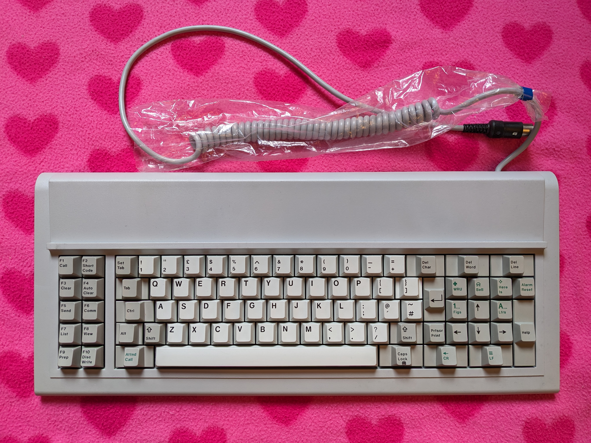

# Cherry G80-0614H Keyboard

This is the Keyboard Mapping & Configuration for the Cherry G80-0614H.  This model has a variant of the IBM XT Keyboard Layout, and customised for use on the BT Merlin Cheetah Terminal system.  The Keyboard uses the XT Protocol for communication, and uses Set 1 Scancodes.

## Key Mapping

The keys can be re-assigned by updating the [keyboard.c](keyboard.c) file.  Please refer to [hid_keycodes.h](/src/common/lib/hid_keycodes.h) to list available key codes which can be mapped.  I do intend on slightly updating the layout, and this will be made clear when I commit that change.

Please note, that some keys require the use of the Fn Modifier Key to be pressed (by default, this is mapped to F9).  Keys mapped with dual values also represent pressing Shift Modifier.

F10 is mapped to LGUI (Windows Key or Command Key)

| Key on Keyboard | Modifier Mapping |
|---|---|
| F1 | F9 |
| F2 | F10 |
| F3 | F11 ** |
| F4 | F12 |
| F5 | Vol Down |
| F6 | Vol Up |
| F7 | Brightness Down |
| F8 | Brightness Up |
| CapsLock | Menu |

_* Mapping may differ on Windows PC, I've not tested this_

_** F11 Does work, it just doesn't show when pressed in Chrome on the QMK Congigurator Test Page_

All Layouts are set as if the keyboard is set to British PC (as per my Mac)

