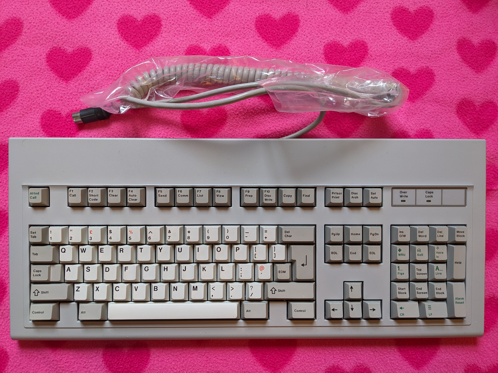

# Cherry G80-1104H Keyboard

This is the Keyboard Mapping & Configuration for the Cherry G80-1104H.  This model has a variant of the UK ISO Layout, and customised for use on the BT Merlin Cheetah Terminal system.  The Keyboard uses the XT Protocol for communication, and uses Set 1 Scancodes.

## Key Mapping

The keys can be re-assigned by updating the [keyboard.c](keyboard.c) file.  Please refer to [hid_keycodes.h](/src/common/lib/hid_keycodes.h) to list available key codes which can be mapped.  The Layers are defined and laid out in a way which matches the default key layout of the IBM Model M Keyboard.  I do intend on slightly updating the layout, and this will be made clear when I commit that change.

Please note, that some keys require the use of the Fn Modifier Key to be pressed (by default, this is mapped to Right-Alt).  Keys mapped with dual values also represent pressing Shift Modifier.

Right-Ctrl is mapped to LGUI (Windows Key or Command Key)

| Key on Keyboard | Modifier Mapping |
|---|---|
| CapsLock | Menu |

_* Mapping may differ on Windows PC, I've not tested this_

All Layouts are set as if the keyboard is set to British PC (as per my Mac)

