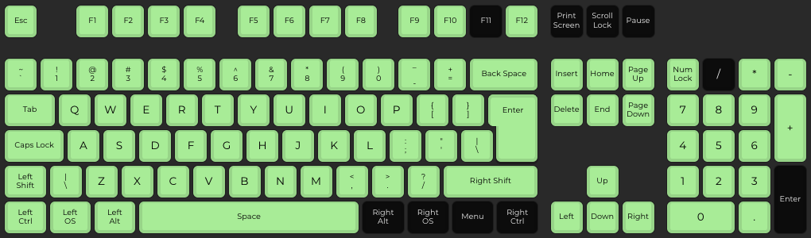

# IBM Model F (PC/AT) Keyboard, Model 6450225

This is the Keyboard Mapping & Configuration for the IBM Model F Keyboard, model 6450225.  This model has a UK Layout and pre-dates the standard ISO and ANSI layout designs.  It operates using the AT Protocol, and uses Set 2 Scancodes.

## Key Mapping

The current build has the following keys available when using the keyboard:

(Key Test performed using [QMK Configurator](https://config.qmk.fm/#/test))

The keys can be re-assigned by updating the [keyboard.c](keyboard.c) file.  Please refer to [hid_keycodes.h](/src/common/lib/hid_keycodes.h) to list available key codes which can be mapped.  The Layers are defined and laid out in a way which matches the default key layout of the IBM 5170 Keyboard.  I do intend on slightly updating the layout, and this will be made clear when I commit that change.

Please note, that some keys require the use of the Fn Modifier Key to be pressed (by default, this is mapped to F9).  Keys mapped with dual values also represent pressing Shift Modifier.

F10 is mapped to LGUI (Windows Key or Command Key)

| Key on Keyboard | Modifier Mapping |
|---|---|
| Pipe / Back Slash | Grave / Negation * |
| Numpad 0 | Insert |
| Numpad Dot | Del |
| Numpad 1 | End |
| Numpad 2 | Down Arrow |
| Numpad 3 | Page Down |
| Numpad 4 | Left Arrow |
| Numpad 6 | Right Arrow |
| Numpad 7 | Home |
| Numpad 8 | Up Arrow |
| Numpad 9 | Page Up |
| F1 | F9 |
| F2 | F10 |
| F3 | F11 ** |
| F4 | F12 |
| F5 | Vol Down |
| F6 | Vol Up |
| F7 | Brightness Down |
| F8 | Brightness Up |
| CapsLock | Menu |

_* Mapping may differ on Windows PC, I've not tested this_

_** F11 Does work, it just doesn't show when pressed in Chrome on the QMK Congigurator Test Page_

All Layouts are set as if the keyboard is set to British PC (as per my Mac)

