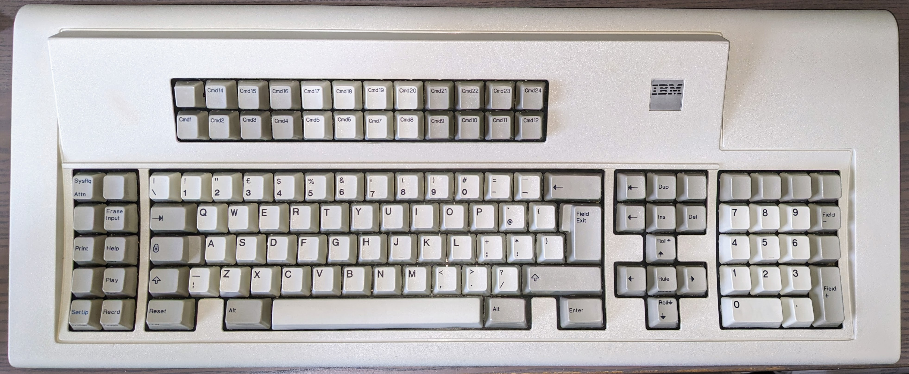

# IBM Model M (M122 Terminal Keyboard)

This is the Keyboard Mapping & Configuration for the IBM Model M (M122) Terminal Keyboard.

## Key Mapping

The keys can be re-assigned by updating the [keyboard.c](keyboard.c) file.  Please refer to [hid_keycodes.h](/src/common/lib/hid_keycodes.h) to list available key codes which can be mapped.

Even though we assign the Fn Modifier, this is done to allow us to still enter Bootloader mode for updating Firmware.

All Layouts are set as if the keyboard is set to British PC (as per my Mac)

